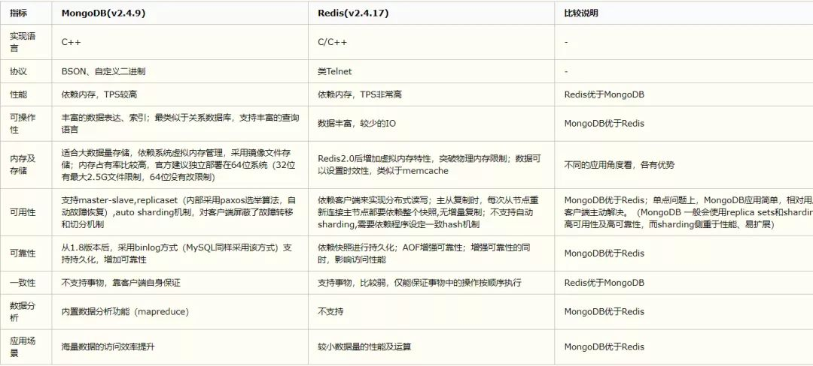

# 工具
## dbdiagrm.io 数据库设计
## PDMan
- 一款开源免费的数据库建模工具。PDMan是PowerDesigner的一个优秀的替代方案。
- MIT协议开源
- Windos Linux Mac
- 目前系统默认支持Orcale MySQL ，java的代码自动生成。 其他类型的数据库或者语言，需要自己添加相应设置和代码dot模板。
- 一键自动生成Markdown以及HTML格式的表结构文档。
## PowerDesgin & chiner
https://mp.weixin.qq.com/s/AYrNI-HetnpxlnUkiBPn3w

# 几种常用数据库对比和简介

## Overview

## Redis 
- REmote DIctionary Server(Redis) 是一个由 Salvatore Sanfilippo 写的 key-value 存储系统，是跨平台的非关系型数据库。

- Redis 是一个开源的使用 ANSI C 语言编写、遵守 BSD 协议、支持网络、可基于内存、分布式、可选持久性的键值对(Key-Value)存储数据库，并提供多种语言的 API。

- Redis 通常被称为数据结构服务器，因为值（value）:
1. 字符串(String)
2. 哈希(Hash)
3. 列表(list)
4. 集合(sets)
5. 有序集合(sorted sets)
- 内存数据库，效率很高，读效率 110000/s, 写81000/s ，多当做缓存工具。
- Redis 官网：https://redis.io/

- 源码地址：https://github.com/redis/redis

- Redis 在线测试：http://try.redis.io/

- Redis 命令参考：http://doc.redisfans.com/ 和 https://www.redis.net.cn/order
## memcached

## KV存储 LevelDB 
- https://github.com/google/leveldb
- LevelDB is a fast key-value storage library written at Google that provides an ordered mapping from string keys to string values.
- 单机数据库，不支持网络
- 基于LSM结构的KV存储，leveldb常被用作各类数据库和存储系统的存储引擎，在BAT都在使用。
- LevelDB 是单进程的服务，性能非常之高，在一台4核Q6600的CPU机器上，每秒钟写数据超过40w，而随机读的性能每秒钟超过10w。
此处随机读是完全命中内存的速度，如果是不命中，速度大大下降。
- **levelDB是一种更适合写多读少的NoSQL数据库**

## ElasticSearch
- [OfficalWebsit](https://www.elastic.co/cn/elasticsearch/)
- [UserGuide](https://www.elastic.co/guide/en/elasticsearch/reference/current/index.html)
- Elasticsearch 是一个分布式、RESTful 风格的搜索和数据分析引擎。
- Kibana 是ES的一个数据可视化工具
- ElasticSearch是基于lucence开发的，也就是运行需要java jdk支持。所以要先安装JAVA环境。
> 由于ElasticSearch 5.x 往后依赖于JDK 1.8的，所以现在我们下载JDK 1.8或者更高版本。
- 官方支持的客户端语言：Java、Python、.NET、SQL 和 PHP。 暂时没有官方C++客户端支持。
### Install
- [OfficalInstall](https://www.elastic.co/guide/en/elasticsearch/reference/current/install-elasticsearch.html)

## MongoDB 
### mongodb怎样使用内存
1. 它会把数据文件映射到内存中：
    - 如果是读操作，内存中的数据起到缓存的作用，

    - 如果是写操作，内存还可以把随机的写操作转换成顺序的写操作，总之可以大幅度提升性能。

2. MongoDB并不干涉内存管理工作，而是把这些工作留给操作系统的虚拟内存管理器去处理，
这样做的好处是简化了MongoDB的工作，但坏处是你没有方法很方便的控制MongoDB占多大内存，

3. MongoDB的内存使用机制让它在缓存重建方面更有优势，简而言之：如果重启进程，那么缓存依然有效，如果重启系统，那么可以通过拷贝数据文件到/dev/null的方式来重建缓存
### mongoDB内存映射原理
#### ongodb非常吃内存，为啥这么吃内存呢？

mongodb使用的是内存映射存储引擎，即Memory Mapped Storage Engine，简称MMAP。

MMAP可以把磁盘文件的一部分或全部内容直接映射到内存，这样文件中的信息位置就会在内存中有对应的地址空间，把磁盘IO操作转换成内存操作

#### 映射了就不需要读磁盘吗，没有磁盘IO吗？
没有内存映射会怎么样 进程调用read,write的系统调用函数。

内核进程把磁盘的数据读到内核空间，然后在copy到用户进程空间。

没错，就是两次复制。

有了内存映射之后，用户进程就可以采用指针的方式读写操作这一段内存。

mmap就是省去了内核空间到用户空间的拷贝：
> 常规方式：磁盘-->内核空间-->用户空间
> mmap:磁盘-->用户空间

#### 原理
如下图：

分如下两部：
1. 内存映射：
    > 在内存映射的过程中，并没有实际的数据拷贝，文件没有被载入内存，只是逻辑上被放入了内存，这个过程由系统调用mmap()实现，所以建立内存映射的效率很高。 

2. 缺页中断
    >既然建立内存映射没有进行实际的数据拷贝，那么进程又怎么能最终直接通过内存操作访问到硬盘上的文件呢？
    
    > 那就要看内存映射之后的几个相关的过程了。

    > mmap()会返回一个指针ptr，它指向进程逻辑地址空间中的一个地址，这样以后，进程无需再调用read或write对文件进行读写，而只需要通过ptr就能够操作文件。但是ptr所指向的是一个逻辑地址，要操作其中的数据，必须通过内存管理单元MMU将逻辑地址转换成物理地址，如图1中过程2所示。这个过程与内存映射无关。

    > 前面讲过，建立内存映射并没有实际拷贝数据，这时，MMU在地址映射表中是无法找到与ptr相对应的物理地址的，也就是MMU失败，将产生一个缺页中断，缺页中断的中断响应函数会在swap中寻找相对应的页面，如果找不到（也就是该文件从来没有被读入内存的情况），则会通过mmap()建立的映射关系，从硬盘上将文件读取到物理内存中，如图1中过程3所示。这个过程与内存映射无关。

    > 如果在拷贝数据时，发现物理内存不够用，则会通过虚拟内存机制（swap）将暂时不用的物理页面交换到硬盘上，如图1中过程4所示。这个过程也与内存映射无关。

    > 所以当mongodb读取数据库文件的时候，首先做内存映射，读取文件变成了读取内存操作，所以mongodb的查询效率相当高，当然，如果你的内存不够大，经常发生缺页中断，那么效率会大打折扣了

### cacheSizeGB不应该超过默认值
cacheSizeGB默认值是(RAM – 1GB) / 2。这个限制的出发点是防止OOM，因为MongoDB使用的总内存不仅是WT Cache，还包括了一些额外的消耗，例如：
- 执行CRUD需要的必要缓存 
- 建立网络连接所需的堆栈空间
- 其他
### mongodb持久化和存储
- mongodb的读写全部针对内存进行，什么时候写入硬盘，由系统决定

## MongoDB与Redis的区别分析
- https://www.jianshu.com/p/2b523fbee36f
- https://zhuanlan.zhihu.com/p/32984037

### redis与mongoDB的区别
1. 内存管理
Redis 数据全部存在内存，定期写入磁盘，当内存不够时，可以选择指定的 LRU 算法删除数据。

MongoDB 数据会优先存于内存，当内存不够时，只将热点数据放入内存，其他数据存在磁盘。

需要注意的是Redis 和mongoDB特别消耗内存，一般不建议将它们和别的服务部署在同一台服务器上。

2. 数据结构
Redis 支持的数据结构丰富，包括hash、set、list等。

MongoDB 数据结构比较单一，但是支持丰富的数据表达，索引，最类似关系型数据库，支持的查询语言非常丰富。

3. 数据量和性能
当物理内存够用的时候，性能，redis>mongodb>mysql

数据量，mysql>mongodb>redis

注意mongodb可以存储文件，适合存放大量的小文件，内置了GirdFS 的分布式文件系统。

4. 可靠性
mongodb从1.8版本后，采用binlog方式（MySQL同样采用该方式）支持持久化，增加可靠性；

Redis依赖快照进行持久化；AOF增强可靠性；增强可靠性的同时，影响访问性能。

可靠性上MongoDB优于Redis。

5. 如下图 差异对比

