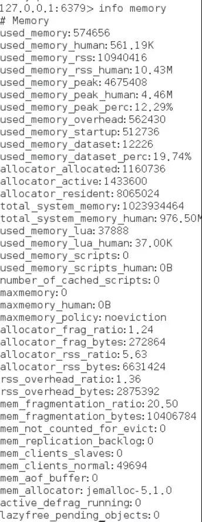

# Redis 
- REmote DIctionary Server(Redis) 是一个由 Salvatore Sanfilippo 写的 key-value 存储系统，是跨平台的非关系型数据库。

- Redis 是一个开源的使用 ANSI C 语言编写、遵守 BSD 协议、支持网络、可基于内存、分布式、可选持久性的键值对(Key-Value)存储数据库，并提供多种语言的 API。

- Redis 通常被称为数据结构服务器，因为值（value）:
1. 字符串(String)
2. 哈希(Hash)
3. 列表(list)
4. 集合(sets)
5. 有序集合(sorted sets)
- 内存数据库，效率很高，读效率 110000/s, 写81000/s ，多当做缓存工具。
- Redis 官网：https://redis.io/

- Redis 中文网站: https://www.redis.net.cn/

- 源码地址：https://github.com/redis/redis

- Redis 在线测试：http://try.redis.io/

- Redis 菜鸟教程： https://www.runoob.com/redis/redis-tutorial.html

- Redis 命令参考：http://doc.redisfans.com/ 和 https://www.redis.net.cn/order

**Redis最新版本无法在window上使用**

# 博文
## Redis内存使用和管理知识总结
- https://stor.51cto.com/art/201909/603422.htm
Redis是当今很火爆的内存数据库，我们的所有数据都存在了内存之中，因此我们的每次写入、读取都是从内存中进行操作，所以在带来速度的同时，也从内存的使用上给我们带来了挑战。众所周知，在硬件资源中内存价格是高于硬盘价格的，通过学习Redis的内存知识可以使我们在保护Redis数据库的同时更高效的发挥出Redis的作用，进而管理内存，减少内存消耗和硬件成本。

Redis作为内存数据库，对于自身所使用的内存情况是有命令可以统计的，通过获取到的相关信息可以了解Redis自身内存的使用现状，进而有助于判断内存使用健康度。Redis提供查看内存的指令为info memory。

在以上各项指标中需要重点关注的指标有：used_memory_rss和used_memory以及它们的比值mem_fragmentation_ratio。

当mem_fragmentation_ratio>1 时，说明used_memory_rss-used_memory多出的部分内存并没有用于数据存储，而是被内存碎片所消耗，这个值越大，表明内存碎片越多。

当mem_fragmentation_ratio<1 时，这种情况说明正在使用虚拟内存，也就是在使用主机的硬盘，由于硬盘性能是远远低于内存的，所以要小心因为性能问题导致整体Redis故障。根据日常使用的情况mem_fragmentation_ratio的数值在1 ~ 1.5之间是比较健康的。在出现内存碎片过多的问题怎么处理呢?最简单暴力的办法就是重启，在Redis4.0版本之后支持在运行期进行自动内存碎片清理，主要通过设置config set activedefrag yes来进行实现，同时也提供了memory purge命令来手动进行内存碎片清理。

Redis默认是无限使用内存的，所以防止系统内存被耗尽，需要对Redis的内存上限进行设置，Redis使用maxmemory参数限制最大可用内存。通过前面的介绍我们可以得知maxmemory配置的是Redis实际使用的内存量，也就是used_memory统计项对应的内存。由于内存碎片率的存在，实际消耗的内存可能会比maxmemory设置的更大，实际使用时要小心这部分内存溢出。根据惯例一般会预留出20%的服务器空闲内存防止内存溢出通过。

Redis的内存上限可以通过config set maxmemory进行动态修改，即修改最大可用内存。通过动态修改maxmemory，可以实现在当前服务器下动态伸缩Redis内存的目的，考虑到现在在部署Redis时大多采用集群或哨兵模式，单台主机上并非Redis单实例，因此建议针对所有的Redis进程都要配置maxmemory。

Redis针对内存使用情况提供内存回收策略供运维人员进行配置，主要用于删除到达过期时间的键对象以及当Redis内存使用达到所设置的maxmemory上限时则执行内存回收策略。

Redis所有的键都可以设置过期属性，在数据库结构中的expires字典中保存了数据库中所有键的过期时间，我们称expire这个字典为过期字典。由于进程内保存大量的键，维护每个键精准的过期删除机制会导致消耗大量的CPU，对于单线程的Redis来说成本过高，因此Redis采用惰性删除和定时任务删除机制实现过期键的内存回收。

惰性删除：惰性删除用于当客户端读取带有超时属性的键时，如果已经超过键设置的过期时间，会执行删除操作并返回空，这种删除策略对CPU是友好的，删除操作只有在不得不的情况下才会进行，不会对其他的expire key上浪费无谓的CPU时间。但是这种策略对内存不友好，一个key已经过期，但是在它被操作之前不会被删除，仍然占据内存空间。如果有大量的过期键存在但是又很少被访问到，那会造成大量的内存空间浪费。因为可能存在一些key永远不会被再次访问到，这些设置了过期时间的key也是需要在过期后被删除的，我们甚至可以将这种情况看作是一种内存泄露—-无用的垃圾数据占用了大量的内存，而服务器却不会自己去释放它们，这对于运行状态非常依赖于内存的Redis服务器来说，肯定不是一个好消息。正因为如此，Redis还提供另一种定时任务删除机制作为惰性删除的补充。

定时任务删除：Redis内部维护一个定时任务，默认每秒运行10次(通过配置server.hz控制)。Redis会周期性的随机测试一批设置了过期时间的key并进行处理。测试到的已过期的key将被删除。

当Redis所用内存达到maxmemory上限时会触发相应的溢出控制策略。具体策略受maxmemory-policy参数控制，Redis支持6种策略，如下所示：

1)noeviction：默认策略，数据永不过期，不会删除任何数据，当内存不足以容纳新写入数据时，新写入操作会报错，一般不推荐使用。

2)volatile-lru：根据LRU算法删除设置了超时属性(expire)的键，直到腾出足够空间为止。如果没有可删除的键对象，回退到noeviction策略。这种情况一般是把 Redis 既当缓存，又做持久化存储的时候才用。

3)allkeys-lru：根据LRU算法删除键，不管数据有没有设置超时属性，直到腾出足够空间为止。一般推荐使用该策略

4)allkeys-random：内存不足以容纳新写入数据时，在键空间中，随机移除某个 Key。

5)volatile-random：当内存不足以容纳新写入数据时，在设置了过期时间的键空间中，随机移除某个 Key。

6)volatile-ttl：当内存不足以容纳新写入数据时，在设置了过期时间的键空间中，有更早过期时间的 Key 优先移除。如果没有，回退到noeviction策略。

内存溢出控制策略可以采用config set maxmemory-policy{policy}动态配置。我们上文已经介绍了Redis所支持的的内存溢出应对策略，运维人员可以根据实际需求灵活定制。

综上所述，我们从Redis数据库最关键特性—内存出发，详细介绍了Redis的内存使用和内存管理，而这也是成为一名专业Redis运维人员的核心技能。大家通过本文能够提升对Redis内存的认识，但要真正掌握则需要长时间的学习和使用，希望大家共同努力学习和进步。