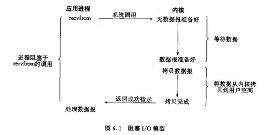
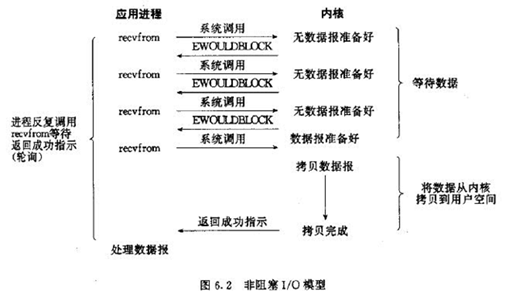
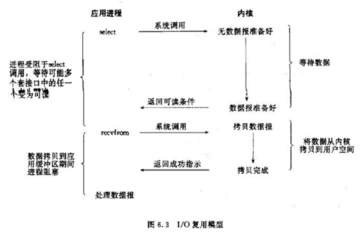
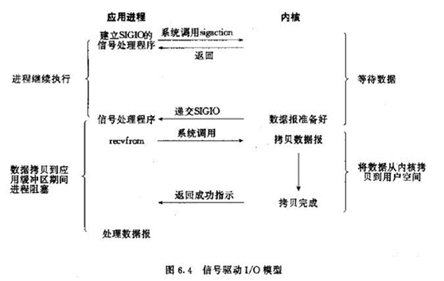
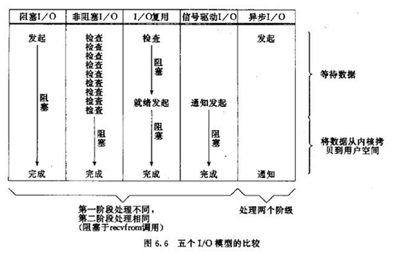

# IO
IO (Input/Output，输入/输出)即数据的读取（接收）或写入（发送）操作，
通常用户进程中的一个完整IO分为两阶段：
> 用户进程空间<-->内核空间、内核空间<-->设备空间（磁盘、网络等）。

IO有内存IO、网络IO和磁盘IO三种，通常我们说的IO指的是后两者。

*LINUX中进程无法直接操作I/O设备，其必须通过系统调用请求kernel来协助完成I/O动作；内核会为每个I/O设备维护一个缓冲区。*

## IO可以分成两种：
- 来自网络的IO
- 来自文件或者设备的IO

对于一个输入操作来说，进程IO系统调用后，
内核会先看缓冲区中有没有相应的缓存数据，没有的话再到设备中读取，
因为设备IO一般速度较慢，需要等待；
内核缓冲区有数据则直接复制到进程空间。

- 所以，对于一个网络输入操作通常包括两个不同阶段：
    > 等待网络数据到达网卡→读取到内核缓冲区，数据准备好；
    > 从内核缓冲区复制数据到进程空间。

## 完成IO操作可以简单的表述为两个步骤：
- 发起IO请求
- 执行IO操作

## 如何区分是同步IO还是异步IO呢？
- "执行IO操作"是否阻塞
    > 当请求被阻塞，就是同步IO，否则就是异步IO

-  同步IO的特点：
    > 同步IO指的是用户进程触发I/O操作并等待或者轮询的去查看I/O操作是否就绪。
    > 同步IO的执行者是IO操作的发起者。
    > 同步IO需要发起者进行内核态到用户态的数据拷贝过程，所以这里必须由个阻塞

- 异步IO的特点：
    > 异步IO是指用户进程触发I/O操作以后就立即返回，继续开始做自己的事情，
    > 而当I/O操作已经完成的时候会得到I/O完成的通知。
    > 异步IO的执行者是内核线程，内核线程将数据从内核态拷贝到用户态，所以这里没有阻塞
## 如何区分是阻塞IO还是非阻塞IO呢？
- 发起IO操作是否阻塞
    > 如果阻塞直到完成，就是阻塞IO，否则就是非阻塞IO

## 5中 IO 模型
- 参考 https://cloud.tencent.com/developer/article/1684951

### 阻塞IO模型 Blocking IO Model

进程发起IO系统调用后，进程被阻塞，转到内核空间处理，整个IO处理完毕后返回进程。操作成功则进程获取到数据。

1、典型应用：阻塞socket、Java BIO；

2、特点：

进程阻塞挂起不消耗CPU资源，及时响应每个操作；
实现难度低、开发应用较容易；
适用并发量小的网络应用开发；
不适用并发量大的应用：因为一个请求IO会阻塞进程，所以，得为每请求分配一个处理进程（线程）以及时响应，系统开销大。

### 非阻塞IO模型 Non-blocking IO Model

进程发起IO系统调用后，如果内核缓冲区没有数据，需要到IO设备中读取，进程返回一个错误而不会被阻塞；进程发起IO系统调用后，如果内核缓冲区有数据，内核就会把数据返回进程。

对于上面的阻塞IO模型来说，内核数据没准备好需要进程阻塞的时候，就返回一个错误，以使得进程不被阻塞。

1、典型应用：socket是非阻塞的方式（设置为NONBLOCK）

2、特点：

进程轮询（重复）调用，消耗CPU的资源；
实现难度低、开发应用相对阻塞IO模式较难；
适用并发量较小、且不需要及时响应的网络应用开发；

### IO复用模型 IO Reuse Model

多个的进程的IO可以注册到一个复用器（select）上，然后用一个进程调用该select， select会监听所有注册进来的IO；

如果select没有监听的IO在内核缓冲区都没有可读数据，select调用进程会被阻塞；而当任一IO在内核缓冲区中有可数据时，select调用就会返回；

而后select调用进程可以自己或通知另外的进程（注册进程）来再次发起读取IO，读取内核中准备好的数据。

可以看到，多个进程注册IO后，只有另一个select调用进程被阻塞。

1、典型应用：select、poll、epoll三种方案，nginx都可以选择使用这三个方案;Java NIO;

2、特点：

专一进程解决多个进程IO的阻塞问题，性能好；Reactor模式;
实现、开发应用难度较大；
适用高并发服务应用开发：一个进程（线程）响应多个请求；
3、select、poll、epoll

Linux中IO复用的实现方式主要有select、poll和epoll：
Select：注册IO、阻塞扫描，监听的IO最大连接数不能多于FD_SIZE；
Poll：原理和Select相似，没有数量限制，但IO数量大扫描线性性能下降；
Epoll ：事件驱动不阻塞，mmap实现内核与用户空间的消息传递，数量很大，Linux2.6后内核支持；

### 信号驱动IO模型 Signal-driven IO Model

当进程发起一个IO操作，会向内核注册一个信号处理函数，然后进程返回不阻塞；当内核数据就绪时会发送一个信号给进程，进程便在信号处理函数中调用IO读取数据。

特点：回调机制，实现、开发应用难度大； 

### 异步IO 模型 Asynchronous IO model

当进程发起一个IO操作，进程返回（不阻塞），但也不能返回果结；内核把整个IO处理完后，会通知进程结果。如果IO操作成功则进程直接获取到数据。

1、典型应用：JAVA7 AIO、高性能服务器应用

2、特点：

不阻塞，数据一步到位；Proactor模式；
需要操作系统的底层支持，LINUX 2.5 版本内核首现，2.6 版本产品的内核标准特性；
实现、开发应用难度大；
非常适合高性能高并发应用；

## IO模型比较

### 阻塞IO调用和非阻塞IO调用、阻塞IO模型和非阻塞IO模型
注意这里的阻塞IO调用和非阻塞IO调用不是指阻塞IO模型和非阻塞IO模型：
- 阻塞IO调用 ：在用户进程（线程）中调用执行的时候，进程会等待该IO操作，而使得其他操作无法执行。

- 非阻塞IO调用：在用户进程中调用执行的时候，无论成功与否，该IO操作会立即返回，之后进程可以进行其他操作（当然如果是读取到数据，一般就接着进行数据处理）。

这个直接理解就好，进程（线程）IO调用会不会阻塞进程自己。所以这里两个概念是相对调用进程本身状态来讲的。

从上面对比图片来说，阻塞IO模型是一个阻塞IO调用，而非阻塞IO模型是多个非阻塞IO调用+一个阻塞IO调用，因为多个IO检查会立即返回错误，不会阻塞进程。

而上面也说过了，非阻塞IO模型对于阻塞IO模型来说区别就是，内核数据没准备好需要进程阻塞的时候，就返回一个错误，以使得进程不被阻塞。

### 同步IO和异步IO
- 同步IO：导致请求进程阻塞，直到I/O操作完成。
- 异步IO：不导致请求进程阻塞。

上面两个定义是《UNIX网络编程 卷1：套接字联网API》给出的。

这不是很好理解，我们来扩展一下，先说说同步和异步，同步和异步关注的是双方的消息通信机制：
- 同步：双方的动作是经过双方协调的，步调一致的。
- 异步：双方并不需要协调，都可以随意进行各自的操作。

这里我们的双方是指，用户进程和IO设备；明确同步和异步之后，我们在上面网络输入操作例子的基础上，进行扩展定义：
- 同步IO：用户进程发出IO调用，去获取IO设备数据，双方的数据要经过内核缓冲区同步，完全准备好后，再复制返回到用户进程。而复制返回到用户进程会导致请求进程阻塞，直到I/O操作完成。
- 异步IO：用户进程发出IO调用，去获取IO设备数据，并不需要同步，内核直接复制到进程，整个过程不导致请求进程阻塞。

所以， 阻塞IO模型、非阻塞IO模型、IO复用模型、信号驱动的IO模型者为同步IO模型，只有异步IO模型是异步IO。