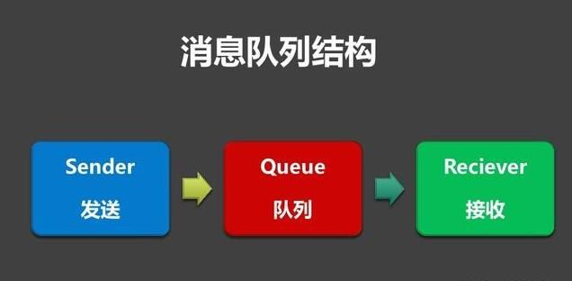

# RPC 框架
1. gRPC google的
> https://github.com/grpc
2. Thrift
3. bRPC 百度的
> https://github.com/apache/incubator-brpc

> 中文文档
> https://github.com/apache/incubator-brpc/blob/master/README_cn.md
3. rest_rpc
- purecpp.org写的rpc
- 消息的序列化使用MessagePack
- https://github.com/qicosmos/rest_rpc

4. ZeroRPC-python实现
- git@github.com:0rpc/zerorpc-python.git

5. RMI（JDK自带）： JDK自带的RPC

6. Dubbo: 
- Dubbo是 阿里巴巴公司开源的一个高性能优秀的服务框架，
- 使得应用可通过高性能的 RPC 实现服务的输出和输入功能，可以和 Spring框架无缝集成。

# 一个RPC框架的关键技术分为两个：
1. 网络传输
2. 序列化和反序列化
3. Call ID映射。怎么告诉远程如何调用

# 序列化框架
1. MessagePack 序列化框架
- MessagePack 是一个高效的二进制序列化框架，它像 JSON 一样支持不同语言间的数据交换，但是它的性能更快，序列化之后的码流也更小。
- MessagePack 提供了对多语言的支持，官方支持的语言如下：Java、Python、Ruby、Haskell、C#、OCaml、Lua、Go、C、C++ 等。
- 可以作为独立的序列化框架

2. Thrift 序列化框架

3. Java 默认的序列化机制 -- 这个不常用

4. Protocol Buffers 序列化框架
- 也就比较流行的
- 可以独立作为序列化框架使用
- IDL 文件定义（*.proto）, 包含数据结构定义，以及可选的服务接口定义（gRPC）

# 消息中间件 和RPC的区别 关联

## 定义

### RPC
- 远程过程调用协议RPC（Remote Procedure Call Protocol) 
- 两台服务器A，B，一个应用部署在A服务器上，想要调用B服务器上应用提供的函数/方法，
- 由于不在一个内存空间，不能直接调用，需要通过网络来表达调用的语义和传达调用的数据。
- RPC的一般需要经历4个步骤：
> 1. **建立通信**
>首先要解决通讯的问题：即A机器想要调用B机器，首先得建立起通信连接，主要是通过在客户端和服务器之间建立TCP连接。

> 2. **服务寻址**
> 要解决寻址的问题，A服务器上如何连接到B服务器（如主机或IP地址）以及特定的端口，方法的名称是什么。

> 3. **网络传输**
> 序列化
> 反序列化

> 4. **服务调用**
> B服务器进行本地调用（通过代理Proxy）之后得到了返回值，此时还需要再把返回值发送回A服务器，同样也需要经过序列化操作，然后再经过网络传输将二进制数据发送回A服务器。
MQ(消息队列)
消息队列（MQ）是一种能实现生产者到消费者单向通信的通信模型，一般来说是指实现这个模型的中间件。

### 典型的MQ中间件
- 典型的特点：
> 1. 解耦
> 2. 可靠投递
> 3. 广播
> 4. 最终一致性
> 5. 流量削峰
> 6. 消息投递保证
> 7. 异步通信（支持同步）
> 8. 提高系统吞吐、健壮性
- 就是具体业务和底层逻辑解耦的组件。相当于前端业务和底层逻辑的中间桥梁。
- 消息中间件是在分布式系统中发送和接受消息的基础服务设施。
- 业务解耦、 削峰填谷
- 秒杀业务中利用MQ来实现流量削峰，以及应用解耦使用。

## 总体差异
1. MQ 是生产者消费者模式。

2. RPC 是请求响应模式。

3. MQ 是面向数据的。

4. RPC 是面向动作的。

5. 消息队列适用于异步场景。

6. rpc是远程同步调用。

7. 消息队列是系统级、模块级的通信。

8. RPC是对象级、函数级通信。

9. 在架构上，RPC和MQ的差异点是，Message有一个中间结点Message Queue，可以把消息存储。

10. 同步调用：对于要立即等待返回处理结果的场景，RPC是首选。异步调用 MQ首选

11. MQ 的使用，一方面是基于性能的考虑，比如服务端不能快速的响应客户端（或客户端也不要求实时响应），需要在队列里缓存。
另外一方面，它**更侧重数据**的传输，因此方式更加多样化，除了点对点外，还有订阅发布等功能。

12. 而且随着业务增长，有的处理端处理量会成为瓶颈，会进行同步调用改造为异步调用，这个时候可以考虑使用MQ。