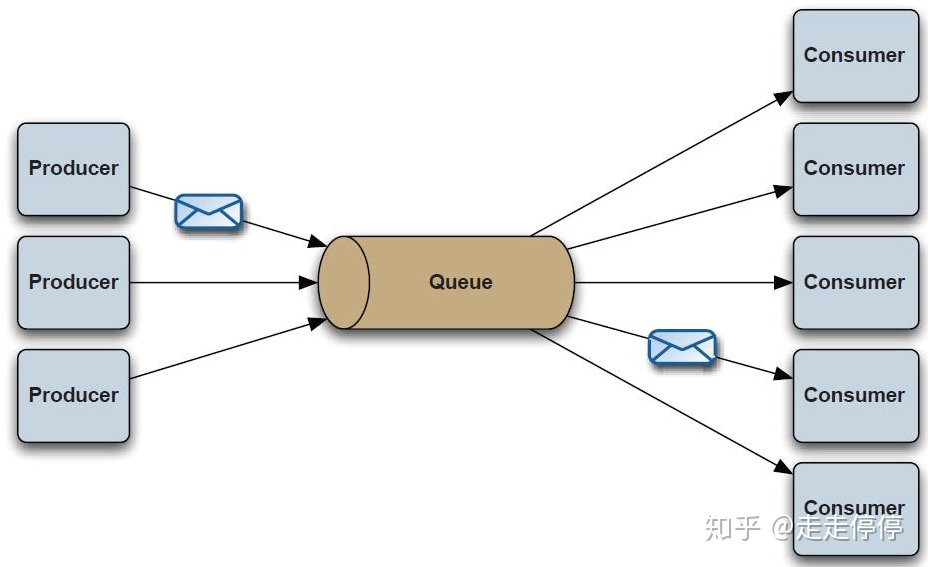
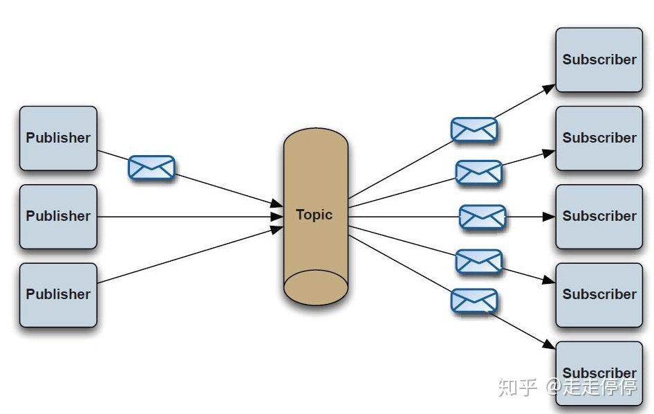
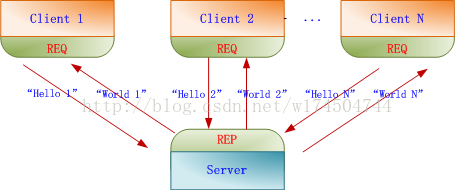
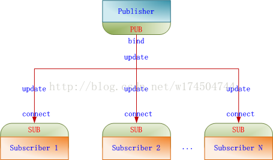
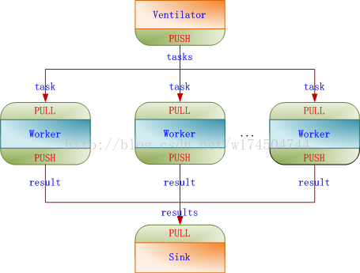
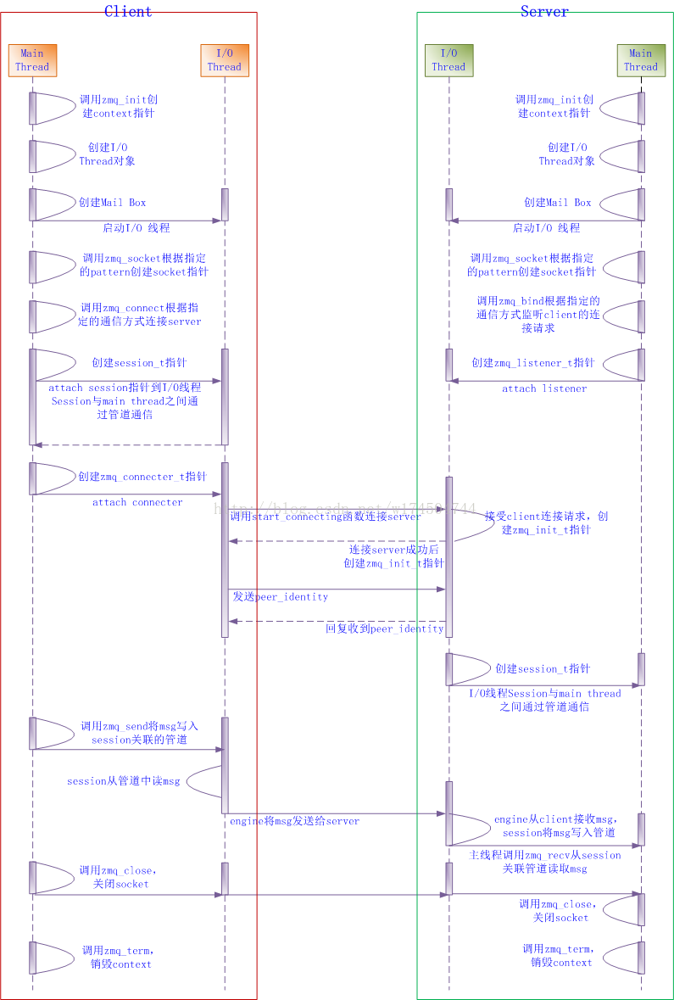
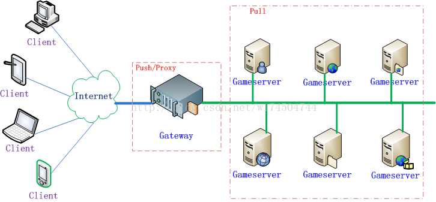

# MessageQueue (MQ) 消息队列
1. kafka
2. rabbitMQ
3. RocketMQ
4. ZeroMQ

- MQ是异步RPC的主要手段之一。
- 生产者消费者模式 推拉模型
- 观察者模式 发布订阅模型
    > 是否有点像Redis中的哨兵
## 消息送达模式
一个 messaging system 最重要的事情莫过于消息送达的模式：at least once 或者 at most once。

### at least once
at least once 是指同一个消息会被传输 1 到 n 次.

如果 messaging system 内建了重传机制，并且将消息持久化到磁盘中以保证即便进程崩溃消息依旧能够送达，那么这就是 at least once。

**场景**：
我们发送一条消息，自然是为了接受者能够保证接收到。至于保证接收的副作用 --- 重传的副本，只要消息的处理是幂等（Idempotent）的，就不会有问题。

### at most once
at most once 是指同一个消息会被传输 0 到 1 次。

如果没有构建任何上述的机制，消息送出后就并不理会，这是 at most once.
**场景**：
>各种网络拓扑下的 heart beat（当然，大部分场合下 heart beat 可以直接用 IP/UDP，不必使用 messaging），偶尔丢几个消息无关痛痒

>密集的 status report message 或者 tracking event。丢失的消息对全局并不构成威胁。

## 消息中间件的组成
-  Broker
> 消息服务器，作为server提供消息核心服务

-  Producer
> 消息生产者，业务的发起方，负责生产消息传输给broker，

- Consumer
> 消息消费者，业务的处理方，负责从broker获取消息并进行业务逻辑处理

- Topic
> 主题，发布订阅模式下的消息统一汇集地，不同生产者向topic发送消息，由MQ服务器分发到不同的订阅者，实现消息的 广播

- Queue
> 队列，PTP模式下，特定生产者向特定queue发送消息，消费者订阅特定的queue完成指定消息的接收

- Message
> 消息体，根据不同通信协议定义的固定格式进行编码的数据包，来封装业务数据，实现消息的传输
## 消息中间件模式分类
- 点对点:使用queue作为通信载体
> 消息生产者生产消息发送到queue中，然后消息消费者从queue中取出并且消费消息。
> 消息被消费以后，queue中不再存储，所以消息消费者不可能消费到已经被消费的消息。
> Queue支持存在多个消费者，但是对一个消息而言，只会有一个消费者可以消费。

- Pub/Sub发布订阅（广播）：使用topic作为通信载体
> 消息生产者（发布）将消息发布到topic中，同时有多个消息消费者（订阅）消费该消息。
> 和点对点方式不同，发布到topic的消息会被所有订阅者消费。
> queue实现了负载均衡，将producer生产的消息发送到消息队列中，由多个消费者消费。
> 但一个消息只能被一个消费者接受，当没有消费者可用时，这个消息会被保存直到有一个可用的消费者。
> topic实现了发布和订阅，当你发布一个消息，所有订阅这个topic的服务都能得到这个消息，所以从1到N个订阅者都能得到一个消息的拷贝。

## 消息中间件的优势
-  系统解耦
> 交互系统之间没有直接的调用关系，只是通过消息传输，故系统侵入性不强，耦合度低。

- 提高系统响应时间
> 例如原来的一套逻辑，完成支付可能涉及先修改订单状态、计算会员积分、通知物流配送几个逻辑才能完成；
> 通过MQ架构设计，就可将紧急重要（需要立刻响应）的业务放到该调用方法中，响应要求不高的使用消息队列，放到MQ队列中，供消费者处理。

- 为大数据处理架构提供服务
> 通过消息作为整合，大数据的背景下，消息队列还与实时处理架构整合，为数据处理提供性能支持。

- Java消息服务——JMS
> Java消息服务（Java Message Service，JMS）应用程序接口是一个Java平台中关于面向消息中间件（MOM）的API，
> 用于在两个应用程序之间，或分布式系统中发送消息，进行异步通信。

> JMS中的P2P和Pub/Sub消息模式：点对点（point to point， queue）与发布订阅（publish/subscribe，topic）最初是由JMS定义的。
> 这两种模式主要区别或解决的问题就是发送到队列的消息能否重复消费(多订阅)。

## 消息中间件应用场景
-  异步通信
> 有些业务不想也不需要立即处理消息。
> 消息队列提供了异步处理机制，允许用户把一个消息放入队列，
> 但并不立即处理它。想向队列中放入多少消息就放多少，然后在需要的时候再去处理它们。

- 解耦
> 降低工程间的强依赖程度，针对异构系统进行适配。
> 在项目启动之初来预测将来项目会碰到什么需求，是极其困难的。
> 通过消息系统在处理过程中间插入了一个隐含的、基于数据的接口层，两边的处理过程都要实现这一接口，当应用发生变化时，可以独立的扩展或修改两边的处理过程，只要确保它们遵守同样的接口约束。

- 冗余
> 有些情况下，处理数据的过程会失败。
> 除非数据被持久化，否则将造成丢失。
> 消息队列把数据进行持久化直到它们已经被完全处理，通过这一方式规避了数据丢失风险。
> **许多消息队列所采用的”插入-获取-删除”范式中，在把一个消息从队列中删除之前，需要你的处理系统明确的指出该消息已经被处理完毕，从而确保你的数据被安全的保存直到你使用完毕。**

- 扩展性
> 因为消息队列解耦了你的处理过程，所以增大消息入队和处理的频率是很容易的，
> 只要另外增加处理过程即可。不需要改变代码、不需要调节参数。便于分布式扩容。

- 过载保护
> 在访问量剧增的情况下，应用仍然需要继续发挥作用，但是这样的突发流量无法提取预知；
> 如果以为了能处理这类瞬间峰值访问为标准来投入资源随时待命无疑是巨大的浪费。
> 使用消息队列能够使关键组件顶住突发的访问压力，而不会因为突发的超负荷的请求而完全崩溃。

- 可恢复性
> 系统的一部分组件失效时，不会影响到整个系统。
> 消息队列降低了进程间的耦合度，所以即使一个处理消息的进程挂掉，加入队列中的消息仍然可以在系统恢复后被处理。

- 顺序保证
> 在大多使用场景下，数据处理的顺序都很重要。
> 大部分消息队列本来就是排序的，并且能保证数据会按照特定的顺序来处理。

-  缓冲
> 在任何重要的系统中，都会有需要不同的处理时间的元素。
> 消息队列通过一个缓冲层来帮助任务最高效率的执行，该缓冲有助于控制和优化数据流经过系统的速度。以调节系统响应时间。

- 数据流处理
> 分布式系统产生的海量数据流，
> 如：业务日志、监控数据、用户行为等，针对这些数据流进行实时或批量采集汇总，
> 然后进行大数据分析是当前互联网的必备技术，通过消息队列完成此类数据收集是最好的选择。

## 消息中间件常用协议
-  AMQP协议
> AMQP即Advanced Message Queuing Protocol,
> 一个提供统一消息服务的应用层标准高级消息队列协议,是应用层协议的一个开放标准,为面向消息的中间件设计。
> 基于此协议的客户端与消息中间件可传递消息，并不受客户端/中间件不同产品，不同开发语言等条件的限制。
> 优点：可靠、通用

- MQTT协议
> MQTT（Message Queuing Telemetry Transport，消息队列遥测传输）
> 是IBM开发的一个即时通讯协议，有可能成为物联网的重要组成部分。
> 该协议支持所有平台，几乎可以把所有联网物品和外部连接起来，被用来当做传感器和致动器（比如通过Twitter让房屋联网）的通信协议。
> 优点：格式简洁、占用带宽小、移动端通信、PUSH、嵌入式系统

- STOMP协议
> STOMP（Streaming Text Orientated Message Protocol）
> 是流文本定向消息协议，是一种为MOM(Message Oriented Middleware，面向消息的中间件)设计的简单文本协议。
> STOMP提供一个可互操作的连接格式，允许客户端与任意STOMP消息代理（Broker）进行交互。
> 优点：命令模式（非topic\queue模式）

- XMPP协议
> XMPP（可扩展消息处理现场协议，Extensible Messaging and Presence Protocol）
> 是基于可扩展标记语言（XML）的协议，多用于即时消息（IM）以及在线现场探测。
> 适用于服务器之间的准即时操作。
> 核心是基于XML流传输，这个协议可能最终允许因特网用户向因特网上的其他任何人发送即时消息，即使其操作系统和浏览器不同。
> 优点：通用公开、兼容性强、可扩展、安全性高，但XML编码格式占用带宽大

- 其他基于TCP/IP自定义的协议
> 有些特殊框架（如：redis、kafka、zeroMq等）根据自身需要未严格遵循MQ规范，
> 而是基于TCP\IP自行封装了一套协议，通过网络socket接口进行传输，实现了MQ的功能。
## 消息幂等性
- 在相同条件下，对于同一个业务，不管执行多少次，结果是一致的。
- 在分布式系统中，幂等性是十分重要的。

## 主流MQ对比
- https://www.cnblogs.com/valor-xh/p/6348009.html

|MQ|实现语言|说明|
|--|-------|---|
|Kafka|Scala、java||
|RabbitMQ|Erlang||
|ActiveMQ|Java|
|Redis|C++|Key-Value的NoSQL，支持MQ|
|ZeroMQ|C++|以组件和库形式组入|
|RocketMQ|java|阿里巴巴自主研发的|
-   TPS 对比
> ZerioMQ 最好 RabbitMQ次之，ActiveMQ最差
- 消息持久化
> 持久化消息主要是指：MQ down或者MQ所在的服务器down了，消息不会丢失的机制。
> ZerioMQ不支持，activeMq和rabbitMq都支持
- RabbitMq比kafka成熟，可用性上，稳定性上，可靠性上 RabbitMQ更好。
- Kafka设计的初衷就是处理日志的，可以看做是一个日志系统，针对性很强，所以它并没有具备一个成熟MQ应该具备的特性

### Kafka
- Kafka是一种分布式的，基于发布/订阅的消息系统。
- 使用scala实现的一个高性能分布式Publish/Subscribe消息队列系统
- 主要设计目标如下：
> 1. 以时间复杂度为O(1)的方式提供消息持久化能力，即使对TB级以上数据也能保证常数时间复杂度的访问性能。
> 2. 高吞吐率。即使在非常廉价的商用机器上也能做到单机支持每秒100K条以上消息的传输。
> 3. 支持Kafka Server间的消息分区，及分布式消费，同时保证每个Partition内的消息顺序传输。
> 4. 同时支持离线数据处理和实时数据处理。
> 5. Scale out：支持在线水平扩展
- 具有以下特性：
> 快速持久化：通过磁盘顺序读写与零拷贝机制，可以在O(1)的系统开销下进行消息持久化；
> 高吞吐：在一台普通的服务器上既可以达到10W/s的吞吐速率；
> 高堆积：支持topic下消费者较长时间离线，消息堆积量大；
> 完全的分布式系统：Broker、Producer、Consumer都原生自动支持分布式，依赖zookeeper自动实现复杂均衡；
> 支持Hadoop数据并行加载：对于像Hadoop的一样的日志数据和离线分析系统，但又要求实时处理的限制，这是一个可行的解决方案。

### RabbitMQ
- Erlang编写
- 本身支持很多的协议：AMQP，XMPP, SMTP, STOMP，
- 也正因如此，它非常重量级，更适合于企业级的开发。
- 同时实现了Broker构架，这意味着消息在发送给客户端时先在中心队列排队。
- 对路由，负载均衡或者数据持久化都有很好的支持。
- 多用于进行企业级的ESB整合。

### RocketMQ
- 阿里系下开源的一款分布式、队列模型的消息中间件，
- 原名Metaq，3.0版本名称改为RocketMQ，是阿里参照kafka设计思想使用java实现的一套mq。
- 同时将阿里系内部多款mq产品（Notify、metaq）进行整合，
- 只维护核心功能，去除了所有其他运行时依赖，保证核心功能最简化，
- 在此基础上配合阿里上述其他开源产品实现不同场景下mq的架构，目前主要多用于订单交易系统。
- 具有以下特点：
> 能够保证严格的消息顺序
> 提供针对消息的过滤功能
> 提供丰富的消息拉取模式
> 高效的订阅者水平扩展能力
> 实时的消息订阅机制
> 亿级消息堆积能力

### Redis
- Redis是一个C语言开发的基于Key-Value对的NoSQL数据库，但它本身支持MQ功能，所以完全可以当做一个轻量级的队列服务来使用
- 实验表明：
> 入队时，当数据比较小时Redis的性能要高于RabbitMQ，而如果数据大小超过了10K，Redis则慢的无法忍受；
> 出队时，无论数据大小，Redis都表现出非常好的性能，而RabbitMQ的出队性能则远低于Redis。

### ZeroMQ
- ZeroMQ号称最快的消息队列系统，尤其针对大吞吐量的需求场景。
- ZeroMQ能够实现RabbitMQ不擅长的高级/复杂的队列，但是开发人员需要自己组合多种技术框架，技术上的复杂度是对这MQ能够应用成功的挑战。
- ZeroMQ具有一个独特的非中间件的模式，你不需要安装和运行一个消息服务器或中间件，因为你的应用程序将扮演这个服务器角色。
- 你只需要简单的引用ZeroMQ程序库，然后你就可以愉快的在应用程序之间发送消息了。
- 但是ZeroMQ仅提供非持久性的队列，也就是说如果宕机，数据将会丢失。
- 其中，Twitter的Storm 0.9.0以前的版本中默认使用ZeroMQ作为数据流的传输（Storm从0.9版本开始同时支持ZeroMQ和Netty作为传输模块）。
- ZeroMQ套接字是与传输层无关的：ZeroMQ套接字对所有传输层协议定义了统一的API接口。
> 默认支持 进程内(inproc) ，进程间(IPC) ，多播，TCP协议，在不同的协议之间切换只要简单的改变连接字符串的前缀。
- **可以在任何时候以最小的代价从进程间的本地通信切换到分布式下的TCP通信。ZeroMQ在背后处理连接建立，断开和重连逻辑。**

- 特性：
1. 无锁的队列模型：
> 对于跨线程间的交互（用户端和session）之间的数据交换通道pipe，采用无锁的队列算法CAS；
> 在pipe的两端注册有异步事件，在读或者写消息到pipe的时，会自动触发读写事件。

2. 批量处理的算法：对于批量的消息，进行了适应性的优化，可以批量的接收和发送消息。
3. 多核下的线程绑定，无须CPU切换：
> 区别于传统的多线程并发模式，信号量或者临界区，zeroMQ充分利用多核的优势，每个核绑定运行一个工作者线程，避免多线程之间的CPU切换开销。

### ActiveMQ
- ActiveMQ是Apache下的一个子项目。 
- 使用Java完全支持JMS1.1和J2EE 1.4规范的 JMS Provider实现，少量代码就可以高效地实现高级应用场景。
- 类似于ZeroMQ，它能够以代理人和点对点的技术实现队列。
- 同时类似于RabbitMQ，它少量代码就可以高效地实现高级应用场景
- 可插拔的传输协议支持，比如：in-VM, TCP, SSL, NIO, UDP, multicast, JGroups and JXTA transports。
- RabbitMQ、ZeroMQ、ActiveMQ均支持常用的多种语言客户端 C++、Java、.Net,、Python、 Php、 Ruby等。

### Kafka/Jafka
- Kafka是Apache下的一个子项目，是一个高性能跨语言分布式发布/订阅消息队列系统，
- 而Jafka是在Kafka之上孵化而来的，即Kafka的一个升级版。
- 具有以下特性：
> 1. 快速持久化，可以在O(1)的系统开销下进行消息持久化；
> 2. 高吞吐，在一台普通的服务器上既可以达到10W/s的吞吐速率；
> 3. 完全的分布式系统，Broker、Producer、Consumer都原生自动支持分布式，自动实现负载均衡；
> 4. 支持Hadoop数据并行加载，对于像Hadoop的一样的日志数据和离线分析系统，但又要求实时处理的限制，这是一个可行的解决方案。
- Kafka通过Hadoop的并行加载机制统一了在线和离线的消息处理。
- Apache Kafka相对于ActiveMQ是一个非常轻量级的消息系统，除了性能非常好之外，还是一个工作良好的分布式系统。

----

# ZeroMQ
- ZeroMQ号称是“史上最快的消息队列”，基于c语言开发的.
- 它虽然是以C为源码进行开发，但是可以绑定多种语言。
- 实时流处理sorm的task之间的通信就是用的zeroMQ。
- 引用官方说法，“ZMQ(以下ZeroMQ简称ZMQ)是一个简单好用的传输层，像框架一样的一个socket library，他使得Socket编程更加简单、简洁和性能更高。
- 是一个消息处理队列库，可在多个线程、内核和主机盒之间弹性伸缩。
- ZMQ的明确目标是“成为标准网络协议栈的一部分，之后进入Linux内核”。现在还未看到它们的成功。
- 但是，它无疑是极具前景的、并且是人们更加需要的“传统”BSD套接字之上的一 层封装,ZMQ让编写高性能网络应用程序极为简单和有趣。” 
- 确实，它跟RabbitMQ，ActiveMQ之类有着相当本质的区别，
- ZeroMQ根本就不是一个消息队列服务器，更像是一组底层网络通讯库，对原有的Socket API加上一层封装，是我们操作更简便。
- ZeroMQ与其他MQ类似，也实现了3中最基本的工作模式：发布-订阅，请求-应答，管道
 

## 优点
- 高到离谱的吞吐量、可自行开发持久化、支持数据量较小的持久化、不过只是保存到内存中。
- 除了点对点 即：请求-应答模式(是一对一)不可有消息丢失 、其他都没有对消息丢失做强烈的保证、
- 官方给出的观点：我们希望消息的尽快送达、而不介意消息的丢失
- 在传统TCP中的Server-client中，server要先启动，然后bind到一个端口，等待client调用connect连接它。 而0MQ中调用zmq_bind和调用zmq_connect的双方没有那么严格的先后顺序。这也是0MQ有趣的特性之一。

## 缺点
- Concurrency model 在设计上存在一定的缺陷
- ZeroMQ 并非严格意义上的 at least once 或者 at most once
    > 以其 Pub/Sub 模式来说，ZeroMQ 构建了消息确认和重传机制，却未对消息进行持久化，
    > 那么内存耗尽或者进程崩溃都会造成消息丢失，而重传则可能会造成消息被发送 1 到 n 次

## [官网](https://zeromq.org/)
- guide文档 https://zguide.zeromq.org/
- https://github.com/anjuke/zguide-cn  中文翻译文档，但是版本比较老
- book: ZeroMQ
> 作者: Pieter Hintjens
> 出版社: O'Reilly Media
> 副标题: Messaging for Many Applications
> 出版年: 2013-3-28
> 页数: 516
> 定价: USD 39.99
> 装帧: Paperback
> ISBN: 9781449334062
- csdn 源码分析的文章 https://blog.csdn.net/kaka11/category_619873.html 
##  ZeroMQ概述

ZeroMQ是一种基于消息队列的多线程网络库，
其对套接字类型、连接处理、帧、甚至路由的底层细节进行抽象，提供跨越多种传输协议的套接字。

ZeroMQ是网络通信中新的一层，介于应用层和传输层之间（按照TCP/IP划分），
其是一个可伸缩层，可并行运行，分散在分布式系统间。

## 系统架构

### 总体架构
- ZeroMQ几乎所有的I/O操作都是异步的，主线程不会被阻塞。
- ZeroMQ会根据用户调用zmq_init函数时传入的接口参数，创建对应数量的I/O Thread。
    > 每个I/O Thread都有与之绑定的Poller.
    > Poller采用经典的Reactor模式实现.
    > Poller根据不同操作系统平台使用不同的网络I/O模型（select、poll、epoll、devpoll、kequeue等）。
- 主线程与I/O线程通过Mail Box传递消息来进行通信。
    > Server开始监听或者Client发起连接时：
    > 在主线程中创建zmq_connecter或zmq_listener，
    > 通过Mail Box发消息的形式将其绑定到I/O线程，
    > I/O线程会把zmq_connecter或zmq_listener添加到Poller中用以侦听读/写事件。
    
    > Server与Client在第一次通信时，会创建zmq_init来发送identity，用以进行认证。
    > 认证结束后，双方会为此次连接创建Session，以后双方就通过Session进行通信。
    > 每个Session都会关联到相应的读/写管道， 主线程收发消息只是分别从管道中读/写数据。
    > Session并不实际跟kernel交换I/O数据，而是通过plugin到Session中的Engine来与kernel交换I/O数据。

- 所处的层次
    > ZeroMQ不是单独的服务或者程序，仅仅是一套组件，
    > 其封装了网络通信、消息队列、线程调度等功能，向上层提供简洁的API，
    > 应用程序通过加载库文件，调用API函数来实现高性能网络通信。

    > ==== Application===
    > ==== ZerioMQ=======
    > ==== OS API========

### 消息模型
ZeroMQ将消息通信分成4种模型：
- 一对一结对模型 Exclusive-Pair 
- 请求回应模型 Request-Reply 
- 发布订阅模型 Publish-Subscribe 
- 推拉模型 Push-Pull 

这4种模型总结出了通用的网络通信模型，在实际中可以根据应用需要，组合其中的2种或多种模型来形成自己的解决方案。

#### Exclusive-Pair 模型
- 最简单的1:1消息模型，可以认为就是一个TCP Connection，
- 但是一个TCP Server只能接收一个连接。不同于 Req-Rep模型。

#### Request-Reply 模型
- 客户端发起请求，然后等服务端回应请求。
- 一个请求必须对应一个回应。
- 从客户端看是发-收 配对。从服务端看是收-发 配对。
- 同Exclusive-Pair不同的是 可以N个客户端对应1个服务端。
- 该模型主要用于远程调用及任务分配等.

#### Publish-Subscribe 模型
- 发布端单向分发数据，且不关心是否把全部信息发送给订阅端。
- 如果发布端开始发布信息时，订阅端尚未连接上来，则这些信息会被直接丢弃。
- 订阅端未连接导致信息丢失的问题，可以通过与请求回应模型组合来解决。
- 订阅端只负责接收，而不能反馈，且在订阅端消费速度慢于发布端的情况下，会在订阅端堆积数据。
- 该模型主要用于数据分发。天气预报、微博明星粉丝可以应用这种经典模型。

#### Push-Pull 模型
- Server端作为Push端，而Client端作为Pull端，
- 如果有多个Client端同时连接到Server端，则Server端会在内部做一个负载均衡,采用平均分配的算法，将所有消息均衡发布到Client端上。
- 与发布订阅模型相比，推拉模型在没有消费者的情况下，发布的消息不会被消耗掉；
- 在消费者能力不够的情况下，能够提供多消费者并行消费解决方案。
- 该模型主要用于多任务并行。
- **???? 这个模型不是太理解应用场景的原理等等**

### 通信协议
- 提供进程内、进程间、机器间、广播等四种通信协议。
- 通信协议配置简单，用类似于URL形式的字符串指定即可。
- 格式分别为inproc://、ipc://、tcp://、pgm://。
- ZeroMQ会自动根据指定的字符串解析出协议、地址、端口号等信息。
## 工作流程

## 应用场景
- 应用ZeroMQ的Push-Pull模型实现联众游戏服务器的“热插拔”、负载均衡和消息派发。
- 按照如下图 部署服务器：
> Push端充当Gateway，作为一组游戏服务器集群最上层的一个Proxy，起负载均衡的作用，
> 所有Gameserver作为Pull端。当一个请求到达Push端（Gateway）时，Push端根据一定的分配策略将任务派发到Pull端（Gameserver）。
> 以联众某款游戏A为例，游戏A刚上线时，预计最大同时在线人数是10W，单台Gameserver并发处理能力为1W，需要10台Gameserver，
> 由于游戏A可玩性非常好，半个月后最大同时在线人数暴增到50W，
> 那么不需要在某天的凌晨将Gateway和Gameserver停机，只需要随时在机房新添加40台Gameserver，启动并连接到Gateway即可。

- ZeroMQ中对Client和Server的启动顺序没有要求，Gameserver之间如果需要通信的话，Gameserver的应用层不需要管理这些细节，ZeroMQ已经做了重连处理。

## 总结

### 简单

1. 仅仅提供24个API接口，风格类似于BSD Socket。

2. 处理了网络异常，包括连接异常中断、重连等。

3. 改变TCP基于字节流收发数据的方式，处理了粘包、半包等问题，以msg为单位收发数据，结合Protocol Buffers，可以对应用层彻底屏蔽网络通信层。

4. 对大数据通过SENDMORE/RECVMORE提供分包收发机制。

5. 通过线程间数据流动来保证同一时刻任何数据都只会被一个线程持有，以此实现多线程的“去锁化”。

6. 通过高水位HWM来控制流量，用交换SWAP来转储内存数据，弥补HWM丢失数据的缺陷。

7. 服务器端和客户端的启动没有先后顺序。

### 灵活

1. 支持多种通信协议，可以灵活地适应多种通信环境，包括进程内、进程间、机器间、广播。

2. 支持多种消息模型，消息模型之间可以相互组合，形成特定的解决方案。

3. 跨平台 支持Linux、Windows、OS X等。

4. 多语言,可以绑定C、C++、Java、.NET、Python等30多种开发语言。

5. 高性能,相对同类产品，性能卓越。

### 参考文章
- https://blog.csdn.net/w174504744/article/details/73187697

## ZeroMQ无锁队列分析
- 
- ZeroMQ使用了一个无锁队列，用于线程间的高性能数据交换。这个无锁队列由两个对象组成：
> yqueue_t: 一个普通的队列，实现内存块链表，以及内存块的回收和重复利用。
> ypipe_t: 基于yqueue_t实现的无锁管道队列，实现一读一写的无锁操作。
> yqueue_t类实现了一个普通的队列（多线程不安全），但为了提高性能，使用了内存块链的方式，每个内存块可支持多个数据元素节点。

## nanomsg 
- nanomsg 是一个套接字库，提供了多种常见的通信协议，其目标是使网络层更快、更具扩展性、更容易使用。
- 它用 C 进行了彻底地重写，可以说是对 ZeroMQ 的重建。它构建在 ZeroMQ 的可靠性能之上，同时又提供了若干重要的改进。
- 二者的对比:
> 1. 用于新传输协议的 API——对于 ZeroMQ，人们经常抱怨的问题是它没有提供用于新传输协议的 API，
> 这从根本上把用户限制在 TCP、PGM、IPC 和 ITC 上。
> 而 nanomsg 提供了一个可插拔的接口，用于新的传输（如 WebSockets）和消息协议。

> 2. POSIX 兼容性——nanomsg 完全兼容 POSIX，而且 API 更简洁，兼容性更好。
> 在 ZeroMQ 中，套接字用空指针表示，然后绑定到上下文；而在 nanomsg 中，只需要初始化一个新的套接字并使用它，一步即可完成。

> 3. 线程安全——ZeroMQ 在架构上有一个根本性缺陷：其套接字不是线程安全的。
> 在 ZeroMQ 中，每个对象都被隔离在自己的线程中，因此不需要信号量和互斥锁。
> 并发是通过消息传递实现的。nanomsg 消除了对象与线程间的一对一关系，它不再依赖于消息传递，而是将交互建模为一组状态机。
> 因此，nanomsg 套接字是线程安全的。

> 4. 内存和 CPU 使用效率——ZeroMQ 使用一种很简单的 Trie 结构存储和匹配发布 / 订阅服务。
> 当订阅数超过 10000 时，该结构很快就显现出不合理之处了。
> nanomsg 则使用一种称为“基数树（radix tree）”的结构来存储订阅，并提供了真正的零复制 API，允许内存从一台机器复制到另一台机器，而且完全不需要 CPU 的参与，这极大地提高了性能。

> 5. 负载均衡算法——ZeroMQ 采用了轮转调度算法。虽然该算法可以平均分配工作，但也有其局限性。
> 比如，有两个数据中心，一个在伦敦，一个在纽约。
> 在理想情况下，一个位于伦敦数据中心的网站，其请求不应该路由到纽约。
> 但在ZeroMQ 的负载均衡算法里，这完全有可能。而 nanomsg 避免了这种情况的出现。

## 自己的思考
- 如何监控Zerio 的socket
1. 例如 重连 连接断开等等，需要后续调研
2. Zerio只是一个消息的发送-接收，需要自己考虑如何实现 序列化-反序列化

# 消息队列面试详解

## 用途
- 解耦
    > 业务逻辑和IO等解耦，各个子系统间不再耦合。
    > 比如说某一个系统A要与其他系统打交道（即调用其中的方法），如果其它系统改变或者新增系统，那么A系统都会改变，这样的话耦合度比较高，比较麻烦。
- 异步
    > 某一个用户使用系统A，但是A要调用系统B,C,D,但是每一个系统返回的时间是不一样的，你必须要等待全部返回后才可以响应用户。
    > 如果我们这里采用消息队列，当用户发送请求后，我们把数据传给消息队列，然后再直接响应给用户我已经发送了信息。
- 削峰
    > 比如平常用户的请求我们会直接访问数据库，在大量用户过来的时候，这样的话我们会对数据库照常比较大的压力

- 日志处理
- 消息通讯

## 缓存
- 缓存穿透：
> 是在缓存和数据库都查不到
> 经常所的空数据

- 缓存击穿：是量太大缓存过期（某一个键值过期）

- 缓存雪崩和缓存击穿的区别：缓存雪崩式很多key过期缓存击穿是某一个key过期。

