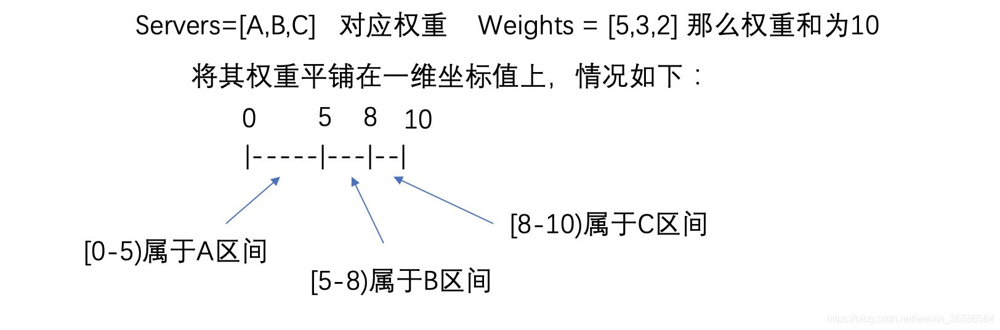

# 负载均衡
## 什么是负载均衡 
1. 负载均衡指多台服务器以对称的方式组成一个服务器集合，每台服务器都具有等价的地位，都可以单独对外提供服务而无须其他服务器的辅助。
2. 通过某种负载分担任务，将外部发送来的请求均匀分配到对称结构中的某一台服务器上，而接受到的请求的服务器独立地回应客户的请求。
3. 负载均衡能够平均分配客户请求到服务器阵列，借此提供快速获取重要数据，解决大量并发访问服务问题，这种集群技术可以用最少的投资获得接近于大型主机的性能。

## 负载均衡方式：
软件负载均衡：Nginx、LVS、HAProxy
硬件负载均衡：Array、F5
## 常见算法
常见的负载均衡算法有：随机算法、加权轮询、一致性hash、最小活跃数算法

## 随机算法 Random
1. 先定义一个服务器列表
```java
public class ServerIps {
    public static final List<String> LIST = Arrays.asList(
            "192.168.0.1",
            "192.168.0.2",
            "192.168.0.3",
            "192.168.0.4",
            "192.168.0.5",
            "192.168.0.6",
            "192.168.0.7",
            "192.168.0.8",
            "192.168.0.9",
            "192.168.0.10"
    );
}
```

2. 最简单的实现
```java
/**
 * 随机算法
 */
public class Random {
    public static String getServer() {
        // 生成一个随机数作为list的下标值
        java.util.Random random = new java.util.Random();
        int randomPos = random.nextInt(ServerIps.LIST.size());
        return ServerIps.LIST.get(randomPos);
    }
    public static void main(String[] args) {
        //连续调用10次
        for (int i=0; i<10; i++) {
            System.out.println(getServer());
        }
    }
}

```
当调用次数比较少时，Random产生的随机数可能会比较集中，此时多数请求会落到同一台服务器上，只有在经过多次请求后，才能使调用请求进行“均衡”分配。

上面的随机算法适用于每台机器的性能差不多的时候，实际上，生产中可能某些机器的性能更高一点，它可以处理更多的请求，所以，我们可以对每台服务器设置一个权重。

##  权重随机算法
1. 前提定义
```java
public class ServerIps {
    public static final Map<String, Integer> WEIGHT_LIST = new HashMap<String, Integer>();
    static {
        // 权重之和为50
        WEIGHT_LIST.put("192.168.0.1", 1);
        WEIGHT_LIST.put("192.168.0.2", 8);
        WEIGHT_LIST.put("192.168.0.3", 3);
        WEIGHT_LIST.put("192.168.0.4", 6);
        WEIGHT_LIST.put("192.168.0.5", 5);
        WEIGHT_LIST.put("192.168.0.6", 5);
        WEIGHT_LIST.put("192.168.0.7", 4);
        WEIGHT_LIST.put("192.168.0.8", 7);
        WEIGHT_LIST.put("192.168.0.9", 2);
        WEIGHT_LIST.put("192.168.0.10", 9);
    }
}
```
2. 简单暴力实现
```java
/**
 * 简单的权重随机算法
 */
public class WeightRandom {
    public static String getServer() {
        // 生成一个随机数作为listd的下标志
        List<String> ips = new ArrayList<String>();
        for (String ip : ServerIps.WEIGHT_LIST.keySet()) {
            Integer weight = ServerIps.WEIGHT_LIST.get(ip);
            // 按权重进行复制
            for (int i=0; i<weight; i++) {
                ips.add(ip);
            }
        }
        java.util.Random random = new java.util.Random();
        int randomPos = random.nextInt(ips.size());
        return ips.get(randomPos);
    }
    public static void main(String[] args) {
        // 连续调用10次
        for (int i=0; i<10; i++) {
            System.out.println(getServer());
        }
    }
}

```
这种实现方法在遇到权重之和特别大的时候就会比较消耗内存，因为需要对IP地址进行复杂，权重之和越大你那么上文中的ips就需要越多的内存，下面介绍另外一种实现思路。

3. 权重随机算法 -- 实现二 


> 通过随机数生成器生成一个范围在[0,10)至今的随机数，
> 然后计算这个随机数会落到哪个区间上，即可知道返回的是哪个服务器。
>比如随机数为3，那么就返回A服务器。

> 权重越大的机器，在坐标轴上对应的区间范围就越大，
> 因此随机数生成的数字就会有更大的概率落到此区间内。
> 只要随机数生成器产生的随机数分别性很好，在经过多次选择后，每个服务器被选择的次数比例接近其权重比例。

假设现在随机数offset=7:
1、offset<5 is false,所以不再[0,5)区间，将offset=offset-5(offset=2)；
2、offset<3 is true,所以处于[5,8)区间，所以应该选用B服务器。
```java
/**
 * 权重随机算法2
 */
public class WeightRandomV2 {
    public static String getServer() {
        int totalWeight = 0;
        boolean sameWeight = true; // 如果所以权重都相等，那么随机一个ip就好了
        Object[] weights = ServerIps.WEIGHT_LIST.values().toArray();
        for (int i = 0; i < weights.length; i++) {
            Integer weight = (Integer) weights[i];
            totalWeight += weight;
            if (sameWeight && i > 0 && !weight.equals(weights[i - 1])) {
                sameWeight = false;
            }
        }
        java.util.Random random = new java.util.Random();
        int randomPos = random.nextInt(totalWeight);
        if (!sameWeight) {
            for (String ip : ServerIps.WEIGHT_LIST.keySet()) {
                Integer value = ServerIps.WEIGHT_LIST.get(ip);
                if (randomPos < value) {
                    return ip;
                }
                randomPos = randomPos - value;
            }
        }
        return (String) ServerIps.WEIGHT_LIST.keySet().toArray()[new
                java.util.Random().nextInt(ServerIps.WEIGHT_LIST.size())];
    }
    public static void main(String[] args) {
        // 连续调用10次
        for (int i = 0; i < 10; i++) {
            System.out.println(getServer());
        }
    }
}
```

## 轮询 Round Robin
轮询调度算法的原理是每一次把来自用户的请求轮流分配给内部中的服务器，

从1开始，直到N(内部服务器个数)，然后重新开始循环。

算法的优点是其简洁性，它无需记录当前所有连接的状态，所以它是一种无状态调度。

### 实现原理

1. 随时可能有机器上线、下线或者宕机，因此为了避免可能出现的并发问题，方法内部要新建局部变量serverMap，

现将serverMap中的内容复制到线程本地，以避免被多个线程修改。

2. 这样可能会引入新的问题，复制以后serverWeightMap的修改无法反映给serverMap，

也就是说这一轮选择服务器的过程中，新增服务器或者下线服务器，负载均衡算法将无法获知。

新增无所谓，如果有服务器下线或者宕机，那么可能会访问到不存在的地址。

因此，服务调用端需要有相应的容错处理，比如重新发起一次server选择并调用。


3. 轮询法的优点在于：试图做到请求转移的绝对均衡。

4. 轮询法的缺点在于：为了做到请求转移的绝对均衡，必须付出相当大的代价，因为为了保证选择服务器（pos变量修改的互斥性）唯一性，需要引入重量级的悲观锁synchronized，这将会导致该段轮询代码的并发吞吐量发生明显的下降。

5. 简单暴力实现
也可以将ServerIps.LIST本地线程拷贝，解决新增服务器问题，但是解决不了服务器下线或者宕机问题，需要调用端容错，再次发起请求。
```java
/**
 * 简单轮询算法
 */
public class RoundRobin {

    //当前循环的位置
    private static Integer pos = 0;
    public static String getServer() {
        String ip = null;
        // pos同步
        synchronized (pos) {
            if (pos >= ServerIps.LIST.size()) {
                pos = 0;
            }
            ip = ServerIps.LIST.get(pos);
            pos++;
        }
        return ip;
    }
    public static void main(String[] args) {
        //连续调用10次
        for (int i = 0; i < 10; i++) {
            System.out.println(getServer());
        }
    }
}
```

## 加权轮询 Weighted Round Robin
Servers=[A,B,C] 对应权重 Weights = [2,5,1] 那么权重和为8；
比如调用10次，其调用顺序为AABBBBBCAA
调用编号会越来越大，而服务器是固定的，所以需要把调用编号“缩小”，这里对调用编号进行取余，除数为总权重和，比如：
> 1. 1号调用，1%8=1；
> 2. 2号调用，2%8=2；
> 3. 3号调用，3%8=3；
> 4. 8号调用，8%8=0；
> 5. 9号调用，9%8=1；
> 6. 100号调用，100%8=4；

我们发现调用编号可以被缩小为0-7之间的8个数字，问题是怎么根据这8个数字找到对应的服务器咧？和我们随机算法类似，这里也可以把权重想象为一个坐标轴"0-----2----7—8"。

> 1. 1号调用 1%8=1，offset=1，offset <=2 is true,调 A
> 2. 2号调用 2%8=2，offset=2，offset <=2 is true,调 A
> 3. 3号调用 3%8=3，offset=3，offset <=2 is false, offset -2 ,offset=1, offset <=5调 B
> 4. 8号调用 8%8=0，offset=0，特殊情况 offset = 8, offset <=2 is false,offset -2= 6, offset <=5 is false, offset -5=1, offset <=1 is true 调用C

```java
public class ServerIps {
c static final Map<String, Integer> WEIGHT_LIST = new HashMap<String, Integer>();
    static {
        // 权重之和为50
//        WEIGHT_LIST.put("192.168.0.1", 1);
//        WEIGHT_LIST.put("192.168.0.2", 8);
//        WEIGHT_LIST.put("192.168.0.3", 3);
//        WEIGHT_LIST.put("192.168.0.4", 6);
//        WEIGHT_LIST.put("192.168.0.5", 5);
//        WEIGHT_LIST.put("192.168.0.6", 5);
//        WEIGHT_LIST.put("192.168.0.7", 4);
//        WEIGHT_LIST.put("192.168.0.8", 7);
//        WEIGHT_LIST.put("192.168.0.9", 2);
//        WEIGHT_LIST.put("192.168.0.10", 9);
        WEIGHT_LIST.put("A", 2);
        WEIGHT_LIST.put("B", 5);
        WEIGHT_LIST.put("C", 1);
    }
}

/**
 * 权重加轮询算法
 */
public class WeightRoundRobin {
    public static Integer num = 0;
    public static String getServer() {
        int totalWeight = 0;
        boolean sameWeight = true; // 如果所以权重都相等，那么随机一个ip就好了
        Object[] weights = ServerIps.WEIGHT_LIST.values().toArray();
        for (int i = 0; i < weights.length; i++) {
            Integer weight = (Integer) weights[i];
            totalWeight += weight;
            if (sameWeight && i > 0 && !weight.equals(weights[i - 1])) {
                sameWeight = false;
            }
        }
        Integer sequenceNum = getAndIncrement();
        Integer offset = sequenceNum % totalWeight;
        offset = offset == 0 ? totalWeight : offset;
        if (!sameWeight) {
            for (String ip : ServerIps.WEIGHT_LIST.keySet()) {
                Integer weight = ServerIps.WEIGHT_LIST.get(ip);
                if (offset <= weight) {
                    return ip;
                }
                offset = offset - weight;
            }
        }
        return null;
    }

    public static Integer getAndIncrement() {
        return ++num;
    }

    public static void main(String[] args) {
        连续调用10次
        for (int i = 0; i < 10; i++) {
            System.out.println(getServer());
        }
    }
}


```

但是这种算法有一个缺点：一台服务器的权重特别大的时候，他需要连续的处理请求，但是实际上我们想达到的效果是对于100次请求，只要100*8%50=16次就够了，这16次不一定要连续的访问，比如假设我们有三台服务器Servers=[A,B,C] 对应权重 Weights = [5,1,1] 那么权重和为7，
那么上述这个算法的结果就是：AAAAABC，那么如果能够是这么一个结果呢：AABACAA，把B和C平均插入到5个A中间，这样是比较均衡的了。

## 平滑加权轮询
原理：
>每个服务器对应2个权重，分别为Weight和CurrentWeight。
>其中Weight是固定的，CurrentWeight是动态的，初始值为0.
>当有新的请求进来时，遍历服务器列表，让它的CurrentWeight加上自身权重。
>遍历完后，找到最大的CurrentWeight，并将其减去权重总和，然后返回相应服务器就可以了。

下列表中，比如
请求编号1中，初始值为[5, 1, 1]，数组中最大的值5，那么选择结果为A，选择后最大的值5减去权重和7，变成了[-2, 1, 1]；

请求编号2来的时候，[-2, 1, 1]加上[5, 1, 1]，那么就变成编号2中的初始值为[3, 2, 2]，数组中最大的值3，那么选择结果为A，最大的值3减去权重和7，变成了[-4, 2, 2]；

请求编号3来的时候，[-4, 2, 2]加上[5, 1, 1]，那么就变成编号2中的初始值为[1, 3, 3]，数组中最大的值3，那么选择结果为B，最大的值3减去权重和7，变成了[1, -4, 3]；
以此类推。。。。。。。。

|请求编号|CurrentWeight数组[currentWeight+=weight]|选择结果(Max(CurrentWeight))|减去权重总和(Max(CurrentWeight) -= sum(weight))|
|------|------|------|-------|
|1| [5,1,1]+[0,0,0]=[5,1,1]  | A (5) | [-2,1,1]|
|2| [-2,1,1]+[5,1,1]=[3,2,2] | A (3) | [-4,2,2]|
|3| [-4,2,2]+[5,1,1]=[1,3,3] | B (3) | [1,-4,3]|
|4| [1,-4,3]+[5,1,1]=[6,-3,4]| A (6) | [-1,-3,4]|
|5| [-1,-3,4]+[5,1,1]=[4,-2,5]|C (5) | [4,-2,-2]|
|6| [4,-2,-2]+[5,1,1]=[9,-1,-1]| A (9)| [2,-1,-1]|
|7| [2,-1,-1]+[5,1,1]=[7,0,0]| A (7) | [0,0,0]|

如上，经过平滑处理后，序列：AABACAA，相比之前：AAAAABC,分布能好些，

初始化情况CurrentWeight=[0,0,0],经过第7个请求，CurrentWeight再次变为[0,0,0]

```java
    public static final Map<String, Integer> WEIGHT_LIST = new HashMap<String, Integer>();
    static {
        WEIGHT_LIST.put("A", 5);
        WEIGHT_LIST.put("B", 1);
        WEIGHT_LIST.put("C", 1);
    }
}

/**
 * 权重平滑加轮询算法
 */
public class WeightRoundRobinV2 {
    private static Map<String, Weight> weightMap = new HashMap<String, Weight>();
    public static String getServer() {
        // java8
        int totalWeight = ServerIps.WEIGHT_LIST.values().stream().reduce(0, (w1, w2) -> w1+w2);
        // 初始化weightMap，初始值currentWeight复制为weight
        if (weightMap.isEmpty()) {
            ServerIps.WEIGHT_LIST.forEach((key, value) -> {
                weightMap.put(key, new Weight(key, value, value));
            });
        }
        // 找出currentWeight最大值
        Weight maxCurrentWeight = null;
        for (Weight weight : weightMap.values()) {
            if (maxCurrentWeight == null || weight.getCurrentWeight() >
                    maxCurrentWeight.getCurrentWeight()) {
                maxCurrentWeight = weight;
            }
        }
        // 将maxCurrentWeight减去总权重和
        maxCurrentWeight.setCurrentWeight(maxCurrentWeight.getCurrentWeight() -
                totalWeight);
        // 所有的ip的currentWeight统一加上权重
        for (Weight weight : weightMap.values()) {
            weight.setCurrentWeight(weight.getCurrentWeight() + weight.getWeight());
        }
        // 返回maxCurrentWeight所对应的ip
        return maxCurrentWeight.getIp();
    }
    public static void main(String[] args) {
        //连续调用10次
        for (int i = 0; i < 10; i++) {
            System.out.println(getServer());
        }
    }
}

```

## 一致性哈希实现负载均衡
为什么需要哈希算法
解决同一个用户访问服务器是，访问的是不同的服务器的问题

场景：集群造成的session没有同步

当一个用户访问服务器A的时候，该台服务器A会保存这台服务器的session，但是当下次再访问的时候，被负载均衡算法可能算到了不同的服务器B，服务器B中没有用户的session，会要求用户再次登录。

解决：
1. 加入redis，将session存到redis中
2. Tomcat同步session
3. 一致性哈希算法

## 最小活跃数
由于服务的时间并不是固定，如果平均分配服务器有的时候并不合理

比如：
有3个消息，分别请求了A、B、C三台服务器，处理的时间依次为3s、2s、1s，当1s后有一个新的请求过来，按道理说应该A服务器来服务，但是C台服务器已经空闲了，所有这样的分配方式有时候并不合理。

解决：
采用最小活跃数，哪台机器服务最少，用哪台机器，当都大致相等的时候可以根据前面的随机、轮询等。