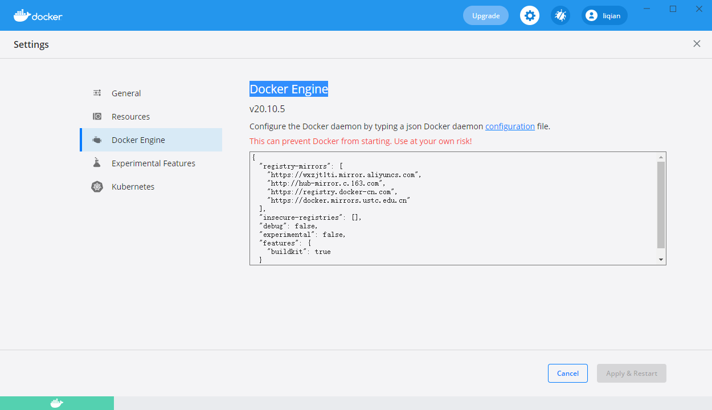

# Install On Windows
## 官网说明
https://hub.docker.com/editions/community/docker-ce-desktop-windows/

**Install**
Double-click Docker for Windows Installer to run the installer.

When the installation finishes, Docker starts automatically. 

The whale  in the notification area indicates that Docker is running, and accessible from a terminal.

**Run**
Open a command-line terminal like PowerShell, and try out some Docker commands!

Run docker version to check the version.

Run docker run hello-world to verify that Docker can pull and run images.

**Enjoy**
Docker is available in any terminal as long as the Docker Desktop for Windows app is running. 

Settings are available on the UI, accessible from the Docker whale in the taskbar.

## [Docker Desktop for Windows user manual](https://docs.docker.com/docker-for-windows/)

## 下载DockerDesktop
Docker desktop是Microsoft Windows的Docker的社区版本。

我们可以从Docker Hub下载适用于Windows的Docker desktop。 

地址是：[Docker Desktop for Windows](https://hub.docker.com/editions/community/docker-ce-desktop-windows/)

Docker Desktop installer包括Docker Engine，Docker CLI客户端，Docker Compose，Notary，Kubernetes和Credential Helper。

使用Docker Desktop创建的容器和映像在安装它的机器上的所有用户帐户之间共享。 

这是因为所有Windows帐户都使用相同的VM来构建和运行容器

## 配置国内镜像源 加速
1. Windows的使用Docker Desktop就可以修改。
[Setting]-->[Docker Engine]:



2. 国内的镜像源
   >* 网易
   >http://hub-mirror.c.163.com

   >* Docker中国区官方镜像 -- 速度还有有点慢，公司网络
   >https://registry.docker-cn.com

   >* 中国科技大学 -- 
   >https://docker.mirrors.ustc.edu.cn

   >* 阿里云容器  服务 -- 速度还可以，公司网路
   >https://cr.console.aliyun.com/

## 使用Docker Desktop
- 可以打开任意cmd或者powershell
- 执行命令
```
docker --version
```

- 从dockerHub上拉去镜像
```
docker run hello-world
```
如果本地没有镜像，会从DockerHub上下载。

- 列出本地已经下载的镜像
```
docker image ls
```
- 列出所有容器
```
docker container ls -all
```
将所有容器列出来，包含已经停止运行的历史容器。

```
docker container ls
```
将所有正在运行的容器列出来.


## Docker 和VMware兼容问题
在window下如果安装了Docker，由于会用到Hyper-V，但是Hyper-V同时VMWare 16之前的版本是不兼容的。
如果想用VMWare 需要停掉Docker服务，然后关掉Hyper-V。
- 关掉Hyper-V: 在[程序和功能]-->[启用或关闭Windows功能]中进行打开和关闭。