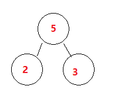
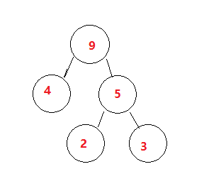
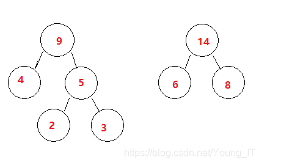
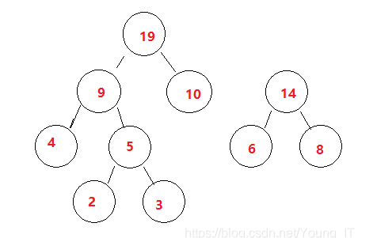
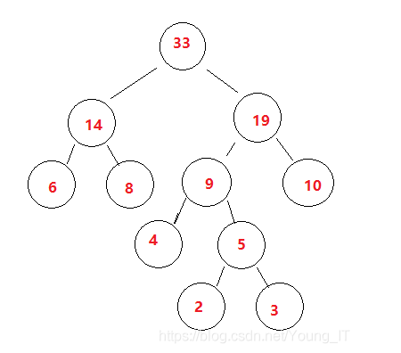
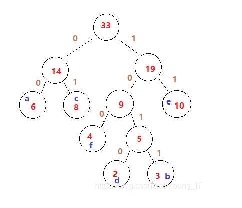

# Title
**已知字符集{ a, b, c, d, e, f }，若各字符出现的次数分别为{ 6, 3, 8, 2, 10, 4 }**

## First Step
1. 找出最小的2个值（3和2）
2. 把他们放入树中
3. 他们的和最为父节点。

如下图：

## Second Step
1. 排除第一步已经挑选出的2个数，将他们的和方式序列汇总。
{ 6, ~~3~~, 8, ~~2~~, 10, 4, *5* }

2. 再次找出最小的2个数(4 和 5)
3. 放入树中，同之前的树进行合并。

如下图：

## Third Step
重复步骤二，形成新的序列，构建树，然后树进行合并。

{ 6, ~~3~~, 8, ~~2~~, 10, ~~4~~, ~~*5*~~,*9* }

如下图：

## Fourth Step

{ ~~6~~, ~~3~~, ~~8~~, ~~2~~, 10, ~~4~~, ~~*5*~~,*9*,*14* }

如下图：

## Fifth Step

{ ~~6~~, ~~3~~, ~~8~~, ~~2~~, ~~10~~, ~~4~~, ~~*5*~~,~~*9*~~,*14*,*19* }

如下图：

## Sixth Step
- HaffmanTree构建完毕后，将对应字符填上去。
- 从根节点开始向下走，左为`"0"`,右为`"1"`.

如下图：

## 最后结果
|字符|哈夫曼编码|
|:--|:--------|
|a|00|
|b|1011|
|c|01|
|d|1010|
|e|11|
|f|100|