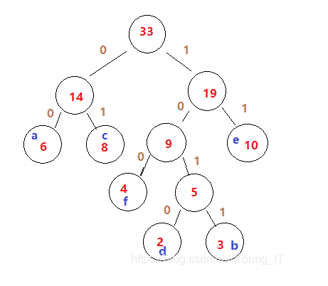
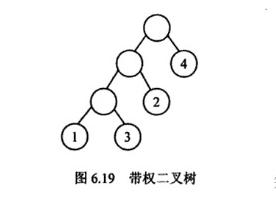
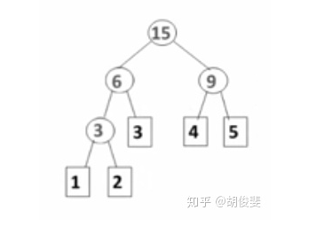

# 哈夫曼编码 HuffmanCode
哈夫曼编码(HuffmanCode)，又叫霍夫曼编码。
是一种编码方式，哈夫曼编码是可变长编码(VLC)的一种。
Huffman于1952年提出的一种编码方式，该方法完全依据**字符**出现的**概率**来构造**异**字头的平均长度最短的码字。

## 哈夫曼编码的方法
先按照出现概率的大小进行排序（从小到大），把2个最小的概率相加 和剩余的概率重新排序，再把2个最小的相加， 再重新排序，直到相加变为1.

每次相加都将`"0"`和`"1"`赋予相加的两个概率，读出时由该符号开始一直走到最后的`"1"`，将路线上所遇到的`"0"`和`"1"`按照最低位到最高位的顺序排好，就是该符号的哈夫曼编码。

如下图里：

编码结果：
|字符|哈夫曼编码|
|:---|:--------|
|a|00|
|b|1011|
|c|01|
|d|1010|
|e|11|
|f|100|

## 哈夫曼树 Huffman Tree
是一种特殊的二叉树，这种树的所有叶子结点都带权值，从中构造出带权路径长度最短的二叉树，就是哈夫曼树。

### 带权路径长度WPL -- 了解即可，一般很少用到
为第i个叶子结点的权值,l为第i个叶子结点的路径长度。

如下图所示的二叉树, 它的带权路径长度值WPL=1×3+3×3+2×2+4×1=20

### 构建方法
- 统计文本中字符出现的次数
- 将字符按照频数升序排序
- 将频数最小的两个叶子结点结合成树，看作一个整体，整体的频数是叶子结点频数和
- 把这个树看作整体和其他的一起也进行升序排序
- 重复上述过程直到生成整棵树

详细步骤参考[CreateHuffmanStepByStep.md]

### 权值重复如何解决
可以用树的深度来决定左右位置。
如下图：

## 前缀编码
任何一个字符都不能是另外一个字符的前缀 叫做 前缀编码。  
这也是**哈夫曼边长编码的前提条件**

**实现**：
确保在哈夫曼树中，任何一个字符的都不是另外一个字符的父节点。

## 如何实现数据的压缩和解压缩
### 实现压缩的原理
如果在一段文字中，一个字符出现的频率很高，那么它的编码应该尽可能的短。  
如果在一段文字中，一个字符出现的评率很低，那么他的编码就会相应的长。  

**实现步骤**:
1. 扫描需要编码的数据，统计数据中各个字符出现的频率
2. 利用得出的频率值，构建哈夫曼树。
3. 对哈夫曼树进行编码，并把编码存储起来。

## 静态哈夫曼编码
输入是固定长度的一段文字，或者数据。

**最大缺点**：
就是它需要对原始数据进行两遍扫描:
- 第一遍统计原始数据中各字符出现的频率,利用得到的频率值创建哈夫曼树并将树的有关信息保存起来,便于解压时使用;
- 第二遍则根据前面得到的哈夫曼树对原始数据进行编码,并将编码信息存储起来。

这样如果用于网络通信中,将会引起较大的延时;对于文件压缩这样的应用场合,额外的磁盘访间将会降低该算法的数据压缩速度。

## 动态哈夫曼编码
它对数据编码的依据是动态变化的哈夫曼树,  
也就是说,对第t+1个字符编码是根据原始数据中前t个字符得到的哈夫曼树来进行的。  
压缩和解压子程序具有相同的初始化树,每处理完一个字符,压缩和解压方使用相同的算法修改哈夫曼树,  
因而该方法不需要为解压而保存树的有关信息。

压缩和解压一个字符所需的时间与该字符的编码长度成正比,因而该过程可以实时进行。
