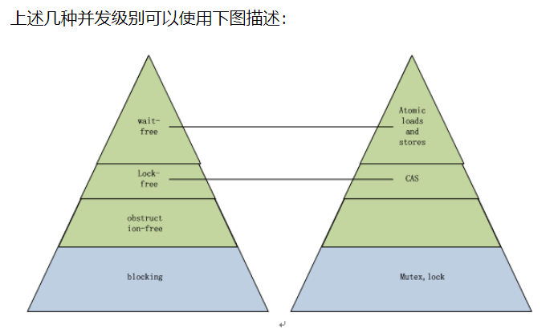

# 对共享数据进行并发访问的数据结构和算法
> 1. Transactional memory --- 事务性内存
> 2. Fine-grained algorithms --- 细粒度(锁)算法
> 3. Lock-free data structures --- 无锁数据结构
##  事务内存Transactional memory
TM是一个软件技术，简化了并发程序的编写。 

TM借鉴了在数据库社区中首先建立和发展起来的概念， 基本的想法是要申明一个代码区域作为一个事务。

一个事务（transaction ） 执行并原子地提交所有结果到内存（如果事务成功），或中止并取消所有的结果（如果事务失败）。 

TM的关键是提供原子性（Atomicity），一致性（Consistency ）和隔离性（Isolation ）这些要素。

事务可以安全地并行执行，以取代现有的痛苦和容易犯错误(下面几点)的技术，如锁和信号量。 

还有一个潜在的性能优势。 我们知道锁是悲观的（pessimistic ），并假设上锁的线程将写入数据，因此，其他线程的进展被阻塞。 
然而访问锁定值的两个事务可以并行地进行，且回滚只发生在当事务之一写入数据的时候。
但是，目前还没有嵌入式的事务内存，比较难和传统代码集成，需要软件做出比较大的变化，
同时，软件TM性能开销极大，2-10倍的速度下降是常见的，这也限制了软件TM的广泛使用

> 1. 因为忘记使用锁而导致条件竞争(race condition)
> 2. 因为不正确的加锁顺序而导致死锁(deadlock)
> 3. 因为未被捕捉的异常而造成程序崩溃(corruption)
> 4. 因为错误地忽略了通知，造成线程无法正常唤醒(lost wakeup)

## 细粒度(锁)算法
是一种基于另类的同步方法的算法.

它通常基于“轻量级的”原子性原语(比如自旋锁)，而不是基于系统提供的昂贵消耗的同步原语。

细粒度(锁)算法适用于任何锁持有时间少于将一个线程阻塞和唤醒所需要的时间的场合，

由于锁粒度极小，在此类原语之上构建的数据结构，可以并行读取，甚至并发写入。

Linux 4.4以前的内核就是采用_spin_lock自旋锁这种细粒度锁算法来安全访问共享的listen socket，

在并发连接相对轻量的情况下，其性能和无锁性能相媲美。

然而，在高并发连接的场景下，细粒度(锁)算法就会成为并发程序的瓶颈所在。


## 无锁算法

不使用锁的情况下实现多线程之间的变量同步，也就是在没有线程被阻塞的情况下实现变量的同步，
所以也叫非阻塞同步（Non-blocking Synchronization）。

> **CAS（比较与交换，Compare and swap） 是一种有名的无锁算法。**

当然在部分情况下，目前来看，无锁编程并不能替代 lock。

#### 实现级别
非同步阻塞的实现可以分成三个级别：wait-free/lock-free/obstruction-free。
- wait-free 无等待并发
> 指的是每一个线程都一直运行下去而无须等待外部条件，
> 整个流程中任何操作都能在一个有限的步骤内完成，这是最高的并发级别，没有任何阻塞.

> 是最理想的模式。

> 能够直接调用一个原子操作实现的算法或程序就属于Wait-free，
> 比如下面的 increment_reference_counter 函数就是wait-free的，
> 它封装了atomic_increment这个原子自增原语，多个线程可以同时调用这个函数对同一个内存变量进行自增，而无须任何阻塞（其实也是有阻塞的，是总线锁级别）
>与此做对比，CAS类的调用就不是wait-free的，
>注意wait-free的原语都不能包含内部循环，CAS原语使用时通常包含在“循环直到成功”的循环内部。
```C++
void increment_reference_counter(rc_base* obj)
{
    atomic_increment(obj->rc);
}
```


- lock-free 无锁并发
> 允许个别线程饥饿，但保证系统级吞吐。确保至少有一个线程能够继续执行。

> 整个系统作为一个整体一直运行下去，系统内部单个线程某段时间内可能会饥饿，
> 这是比wait-freedom弱的并发级别，但系统整体上看依然是没有阻塞的。

> wait-free的算法必定也是lock-free的。

> Lock-free算法通常可以通过同步原语 CAS实现。
```C++
void stack_push(stack* s, node* n)
{
    node* head;
    do
    {
        head = s->head;
        n->next = head;
    }
    while ( ! atomic_compare_exchange(s->head, head, n));
}
```

> 多个线程同时调用上述函数，理论上某个线程可以一直困在循环内部，但一旦有一个线程原子操作失败而返回循环，意味着有其他线程成功执行了原子操作而退出循环，从而保证系统整体是没有阻塞的。

> 其实前面的原子自增函数也可以用下面的原语实现，在这种实现里，不再是所有线程都无阻塞了，某些线程可能会因为CAS失败而回绕若干次循环。
```C++
void increment_reference_counter(rc_base* obj)
{
    Int rc;
    do {
       rc = obj->rc;
    } while(!atomic_compare_exchange(obj->rc,rc,rc+1));
}
```

- obstruction-free 无阻塞并发
> Obstruction-free 是指在任何时间点，一个孤立运行线程的每一个操作可以在有限步之内结束。
> 只要没有竞争，线程就可以持续运行，
> 一旦共享数据被修改，Obstruction-free 要求中止已经完成的部分操作，并进行回滚。
>  事务的过程是：1读取，并写时间戳；2准备写入，版本校验；3校验通过则写入，校验不通过，则回滚。
> obstruction-free 是并发级别更低的非阻塞并发，该算法在不出现冲突性操作的情况下提供单线程式的执行进度保证.

> 所有 Lock-Free 的算法都是 Obstruction-free 的。

#### Blocking algoithms 阻塞并发--有锁的
阻塞类的算法是并发级别最低的同步算法，它一般需要产生阻塞。可以简单认为基于锁的实现是blocking的算法。


蓝色是阻塞的算法，绿色是非阻塞算法，金字塔越上方，并发级别越高，性能越好，右边的金字塔是实现工具（原子操作、锁、互斥体等）

### CAS算法

CAS（比较与交换，Compare and swap） 是一种有名的无锁算法。

CAS, CPU指令，在大多数处理器架构，包括IA32、Space中采用的都是CAS指令.

CAS的语义是“我认为V的值应该为A，如果是，那么将V的值更新为B，否则不修改并告诉V的值实际为多少”.

CAS是项 乐观锁 技术，当多个线程尝试使用CAS同时更新同一个变量时，只有其中一个线程能更新变量的值，而其它线程都失败，失败的线程并不会被挂起，而是被告知这次竞争中失败，并可以再次尝试。

CAS有3个操作数，内存值V，旧的预期值A，要修改的新值B。当且仅当预期值A和内存值V相同时，将内存值V修改为B，否则什么都不做。

CAS比较与交换的伪代码可以表示为：
```
do{
备份旧数据；

基于旧数据构造新数据/新数据

}while(!CAS( 内存地址，备份的旧数据，新数据 ))
```

e.g:
java.util.concurrent.atomic中的AtomicXXX，都使用了这些底层的JVM支持为数字类型的引用类型提供一种高效的CAS操作，而在java.util.concurrent中的大多数类在实现时都直接或间接的使用了这些原子变量类，这些原子变量都调用了 sun.misc.Unsafe 类库里面的 CAS算法，用CPU指令来实现无锁自增，JDK源码：

```java
public final int getAndIncrement() {  
        for (;;) {  
            int current = get();  
            int next = current + 1;  
            if (compareAndSet(current, next))  
                return current;  
        }  
}  

public final boolean compareAndSet(int expect, int update) {  
    return unsafe.compareAndSwapInt(this, valueOffset, expect, update);  
}
```
因而在大部分情况下，java中使用Atomic包中的incrementAndGet的性能比用synchronized高出几倍。

##### CAS开销
CAS（比较并交换）是CPU指令级的操作，只有一步原子操作，所以非常快。而且CAS避免了请求操作系统来裁定锁的问题，不用麻烦操作系统，直接在CPU内部就搞定了。但CAS就没有开销了吗？不！有cache miss的情况。

##### ABA问题
thread1意图对val=1进行操作变成2，cas(val,1,2)。
thread1先读取val=1；thread1被抢占（preempted），让thread2运行。
thread2 修改val=3，又修改回1。
thread1继续执行，发现期望值与“原值”（其实被修改过了）相同，完成CAS操作。
使用CAS会造成ABA问题，特别是在使用指针操作一些并发数据结构时。
解决方案
ABAʹ：添加额外的标记用来指示是否被修改。
从Java1.5开始JDK的atomic包里提供了一个类AtomicStampedReference来解决ABA问题。这个类的compareAndSet方法作用是首先检查当前引用是否等于预期引用，并且当前标志是否等于预期标志，如果全部相等，则以原子方式将该引用和该标志的值设置为给定的更新值。

----

## 无锁和有锁的对比
- 如果存在休眠的情况，无锁性能提升不明显，可以不使用

## 无锁数据结构

为解决在高并发场景下，细粒度锁无法避免的性能瓶颈，将共享数据放入无锁的数据结构中，采用原子修改的方式来访问共享数据。

目前，常见的无锁数据结构主要有：无锁队列(lock free queue)、无锁容器(b+tree、list、hashmap等)。

### 无锁队列(lock free queue)

- [concurrentqueue](https://github.com/cameron314/concurrentqueue) : C++11的快速多生产者、多消费者的无锁并发队列，开发代码库。
- ZMQ无锁队列的分析：yqueue_t

##### 应用场景

##### 实现方式
1. 基于数组实现的环形无锁队列
2. java中 - 无锁的缓存框架：Disruptor
3. 如何避免ABA问题

### 无锁容器(b+tree、list、hashmap等)

# 原子性、原子性原语

我们知道无论是何种情况，只要有共享的地方，就离不开同步，也就是concurrency。

对共享资源的安全访问，在不使用锁、同步原语的情况下，
只能依赖于硬件支持的原子性操作，离开原子操作的保证，无锁编程(lock-free programming)将变得不可能。

留意本例的无锁队列的实现例子，我们发现原子性操作可以简单划分为两部分：

> 1. 原子性读写(atomic read and write)：本例中的原子load(读)、原子store(写)
> 2. 原子性交换(Atomic Read-Modify-Write -- RMW)：本例中的compare_exchange_weak、compare_exchange_strong

原子操作可认为是一个不可分的操作；要么发生，要么没发生，我们看不到任何执行的中间过程，不存在部分结果(partial effects)。

原子操作是一个较为昂贵的指令。

我们要避免滥用原子操作,通常情况下，我们有一个对共享变量必须使用原子操作的规则：
> 任何时刻，只要存在两个或多个线程并发地对同一个共享变量进行操作，
> 并且这些操作中的其中一个是执行了写操作，那么所有的线程都必须使用原子操作。

## 什么样的内存操作是原子的呢？
通常情况下，如果一个内存操作使用了多条CPU指令，那么这个内存操作是非原子的。

那么只使用一条CPU指令的内存操作是不是就一定是原子的呢？

答案是不一定，某些仅仅使用一条CPU的内存操作，在绝大多数CPU架构上是原子，但是，在个别CPU架构上是非原子的。

如果，我们想写出可移植的代码，就不能做出使用一条CPU指令的内存操作一定是原子的假设。

## volatile
用volatile修饰的int(基本数据类型）在现代处理器中，能够做到原子性的读写，并且限制编译器的优化，每次都是从内存中读取最新的值.

很多同学就误以为volatile能够保证原子性并且具有Memery Barrier的作用。

其实vloatile既不能保证原子性，也不会有任何的Memery Barrier(内存栅栏)的保证。

在C++中volatile具有以下特性：

> 1. 易变性：所谓的易变性，在汇编层面反映出来，就是两条语句，下一条语句不会直接使用上一条语句对应的volatile变量的寄存器内容，而是重新从内存中读取。
> 2. "不可优化"性：volatile告诉编译器，不要对我这个变量进行各种激进的优化，甚至将变量直接消除，保证程序员写在代码中的指令，一定会被执行。
> 3. "顺序性"：能够保证Volatile变量间的顺序性，编译器不会进行乱序优化。Volatile变量与非Volatile变量的顺序，编译器不保证顺序，可能会进行乱序优化。