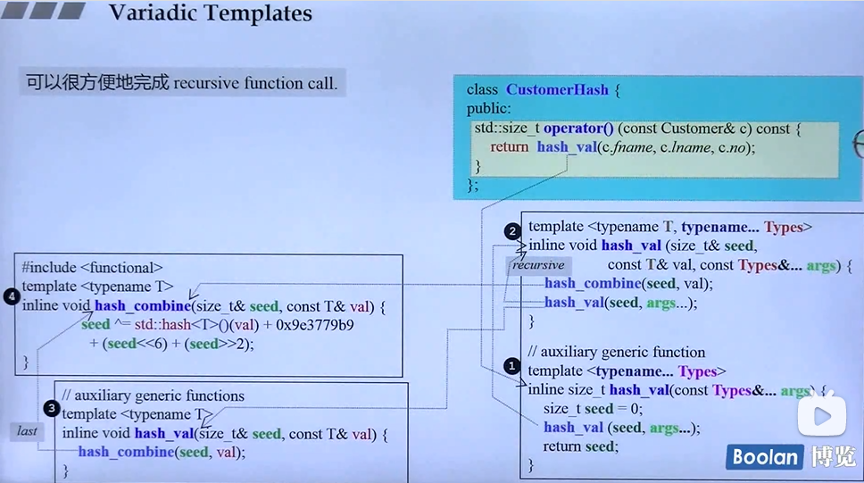

# 网站
- [C++之父关于C++11的blog](https://stroustrup.com/C++11FAQ.html)
- [C++ FAQ](https://isocpp.org/wiki/faq)


# C++11 特性
## initiallizer list
```C++
//C++ 03
std::vector<int> v;
v.push_back(1);
v.push_back(2);
v.push_back(3);

//C++ 11
std::vector<int> v11={1,2,3};
```

```C++
class Point2D
{
public:
    Point2D(int x,int y){
        m_x = x;
        m_y = y;
    }
private:
    int m_x;
    int m_y;
};

std::vector<Point2D> v = { {1,1},{2,3},{4,4} };
```
## auto type
```C++
std::vector<int> vec={1,3,4};
//C++ 03
for(std::vector<int>::iterator it = vec.begin();it!=vec.end();++it)
{
    std::cout<<*it<<std::endl;
}

//C++ 11
for(auto it =vec.begin(); it != vec.end(); ++it)
{
    std::cout<<*it<<std::endl;
}


```
## foreach
```C++
std::vector<int> v={1,2,3};
//C++ 03
for(std::vector<int>::iterator it = vec.begin();it!=vec.end();++it)
{
    std::cout<<*it<<std::endl;
}

//C++ 11

//read only and copy
for(auto e:v){
    std::cout<<e <<std::endl;
}

//const 引用
for(const auto& e:v){
    std::cout<<e <<std::endl;
}

//引用 值可以修改
for(auto& e:v){
    std::cout<<e <<std::endl;
}
```
## nullptr 代替了C++03中的NULL
-[]需要细致了解下优缺点？

## enum class 代替 C++03中的enum
```C++
//C++ 03
enum B{
    B_ONE,
    B_TWO,
    B_THREE
};

//C++ 11
enum class C{
    C_ONE,
    C_TWO,
    C_THREE
};

```
## override、final 关键字
- 参考[override_final.md]

## default 关键字
- compiler generated default constructor
- 强制编译器生成默认构造函数
- 因为在class中，一旦我们提供了构造函数，那么编译器不再添加默认构造函数。
```C++
class B{
public:
    B(int x, int y){
        m_x = x;
        m_y = y;
    }
private:
    int m_x;
    int m_y;
};

int main(){
    B b;//编译错误，不存在默认构造函数
}
```

```C++
//修改版
class B{
public:
    B(int x, int y){
        m_x = x;
        m_y = y;
    }
    B() = default;//告诉编译器强制生成
private:
    int m_x;
    int m_y;
};

int main(){
    B b;//OK
```

- 应用场景：


## delete 关键字，放在函数后面，表示函数不能被调用
- 应用场景：
不希望进行自动转换
```C++
class person
{
public:
    person(int age){
        m_age = age;
    }
private:
    int m_age;
}
int main()
{
    person p(10);//ok
    person p1(10.5);//also ok ,converted from double to int
}
```

如果我们不希望传入double类型:
```C++
//C++ 11
class person
{
public:
    person(int age)
    {
        m_age = age;
    }
    person(double age) = delete;
private:
    int m_age;
}
int main()
{
    person p(10);//ok
    person p1(10.5);//编译错误，函数已经被删除，不能调用
```

## variadic template
- 可变参模板函数
- 原理,如下代码，每次printX都是递归调用自己，知道args为空，这也就是为什么一定要实现一个空的printX()函数的原因。
```C++
#include <iostream>
void print()
{
}

template <typename T, typename... Types>                //这里的...是关键字的一部分
void print(const T& firstArg, const Types&... args)     //这里的...要写在自定义类型Types后面
{
    std::cout << firstArg << std::endl;

    //这里的...要写在变量args后面
    print(args...);                                       // call print() for remaining arguments

}
int main(){
    
    print(1,2,3.4,"name");
    return 0;
}
```

- 应用场景：recursive call function
    如下是一个hash计算的例子
    

    
## lambda function 
```C++
int main()
{
    std::cout<< [](int x,int y) {return x+y;}(3,5) <<std::endl;
}
```

经常使用std::sort 对结构体配合Lammban匿名函数使用。
e.g: 点数据按照x升序排列
```C++
class Point2D
{
public:
    Point2D(int x,int y){
        m_x = x;
        m_y = y;
    }
private:
    int m_x;
    int m_y;
};
int main(){
    std::vector<Point2D> v = { {1,1},{2,3},{4,4} };

    std::sort(v.begin(),v.end(),[](const Point2D& l,const Point2D& r){
        return l.x < r.x;
    }   );
    
}
```

## atomic
- [参考C++11 Atomic](C++11_atomic.md)

## smart pointer 智能指针

## tuple元组

## R value reference

## Perfect Forwarding

## std::ref std::cref
std::ref可以在模板传参的时候传入引用，否则无法传递

&是类型说明符， std::ref 是一个函数，返回 std::reference_wrapper(类似于指针）
std::cref 用于const 引用

## std::bind

## std::thread

## std::pair std::make_pair
- https://oomake.com/question/4109067
```
{
        std::pair<int, int> a;
        a = std::make_pair<int, int>(1, 0);

        int first = 1;
        int second = 0;
        //a= std::make_pair<int, int>(first, second);//无法将参数 1 从“int”转换为“_Ty1 &&”

    }
    

    {
        std::pair<std::string, int> b;
        b = std::make_pair<std::string, int>("key", 0);
        
        std::string first = "1";
        int second = 0;
        //b = std::make_pair<std::string, int>(first, second);// 无法将参数 1 从“std::string”转换为“_Ty1 &&”
    }
    

    {
        std::pair<bool, int> b;
        b = std::make_pair<bool, int>(true, 0);

        bool isB = false;
        //b = std::make_pair<bool, int>(isB, 0);//无法将参数 1 从“bool”转换为“_Ty1 &&”

       
    }

    {
        StructA as;
        std::pair<StructA, int> b;
        //b = std::make_pair<StructA, int>(as, 0);//编译出错： 无法将参数 1 从“StructA”转换为“_Ty1 &&”  
        b = std::make_pair<StructA, int>(std::move(as), 0);//使用std::move转成右值引用
    }
```