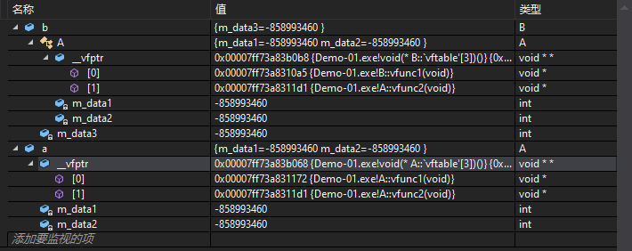

# 多态
## 概念简介
C++支持两种多态性：编译时多态性，运行时多态性。

编译时多态性（静态多态）：通过重载函数实现，子类与基类函数相同，但是没有virtual关键字。
>这种情况叫重写(overwrite)

运行时多态性（动态多态）：通过虚函数实现 virtual关键字。
> 子类重新定义成员函数，成为 覆盖（override）。

## 多态和非多态实质区别
- 函数地址是早绑定还是晚绑定。
>如果函数的调用，在编译器编译期间就可以确定函数的调用地址，并生产代码，是静态的，就是说地址是早绑定的。  
>而如果函数调用的地址不能在编译器期间确定，需要在运行时才确定，这就属于晚绑定。

## 多态的目的：
封装可以使得代码模块化,继承可以扩展已存在的代码,他们的目的都是为了代码重用.

**多态的目的则是为了“接口重用”。**
>也即，不论传递过来的究竟是类的哪个对象，函数都能够通过同一个接口调用到适应各自对象的实现方法。

## 最常见的用法
声明基类类型指针，指向任意一个子类对象，调用虚函数。

可以根据指向的子类对象不同，调用不同的实现。

如果没有声明为虚函数，那么只能限定在调用基类的函数实现。

**达到 ”一个接口，多中方法“ 目的。**

## 使用注意事项
1. 只有类的成员函数才能声明为虚函数，虚函数仅适用于有继承关系的类对象。普通函数不能声明为虚函数。
2. 静态成员函数不能是虚函数，因为静态成员函数不受限于某个对象。
3. 内联函数（inline）不能是虚函数，因为内联函数不能在运行中动态确定位置。
4. 构造函数不能是虚函数。
5. 析构函数可以是虚函数，而且建议声明为虚函数。
6. 子类重写父类的虚函数，需要确保函数签名完全一致。（函数名 参数类型 个数，const修饰）
7. 纯虚函数 virtaul void func()=0; //定义接口，并且要求子类必须实现的

## 为什么析构函数 需要添加 virtual关键字

1. 析构函数不加virtual关键字，delete掉父类的指针，只调动父类的析构函数，而不调动子类的析构函数。

2. 析构函数加virtual关键字，delete掉父类的指针，先调动子类的析构函数，再调动父类的析构函数。

3. 不加virtual关键字，子类存在内存泄漏的风险。


## 虚函数表
1. 编译器处理虚函数的方法是：给每个对象添加一个隐藏成员，用于保存一个指向函数地址数组的指针。这个数组称为“虚函数表”。

2. 虚函数表实质是一个指针数组，里面存的是虚函数的函数指针(_vfptr).

3. 虚指针指向虚函数表。虚指针放在类对象的头部。

4. 没有虚函数的C++类，是不会有虚函数表的。子类覆盖基类虚函数时，也会有张自己的虚函数表。

5. 虚函数表（virtual function table，vtbl）：存储了为类对象进行声明的虚函数的地址。

### 举例说明
**内存layout（布局）**


```C++
class A {
public:
    virtual void vfunc1(){
        std::cout<<"class A:vfunc1"<<std::endl;
        }
    virtual void vfunc2(){
        std::cout<<"class A:vfunc2"<<std::endl;
        }
    void func1(){
        std::cout<<"class A:func1"<<std::endl;
        }
    void func2(){
        std::cout<<"class A:func2"<<std::endl;
        }
private:
    int m_data1, m_data2;
};

class B : public A {
public:
    virtual void vfunc1(){
        std::cout<<"class B:vfunc1"<<std::endl;
        }
    void func2(){
        std::cout<<"class B:func2"<<std::endl;
        }
private:
    int m_data3;
};

class C : public B {
public:
    virtual void vfunc1(){
        std::cout<<"class C:vfunc1"<<std::endl;
        }
            void func2(){
        std::cout<<"class C:func2"<<std::endl;
        }
private:
    int m_data1, m_data4;
};
```
1. 对于非虚函数fucn2()三个类中都有，但是他们互相不关联，各自独有。在调用的时候也不需要尽心查表操作，直接调用即可。

2. 由于子类B和子类C都继承于基类A，他们都会存在一个虚指针指向虚函数表。
    > 如果B类和C类，没有虚函数，那么他们的虚指针直接指向基类A的虚函数表。

    > B类和C类，由于都有虚函数，他们各自有张虚函数表，各自的虚指针指向各自的虚函数表。

3. vfunc1()
    >B类和C类对vfunc1进行了覆写，认为是由三种实现，所以函数地址也各不相同，所以在调用的时候，需要在各自的虚函数表中查找vfunc1的地址。

4. vfunc2()
    >由于B类和C类没有进行覆写，所以A B C类共用一个vfunc2，该函数地址分别保存在三个类的虚函数表中，但是地址是相同的。
## 动态绑定
动态绑定有以下三项条件要符合：
1. 使用指针进行调用

2. 指针属于up-cast后的

3. 调用的是虚函数


```C++
void main()
{
    B b;
    b.vfunc1();

    A a = (A)b;
    a.vfunc1();
}
```



>运行结果：  
>class B:vfunc1  
>class A:vfunc1

>a的创建是通过将b强制转化为类A得来的,它虽然是强制转化后的结果，
>但并不能改变它是一个类A对象的事实，因此这里调用的便是类A中的 vfunc1.

>所以通过对象强转无法实现多态。


```C++
void main()
{
    B b;
    b.vfunc1();

    A * pa = static_cast<A*>(&b);
    pa->vfunc1();
    
    try{
        A& a1 = dynamic_cast<A&>(b);
        a1.vfunc1();
    }catch (std::bad_cast bad) {
        std::cout << "Caught: " << bad.what();
    }

    A* pa_b = new B();
    pa_b->vfunc1();
}
```

>运行结果：  
>class B:vfunc1  
>class B:vfunc1  
>class B:vfunc1  
>class B:vfunc1  

>pa 是一个类A的指针，但它指向的是一个类B的对象。  
>在使用pa调用 vfunc1 的时候，程序发现pa是一个指针，并且现在正在调用一个虚函数叫做 vfunc1，  
>这时通过 pa->vptr 这个虚指针到类B的虚函数中找对应的虚函数地址，找到该地址以后，就用相应的虚函数来进行调用B::vfunc1()。

### pa是类A的指针，为什么查找的是类B的虚函数表？
只要某一个类X包含虚函数，无论是它的父类或者它本身拥有，那么这个类的对象都会包含一个虚指针vptr，至于vptr要指向哪张表，取决于类X它本身是否含有虚函数。此处，类B中存在虚函数，那么它就会拥有自己的一张虚函数表。pa指向的是一个类B的对象，因此 p-vptr 指代的是类B中虚指针，所以它查找的是类B的虚函数表

### 如何从虚函数表中查找到 vfunc1 的地址？
虚函数表中的内容是在编译的时候确定的，通过以下方式进行查找 `(* p->vptr[n] )(p)` 或者 `(* (p->vptr)[n] )(p)`，它的解读是：通过类对象指针p找到虚指针vptr，再查找到虚函数表中的第n个内容，并将他作为函数指针进行调用，调用时的入参是p(式子中的第二个p)，而这个p就是隐藏的this指针，这里的n也是在编译的时候确定的。

## 多继承下的内存layout（布局）

### 单继承
1. 在类对象占用内存空间中，只保留一份虚表指针，也就是只有一个虚表。
2. 虚表中各项保存了类中各虚函数的首地址。

3. 构造函数先构造父类，在构造自身。
4. 析构函数同构造函数正好相反，先析构自身，再析构父类。

### 多重继承
1. 在类对象占用的内存空间，根据继承父类的个数保存虚表指针，产生相应个数的虚表。
2. 构造时，按照父类列表顺序进行父类构造。 析构正好相反。
3. 当对象作为成员时，整个类对象的内存结构同多重继承很相似。
4. 内存布局：  


### 代码示例
```C++
#include <iostream>
class A {
public:
    virtual void vfunc1(){
        std::cout<<"class A:vfunc1"<<std::endl;
        }
    virtual void vfunc2(){
        std::cout<<"class A:vfunc2"<<std::endl;
        }
    void func1(){
        std::cout<<"class A:func1"<<std::endl;
        }
    void func2(){
        std::cout<<"class A:func2"<<std::endl;
        }
private:
    int m_data1, m_data2;
};


class B {
public:
    virtual void vfunc1(){
        std::cout<<"class B:vfunc1"<<std::endl;
        }
    void func2(){
        std::cout<<"class B:func2"<<std::endl;
        }
private:
    int m_data3;
};

class C : public A,public B {
public:
    virtual void vfunc1(){
        std::cout<<"class C:vfunc1"<<std::endl;
        }
            void func2(){
        std::cout<<"class C:func2"<<std::endl;
        }
private:
    int m_data1, m_data4;
};

class C_Sub : public C {
public:
    virtual void vfunc1() {
        std::cout << "class C:vfunc1" << std::endl;
    }
    void func2() {
        std::cout << "class C:func2" << std::endl;
    }
private:
    int m_data1, m_data4;
};
class D : public A{
public:
    virtual void vfunc1() {
        std::cout << "class D:vfunc1" << std::endl;
    }
    void func2() {
        std::cout << "class D:func2" << std::endl;
    }
private:
    int m_data1, m_data4;
};

class D_Sub : public D {
public:
    virtual void vfunc1() {
        std::cout << "class D:vfunc1" << std::endl;
    }
    void func2() {
        std::cout << "class D:func2" << std::endl;
    }
private:
    int m_data1, m_data4;
};
int main(){
    
    A a;
    a.vfunc1();

    B b;
    b.vfunc1();

    C c;
    c.vfunc1();

    D d;
    d.vfunc1();

    C_Sub c_sub;
    c_sub.vfunc1();

    D_Sub d_sub;
    d_sub.vfunc1();

    //引用
    try{
       
        A& a_ref = dynamic_cast<A&>(c);
        a_ref.vfunc1();

        B& b_ref = dynamic_cast<B&>(c);
        b_ref.vfunc1();
    }catch (std::bad_cast bad) {
        //处理类型转换失败的情况
        std::cout << "Caught: " << bad.what();
    }

    //指针
    try {

        A* pa = dynamic_cast<A*>(&c);
        pa->vfunc1();

        B* pb = dynamic_cast<B*>(&c);
        pb->vfunc1();
    }
    catch (std::bad_cast bad) {
        //处理类型转换失败的情况
        std::cout << "Caught: " << bad.what();
    }
    return 0;
}
```