# DataStructure

## 数据 Array
数组是可以在内存中连续存储多个元素的结构，在内存中的分配也是连续的内存地址。

数组中的元素通过数组下标进行访问，数组下标从0开始。

例如下面这段代码就是将数组的第一个元素赋值为 1。
```C
int data[100];
data[0]  = 1;

```

### 优点：
1. 按照索引查询元素速度快
2. 按照索引遍历数组方便

### 缺点：
1. 数组的大小固定后就无法扩容了
2. 数组只能存储一种类型的数据
3. 添加，删除的操作慢，因为要移动其他的元素。

### 适用场景：
频繁查询，对存储空间要求不大，很少增加和删除的情况。

## 栈 Stack
栈是一种特殊的线性表，仅能在线性表的一端操作，栈顶允许操作，栈底不允许操作。 

### 特点
栈的特点是：先进后出，或者说是后进先出。

### 适用场景
从栈顶放入元素的操作叫入栈，取出元素叫出栈。


栈常应用于实现递归功能方面的场景

## 队列 Queue
队列与栈一样，也是一种线性表，  
不同的是，队列可以在一端添加元素，在另一端取出元素，  
也就是：先进先出。从一端放入元素的操作称为入队，取出元素为出队。

### 使用场景：
因为队列先进先出的特点，在多线程阻塞队列管理中非常适用。

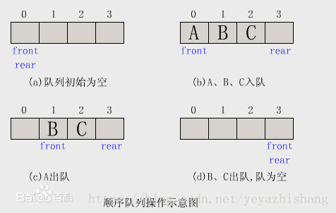

## 链表 List
链表是物理存储单元上非连续的、非顺序的存储结构，

数据元素的逻辑顺序是通过链表的指针地址实现，

每个元素包含两个结点，一个是存储元素的数据域 (内存空间)，另一个是指向下一个结点地址的指针域。

根据指针的指向，链表能形成不同的结构，例如单链表，双向链表，循环链表等。

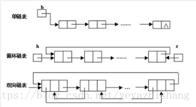

### 优点：
链表是很常用的一种数据结构，不需要初始化容量，可以任意加减元素；
添加或者删除元素时只需要改变前后两个元素结点的指针域指向地址即可，所以添加，删除很快；

### 缺点：
因为含有大量的指针域，占用空间较大；
查找元素需要遍历链表来查找，非常耗时。

### 适用场景：
数据量较小，需要频繁增加，删除操作的场景

## 树 Tree
树是一种数据结构，它是由n（n>=1）个有限节点组成一个具有层次关系的集合。把它叫做 “树” 是因为它看起来像一棵倒挂的树，也就是说它是根朝上，而叶朝下的。它具有以下的特点：

    1. 每个节点有零个或多个子节点；
    2. 没有父节点的节点称为根节点；
    3. 每一个非根节点有且只有一个父节点；
    4. 除了根节点外，每个子节点可以分为多个不相交的子树；

在日常的应用中，我们讨论和用的更多的是树的其中一种结构，就是二叉树。

### 二叉树 Binary Tree


#### 特点：

    1. 每个结点最多有两颗子树，结点的度最大为2。（只能是0 1 或者2）
    2. 左子树和右子树是有顺序的，次序不能颠倒。
    3. 即使某结点只有一个子树，也要区分左右子树。
#### 二叉树的性质

经过前人的总结，二叉树具有以下几个性质：
    1. 二叉树中，第 i 层最多有 2^i-1^ 个结点。
如果二叉树的深度为 K，那么此二叉树最多有 2^K^-1 个结点。
二叉树中，终端结点数（叶子结点数）为 n~0~，度为 2 的结点数为 n~2~，则 n~0~=n~2~+1。
>性质 3 的计算方法为：对于一个二叉树来说，除了度为 0 的叶子结点和度为 2 的结点，剩下的就是度为 1 的结点（设为 n~1~），那么总结点 n=n~0~+n~1~+n~2~。
同时，对于每一个结点来说都是由其父结点分支表示的，假设树中分枝数为 B，那么总结点数 n=B+1。而分枝数是可以通过 n~1~ 和 n~2~ 表示的，即 B=n~1~+2*n~2~。所以，n 用另外一种方式表示为 n=n~1~+2*n~2~+1。
两种方式得到的 n 值组成一个方程组，就可以得出 n~0~=n~2~+1。


#### 优点
添加，删除元素都很快，并且在查找方面也有很多的算法优化，

所以，二叉树既有链表的好处，也有数组的好处，是两者的优化方案。

在处理大批量的动态数据方面非常有用。

#### 扩展：
二叉树有很多扩展的数据结构，包括平衡二叉树、红黑树、B+树等，

在实际应用中广泛用到，例如mysql的数据库索引结构用的就是B+树，还有HashMap的底层源码中用到了红黑树。

#### 满二叉树
**如果二叉树中除了叶子结点，每个结点的度都为 2，则此二叉树称为满二叉树**

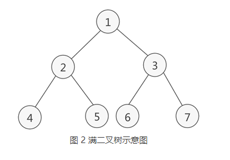

满二叉树除了满足普通二叉树的性质，还具有以下性质：  

> 1. 满二叉树中第 i 层的节点数为 2^n-1^ 个。
> 2. 深度为 k 的满二叉树必有 2^k^-1 个节点 ，叶子数为 2^k-1^。
> 3. 满二叉树中不存在度为 1 的节点，每一个分支点中都两棵深度相同的子树，且叶子节点都在最底层。
> 4. 具有 n 个节点的满二叉树的深度为 log~2~(n+1)。

#### 完全二叉树
**如果二叉树中除去最后一层节点为满二叉树，且最后一层的结点依次从左到右分布，则此二叉树被称为完全二叉树。**

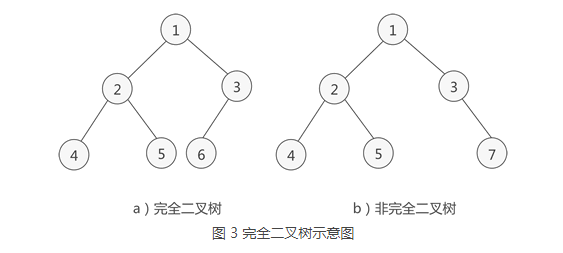

如图 3a) 所示是一棵完全二叉树，

图 3b) 由于最后一层的节点没有按照从左向右分布，因此只能算作是普通的二叉树。

完全二叉树除了具有普通二叉树的性质，它自身也具有一些独特的性质，比如说，
> 1. n 个结点的完全二叉树的深度为 ⌊log2n⌋+1。
> 2. ⌊log~2~n⌋ 表示取小于 log~2~n 的最大整数。例如，⌊log~2~4⌋ = 2，而 ⌊log~2~5⌋ 结果也是 2。

对于任意一个完全二叉树来说，如果将含有的结点按照层次从左到右依次标号（如图 3a)），对于任意一个结点 i ，完全二叉树还有以下几个结论成立：
> 1. 当 i>1 时，父亲结点为结点 [i/2] 。（i=1 时，表示的是根结点，无父亲结点）
> 2. 如果 `2*i>n`（总结点的个数） ，则结点 i 肯定没有左孩子（为叶子结点）；否则其左孩子是结点 `2*i` 。
如果 `2*i+1>n` ，则结点 i 肯定没有右孩子；否则右孩子是结点 `2*i+1` 。

#### 二叉查找树 Binary Search Tree

**特性**
> 1. 某节点的左子树节点值仅包含小于该节点值
> 2. 某节点的右子树节点值仅包含大于该节点值
> 3. 左右子树每个也必须是二叉查找树

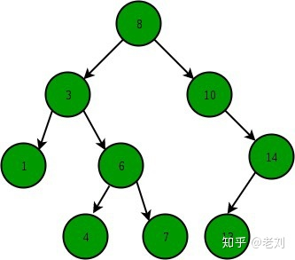

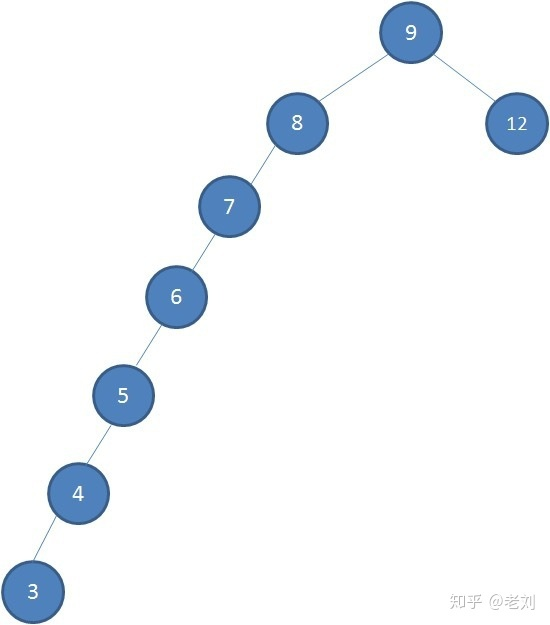

PS:理科生在高中学习生物时学过一个关键字「去除顶端优势」，通过去除植物顶端优势，侧芽会迅速生长，慢慢变得强壮和平衡， 红黑树其实就是去除二叉查找树顶端优势的解决方案，从而达到树的平衡

#### 平衡二叉树 Balanced Binary Tree
- 又被称为AVL树（特殊的二叉查找树）

**具有以下性质：**
它是一棵空树或它的左右两个子树的高度差的绝对值不超过1，

并且左右两个子树都是一棵平衡二叉树。

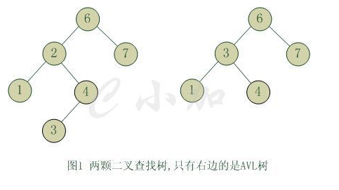

**优点：**
很好的解决了二叉查找树退化成链表的问题，把插入，
查找，删除的时间复杂度最好情况和最坏情况都维持在O(logN)。

**缺点：**
会频繁旋转会使插入和删除牺牲掉O(logN)左右的时间，不过时间上稳定了很多。

**总结：**
平衡二叉树大部分操作和二叉查找树类似，  
主要不同在于插入删除的时候平衡二叉树的平衡可能被改变，  
并且只有从那些插入点到根结点的路径上的结点的平衡性可能被改变，因为只有这些结点的子树可能变化。

#### 红黑树 Red-Black Tree
- HashMap底层实现

**特性**
> 1. 每个节点都有红色或黑色
> 2. 树的根始终是黑色的 (黑土地孕育黑树根， )
> 3. 没有两个相邻的红色节点（红色节点不能有红色父节点或红色子节点，并没有说不能出现连续的黑色节点）
> 4. 从节点（包括根）到其任何后代NULL节点(叶子结点下方挂的两个空节点，并且认为他们是黑色的)的每条路径都具有相同数量的黑色节点

**红黑树有两大操作**
> 1. recolor (重新标记黑色或红色)
> 2. rotation (旋转，这是树达到平衡的关键)

#### B+
- Mysql底层实现

## 散列表，也叫哈希表
是根据关键码和值 (key和value) 直接进行访问的数据结构，通过key和value来映射到集合中的一个位置，这样就可以很快找到集合中的对应元素。

    记录的存储位置=f(key)

这里的对应关系 f 成为散列函数，又称为哈希 (hash函数)。

而散列表就是把Key通过一个固定的算法函数既所谓的哈希函数转换成一个整型数字，

然后就将该数字对数组长度进行取余，取余结果就当作数组的下标，

将value存储在以该数字为下标的数组空间里，

这种存储空间可以充分利用数组的查找优势来查找元素，所以查找的速度很快。

### 实现原理

哈希表是基于数组衍生的数据结构，在添加删除元素方面是比较慢的，

所以很多时候需要用到一种数组链表来做，也就是拉链法。

拉链法是数组结合链表的一种结构，较早前的hashMap底层的存储就是采用这种结构，

直到jdk1.8之后才换成了数组加红黑树的结构，其示例图如下：

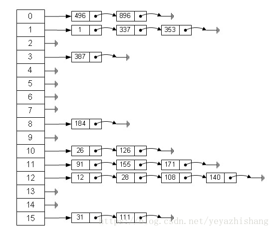

从图中可以看出，左边很明显是个数组，数组的每个成员包括一个指针，指向一个链表的头，当然这个链表可能为空，也可能元素很多。

我们根据元素的一些特征把元素分配到不同的链表中去，也是根据这些特征，找到正确的链表，再从链表中找出这个元素。

Hash表需要解决的是Hash冲突，如果解决不好，会影响性能。

## 堆 Heap

堆是一种比较特殊的数据结构，可以被看做一棵树的数组对象，具有以下的性质：

   - 堆中某个节点的值总是不大于或不小于其父节点的值；
   - 堆总是一棵完全二叉树。

将根节点最大的堆叫做最大堆或大根堆，根节点最小的堆叫做最小堆或小根堆。

常见的堆有二叉堆、斐波那契堆等。

堆的定义如下：
   - n个元素的序列{k1,k2,ki,…,kn}当且仅当满足下关系时，称之为堆。
   - (ki <= k2i,ki <= k2i+1)  或者 (ki >= k2i,ki >= k2i+1), 
   - (i = 1,2,3,4…n/2)，
   - 满足前者的表达式的成为小顶堆，满足后者表达式的为大顶堆，

这两者的结构图可以用完全二叉树排列出来，示例图如下：

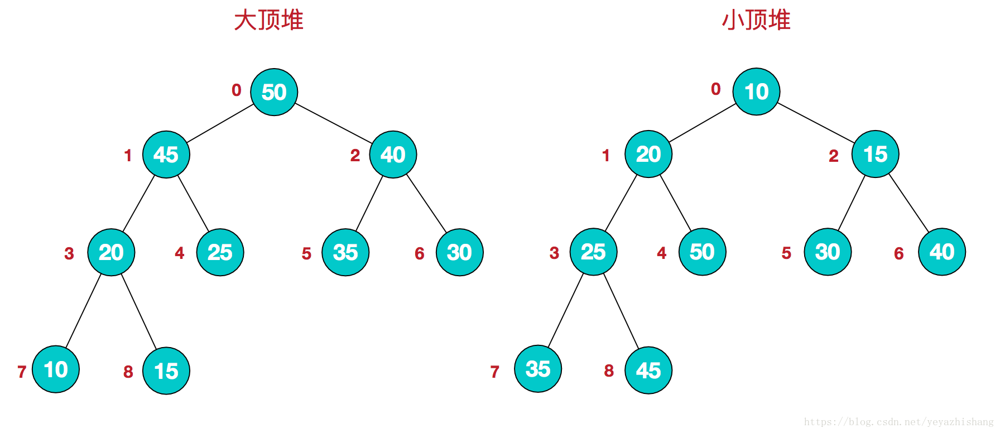

### 应用场景
因为堆有序的特点，一般用来做数组中的排序，称为堆排序。


## 图 Graph

图是由结点的有穷集合V和边的集合E组成。

其中，为了与树形结构加以区别，在图结构中常常将结点称为顶点，边是顶点的有序偶对。

若两个顶点之间存在一条边，就表示这两个顶点具有相邻关系。

按照顶点指向的方向可分为无向图和有向图：

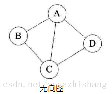

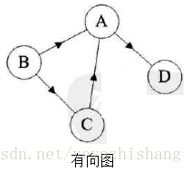

### 应用场景
图是一种比较复杂的数据结构，在存储数据上有着比较复杂和高效的算法，分别有邻接矩阵 、邻接表、十字链表、邻接多重表、边集数组等存储结构。
