# 前言
面向对象的特点是**可维护、可复用、可扩展、灵活性好**，
它真正强大的地方在于：随着业务变的越来越复杂，面向对象依然能够使得程序结构良好，
而面向过程却会导致程序越来越臃肿。

面向对象保持结构良好的秘诀就是**设计模式**。

# 设计模式

## 六大原则：
- **开闭原则：** 一个软件实体如类、模块和函数应该对修改封闭，对扩展开发。
- **单一职责原则：** 一类只做一件事，一类应该只有一个引起它修改的原因。
- **里使替换原则：** 子类应该可以完全替换父类。也就是说在使用继承的时候，只扩展新功能，而不要破坏类原有的功能。
- **依赖倒置原则：** 细节应该依赖于抽象，抽象不应该依赖于细节。把抽象层放在程序设计的高层，并保持稳定，程序的细节变化由低层的实现来完成。
- **迪米特法则：** 又名[最少知道原则]， 一个类不应该知道自己操作的类的细节，换言之，之和朋友谈话，不和朋友的朋友谈话。
- **接口隔离原则：** 客户端不应该依赖它不需要的接口。如果一个接口在实现时，部分方法由于冗余被客户端空实现，则应该将接口拆分，让实现类只需依赖自己需要的接口方法。

### 开放封闭原则（Open Close Principle）
**原则思想**：尽量通过扩展软件实体来解决需求变化，而不是通过修改已有的代码来完成变化

**描述**：一个软件产品在生命周期内，都会发生变化，既然变化是一个既定的事实，我们就应该在设计的时候尽量适应这些变化，以提高项目的稳定性和灵活性。

**优点**：单一原则告诉我们，每个类都有自己负责的职责，里氏替换原则不能破坏继承关系的体系。

### 里氏替换原则（Liskov Substitution Principle）
**原则思想**：使用的基类可以在任何地方使用继承的子类，完美的替换基类。

**大概意思是**：子类可以扩展父类的功能，但不能改变父类原有的功能。子类可以实现父类的抽象方法，但不能覆盖父类的非抽象方法，子类中可以增加自己特有的方法。

**优点**：增加程序的健壮性，即使增加了子类，原有的子类还可以继续运行，互不影响。

### 依赖倒置原则（Dependence Inversion Principle）
依赖倒置原则的核心思想是**面向接口编程**.

依赖倒转原则要求我们在程序代码中传递参数时或在关联关系中，尽量引用层次高的**抽象层类**，

这个是开放封闭原则的基础，具体内容是：**对接口编程，依赖于抽象而不依赖于具体**。

### 迪米特法则（最少知道原则）（Demeter Principle）

**原则思想**：一个对象应当对其他对象有尽可能少地了解，简称类间解耦

大概意思就是一个类尽量减少自己对其他对象的依赖，原则是低耦合，高内聚，只有使各个模块之间的耦合尽量的低，才能提高代码的复用率。

**优点：低耦合，高内聚**。

### 接口隔离原则（Interface Segregation Principle）

这个原则的意思是：使用多个隔离的接口，比使用单个接口要好。
还是一个降低类之间的耦合度的意思，从这儿我们看出，其实设计模式就是一个软件的设计思想，
从大型软件架构出发，为了升级和维护方便。
所以上文中多次出现：**降低依赖，降低耦合**。

例如：支付类的接口和订单类的接口，需要把这俩个类别的接口变成俩个隔离的接口

### 单一职责原则（Principle of single responsibility）

**原则思想**：一个方法只负责一件事情。

**描述**：单一职责原则很简单，一个方法 一个类只负责一个职责，各个职责的程序改动，不影响其它程序。 这是常识，几乎所有程序员都会遵循这个原则。

**优点**：降低类和类的耦合，提高可读性，增加可维护性和可拓展性，降低可变性的风险。


## 分类
- 总计23中设计模式
- 常用的设计模式：
1. 工厂模式
2. 单例模式
3. 装饰模式
4. 策略模式
5. 代理模式
6. 观察者模式

###  构建型模式 5中：
对象实例化的模式，创建型模式用于解耦对象的实例化过程。

1. 工厂方法模式
2. 抽象工程模型
3. 单例模式
4. 建造型模式
5. 原型模式

### 结构型模式 7中：
把类或对象结合在一起形成一个更大的结构。

1. 适配器模式
2. 桥接模式
3. 组合模式
4. 装饰模式
5. 外观模式
6. 享元模式
7. 代理模式

### 行为型模式：
类和对象如何交互，及划分责任和算法
1. 访问者模式
2. 模板模式
3. 策略模式
4. 状态模式
5. 观察者模式
6. 备忘录模式
7. 中介者模式
8. 迭代器模式
9. 解释器模式
10. 命令模式
11. 责任链模式

### Spring中经典的9中设计模式
1. 简单工厂（非23中设计模式中的一种）
2. 工厂方法
3. 单例模式
4. 适配器模式
5. 装饰器模式
6. 代理模式
7. 观察者模式
8. 策略模式
9. 模板方法模式

### 详细介绍

#### 工厂模式 Factory
##### 简单工厂模式 Simple Factory (非23中设计模式中的一种)
**包含如下角色:**
>1. Factory：工厂角色-负责实现创建所有实例的内部逻辑.
>2. Product：抽象产品角色-是所创建的所有对象的父类，负责描述所有实例所共有的公共接口。
>3. ConcreteProduct：具体产品角色-是创建目标，所有创建的对象都充当这个角色的某个具体类的实例。

**结构图：**
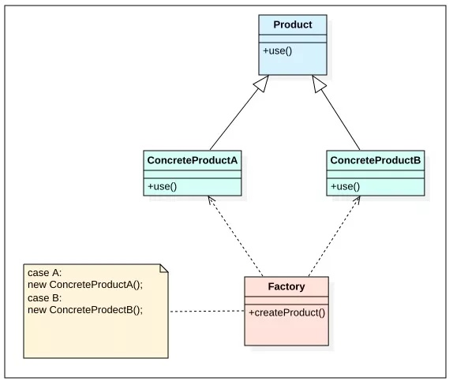

**时序图：**
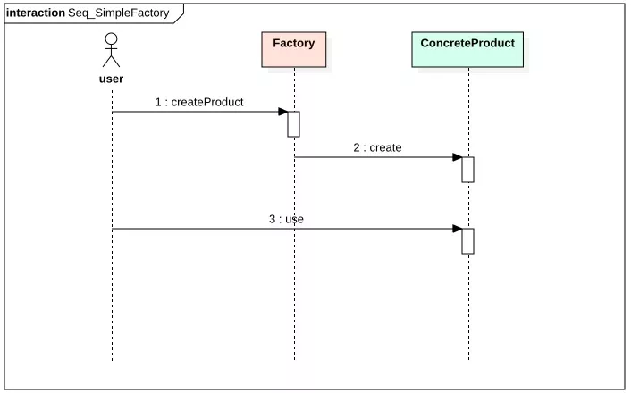

**优点：**
>客户类和工厂类分开。消费者任何时候需要某种产品，只需向工厂请求即可。消费者无须修改就可以接纳新产品。

**缺点：**
>是当产品修改时，工厂类也要做相应的修改。


##### 工厂方法模式 Factory Method 

**包含如下角色：**
>1. Product：抽象产品
>2. ConcreteProduct：具体产品
>3. Factory：抽象工厂
>4. ConcreteFactory：具体工厂

**结构图：**


**时序图：**
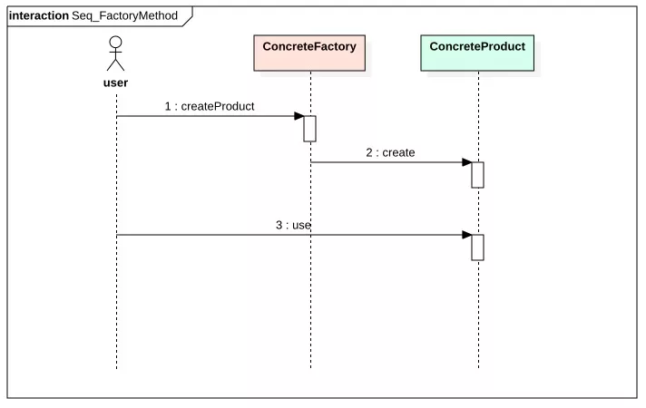

**工厂模式总结**

1. 适用场景
    >输出的产品是标准品，谁来做都可以。

2. 举例
    >常见的数据库连接工厂，SqlSessionFactory，产品是一个数据库连接，至于是oracle提供的，还是mysql提供的，我并不需要关心，因为都能让我通过sql来操作数据。

3. 注意事项
    >项目初期，软件结构和需求都没有稳定下来时，不建议使用此模式，
    >因为其劣势也很明显，增加了代码的复杂度，增加了调用层次，增加了内存负担。
    >所以要注意防止模式的滥用。

4. 简单实现
```java

package FactoryMethod;
public class FactoryPattern
{
    public static void main(String[] args)
    {
        IFactory factory = new ConcreteFactoryA();
        IProduct product = factory.createProduct();
        product.use();
    }
}

//抽象产品：提供了产品的接口
interface IProduct
{
    public void use();
}
//具体产品A：实现抽象产品中的抽象方法
class ConcreteProductA implements IProduct
{
    @override
    public void use()
    {
        System.out.println("具体产品A显示...");
    }
}
//具体产品B：实现抽象产品中的抽象方法
class ConcreteProductB implements IProduct
{
    @override
    public void use()
    {
        System.out.println("具体产品B显示...");
    }
}
//抽象工厂：提供了厂品的生成方法
interface IFactory
{
    public IProduct createProduct();
}
//具体工厂A：实现了厂品的生成方法
class ConcreteFactoryA implements IFactory
{
    @override
    public IProduct createProduct()
    {
        System.out.println("具体工厂A生成-->具体产品A.");
        return new ConcreteProductA();
    }
}
//具体工厂B：实现了厂品的生成方法
class ConcreteFactoryB implements IFactory
{
    @override
    public Product createProduct()
    {  
        System.out.println("具体工厂B生成-->具体产品B.");
        return new ConcreteProductB();
    }
}
```


#### 单例模式 Singleton

**包含如下角色：**
Singleton：单例

**结构图：**
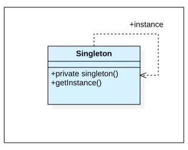

**时序图：**
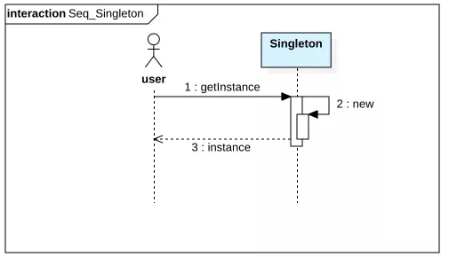

**优点：**
全局只有一个实例，便于统一控制，同时减少了系统资源开销。

**缺点：**
没有抽象层，扩展困难。

**应用场景**
适合需要做全局统一控制的场景，例如：全局唯一的编码生成器。

**注意事项**
只对外提供公共的getInstance方法，不提供任何公共构造函数。

**简单实现**
```java
public class Singleton
{
    private static volatile Singleton instance=null;    //保证 instance 在所有线程中同步
    private Singleton(){}    //private 避免类在外部被实例化
    public static synchronized Singleton getInstance()
    {
        //getInstance 方法前加同步
        if(instance == null)
        {
            instance = new Singleton();
        }
        return instance;
    }
}

```

#### 装饰模式 Decorator

**包含如下角色：**
Component：抽象构件
ConcreteComponent：具体构件
Decorator：抽象装饰类
ConcreteDecorator：具体装饰类

**结构图：**
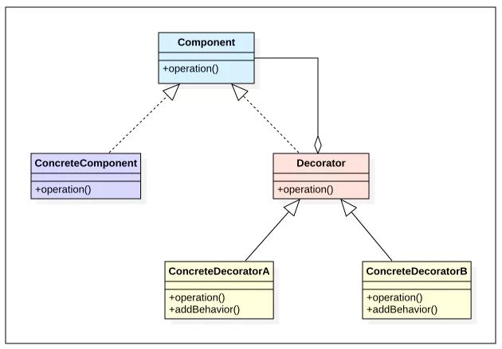

**时序图：**
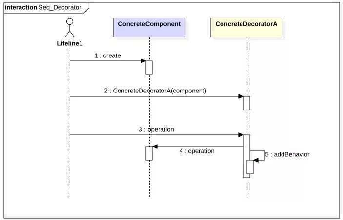

**优点：**
比继承更加灵活（继承是耦合度很大的静态关系），可以动态的为对象增加职责，可以通过使用不同的装饰器组合为对象扩展N个新功能，而不会影响到对象本身。

**缺点：**
当一个对象的装饰器过多时，会产生很多的装饰类小对象和装饰组合策略，增加系统复杂度，增加代码的阅读理解成本。

**适用场景**
适合需要（通过配置，如：diamond）来动态增减对象功能的场景。
适合一个对象需要N种功能排列组合的场景（如果用继承，会使子类数量爆炸式增长）

**注意事项**
一个装饰类的接口必须与被装饰类的接口保持相同，对于客户端来说无论是装饰之前的对象还是装饰之后的对象都可以一致对待。
尽量保持具体构件类Component作为一个“轻”类，也就是说不要把太多的逻辑和状态放在具体构件类中，可以通过装饰类。

**简单实现**
```java
package decorator;
public class DecoratorPattern
{
    public static void main(String[] args)
{
        Component component = new ConcreteComponent();
        component.operation();
        System.out.println("---------------------------------");
        Component decorator = new ConcreteDecorator(component);
        decorator.operation();
    }
}
//抽象构件角色
interface  Component
{
    public void operation();
}
//具体构件角色
class ConcreteComponent implements Component
{
    public ConcreteComponent()
{
        System.out.println("创建具体构件角色");       
    }   
    public void operation()
{
        System.out.println("调用具体构件角色的方法operation()");           
    }
}
//抽象装饰角色
class Decorator implements Component
{
    private Component component;   
    public Decorator(Component component)
{
        this.component=component;
    }   
    public void operation()
{
        component.operation();
    }
}
//具体装饰角色
class ConcreteDecorator extends Decorator
{
    public ConcreteDecorator(Component component)
{
        super(component);
    }   
    public void operation()
{
        super.operation();
        addBehavior();
    }
    public void addBehavior()
{
        System.out.println("为具体构件角色增加额外的功能addBehavior()");           
    }
}
```

#### 策略模式 Strategy

**策略模式结构**
Context: 环境类
Strategy: 抽象策略类
ConcreteStrategy: 具体策略类

**结构图：**
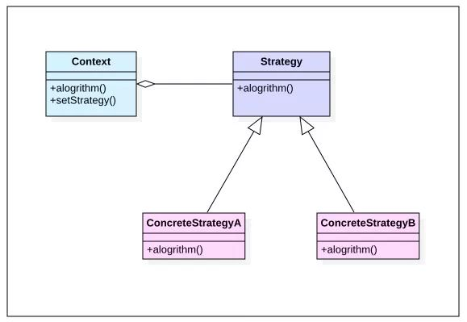

**时序图：**
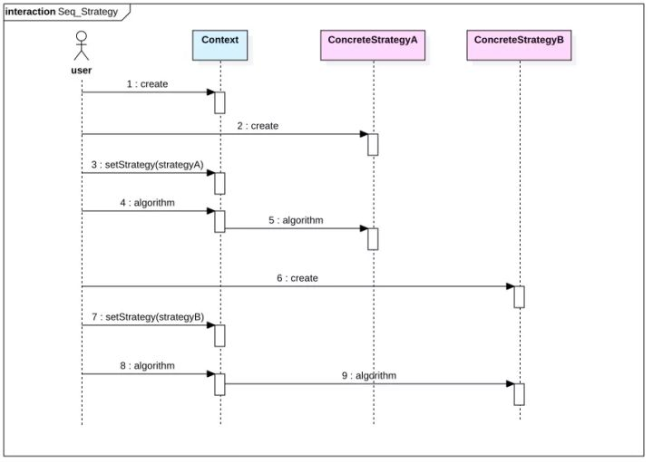

**优点：**
策略模式提供了对“开闭原则”的完美支持，用户可以在不修改原有系统的基础上选择算法或行为。干掉复杂难看的if-else。

**缺点：**
调用时，必须提前知道都有哪些策略模式类，才能自行决定当前场景该使用何种策略。

**试用场景**
一个系统需要动态地在几种可替换算法中选择一种。不希望使用者关心算法细节，将具体算法封装进策略类中。

**注意事项**
一定要在策略类的注释中说明该策略的用途和适用场景。

**简单实现**
```java
package strategy;
public class StrategyPattern
{
    public static void main(String[] args)
    {
        Context context = new Context();
        IStrategy strategyA = new ConcreteStrategyA();
        context.setStrategy(strategyA);
        context.algorithm();
        System.out.println("-----------------");
        IStrategy strategyB = new ConcreteStrategyB();
        context.setStrategy(strategyB);
        context.algorithm();
    }
}
//抽象策略类
interface IStrategy
{   
    public void algorithm();    //策略方法
}
//具体策略类A
class ConcreteStrategyA implements IStrategy
{
    @override
    public void algorithm()
    {
        System.out.println("具体策略A的策略方法被访问！");
    }
}
//具体策略类B
class ConcreteStrategyB implements IStrategy
{
    @override
    public void algorithm()
    {
      System.out.println("具体策略B的策略方法被访问！");
    }
}
//环境类
class Context
{
    private IStrategy strategy;
    public IStrategy getStrategy()
    {
        return strategy;
    }
    public void setStrategy(IStrategy strategy)
    {
        this.strategy=strategy;
    }
    public void algorithm()
    {
        strategy.algorithm();
    }
}
```
#### 代理模式 Proxy 

**代理模式结构**
Subject: 抽象主题角色
Proxy: 代理主题角色
RealSubject: 真实主题角色

**结构图：**
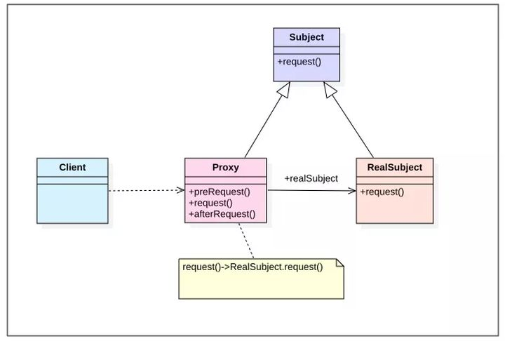

**时序图：**
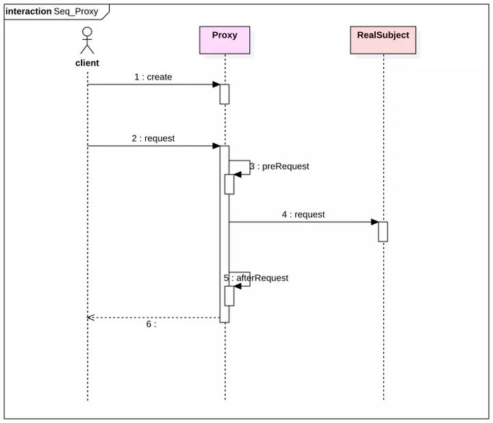

**优点：**
代理可以协调调用方与被调用方，降低了系统的耦合度。根据代理类型和场景的不同，可以起到控制安全性、减小系统开销等作用。

**缺点：**
增加了一层代理处理，增加了系统的复杂度，同时可能会降低系统的相应速度。

**试用场景**
理论上可以代理任何对象，常见的代理模式有：
- 远程(Remote)代理：
为一个位于不同的地址空间的对象提供一个本地的代理对象，这个不同的地址空间可以是在同一台主机中，也可是在另一台主机中，远程代理又叫做大使(Ambassador)。

- 虚拟(Virtual)代理：
如果需要创建一个资源消耗较大的对象，先创建一个消耗相对较小的对象来表示，真实对象只在需要时才会被真正创建。

- Copy-on-Write代理：
它是虚拟代理的一种，把复制（克隆）操作延迟到只有在客户端真正需要时才执行。
一般来说，对象的深克隆是一个开销较大的操作，Copy-on-Write代理可以让这个操作延迟，只有对象被用到的时候才被克隆。

- 保护(Protect or Access)代理：
控制对一个对象的访问，可以给不同的用户提供不同级别的使用权限。

- 缓冲(Cache)代理：
为某一个目标操作的结果提供临时的存储空间，以便多个客户端可以共享这些结果。

- 防火墙(Firewall)代理：
保护目标不让恶意用户接近。

- 同步化(Synchronization)代理：
使几个用户能够同时使用一个对象而没有冲突。

- 智能引用(Smart Reference)代理：
当一个对象被引用时，提供一些额外的操作，如将此对象被调用的次数记录下来等。

**简单实现**
```java
package proxy;
public class ProxyPattern
{
    public static void main(String[] args)
{
        Proxy proxy = new Proxy();
        proxy.request();
    }
}
//抽象主题
interface Subject
{
    void request();
}
//真实主题
class RealSubject implements Subject
{
    public void request()
{
        System.out.println("访问真实主题方法...");
    }
}
//代理
class Proxy implements Subject
{
    private RealSubject realSubject;
    public void request()
{
        if (realSubject==null)
        {
            realSubject=new RealSubject();
        }
        preRequest();
        realSubject.request();
        afterRequest();
    }
    public void preRequest()
{
        System.out.println("访问真实主题之前的预处理。");
    }
    public void afterRequest()
{
        System.out.println("访问真实主题之后的后续处理。");
    }
}
```

#### 观察者模式(Observer)
**包含如下角色：**
Subject：目标
ConcreteSubject：具体目标
Observer：观察者
ConcreteObserver：具体观察者

**结构图：**
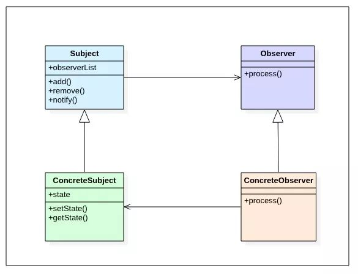

**时序图：**
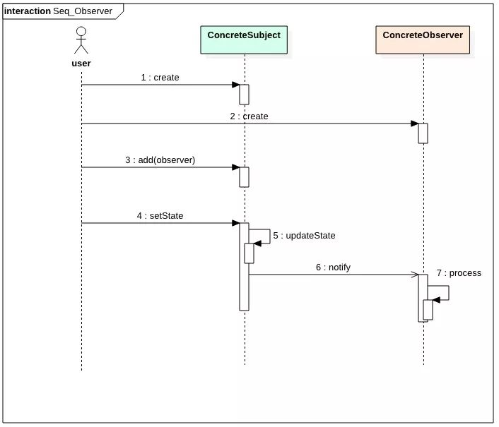

**优点：**
将复杂的串行处理逻辑变为单元化的独立处理逻辑，被观察者只是按照自己的逻辑发出消息，不用关心谁来消费消息，每个观察者只处理自己关心的内容。逻辑相互隔离带来简单清爽的代码结构。

**缺点：**
观察者较多时，可能会花费一定的开销来发消息，但这个消息可能仅一个观察者消费。

**适用场景**
适用于一对多的的业务场景，一个对象发生变更，会触发N个对象做相应处理的场景。例如：订单调度通知，任务状态变化等。

**注意事项**
避免观察者与被观察者之间形成循环依赖，可能会因此导致系统崩溃。

**简单实现**
```java
package observer;
import java.util.*;
public class ObserverPattern
{
    public static void main(String[] args)
    {
        Subject subject = new ConcreteSubject();
        Observer obsA = new ConcreteObserverA();
        Observer obsb = new ConcreteObserverB();
        subject.add(obsA);
        subject.add(obsB);
        subject.setState(0);
    }
}
//抽象目标
abstract class Subject
{
    protected List<Observer> observerList = new ArrayList<Observer>();   
    //增加观察者方法
    public void add(Observer observer)
    {
        observers.add(observer);
    }    
    //删除观察者方法
    public void remove(Observer observer)
    {
        observers.remove(observer);
    }   
    public abstract void notify(); //通知观察者方法
}
//具体目标
class ConcreteSubject extends Subject
{
   private Integer state;
   public void setState(Integer state){
        this.state = state;

        // 状态改变通知观察者
        notify();
    }
    public void notify()
    {
        System.out.println("具体目标状态发生改变...");
        System.out.println("--------------");       

        for(Observer obs:observers)
        {
            obs.process();
        }

    }          
}
//抽象观察者
interface Observer
{
    void process(); //具体的处理
}
//具体观察者A
class ConcreteObserverA implements Observer
{
    public void process()
    {
        System.out.println("具体观察者A处理！");
    }
}
//具体观察者B
class ConcreteObserverB implements Observer
{
    public void process()
    {
        System.out.println("具体观察者B处理！");
    }
}
```
