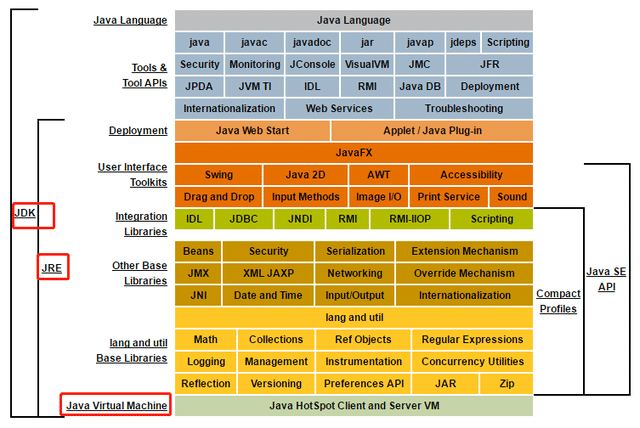
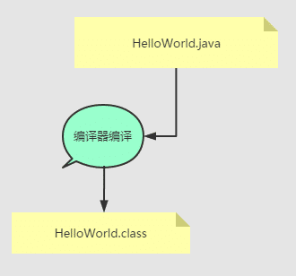
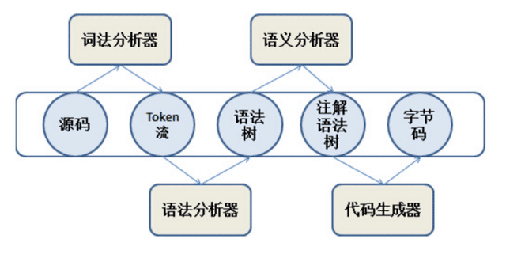
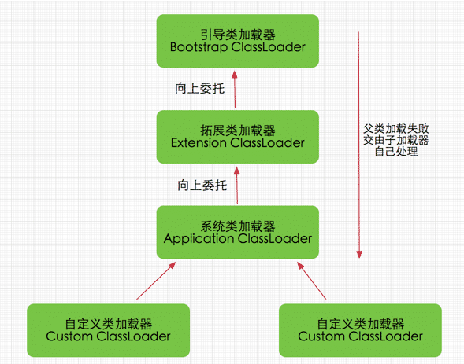

# JVM 分析
- https://www.cnblogs.com/kongzhongqijing/articles/5534624.html

# JDK、JRE、JVM的关系
- 范围关系：JDK>JRE>JVM。
如下图：
    

- .java文件与.class文件的关系
    

    
- class文件与JVM的关系  
JVM通过类加载机制，把class文件装载进JVM中，然后JVM解析class文件的内容，于是就有了类加载过中的链接、初始化等。

- 类加载器关系
    

- Minor、Major、Full GC的关系
1. Minor GC：发生在年轻代的 GC。

>Minor GC是指从年轻代空间（包括 Eden 和 Survivor 区域）回收内存。当 JVM 无法为一个新的对象分配空间时会触发Minor GC，比如当 Eden 区满了。

>Eden区满了触发MinorGC，这时会把Eden区存活的对象复制到Survivor区，当对象在Survivor区熬过一定次数的MinorGC之后，就会晋升到老年代（当然并不是所有的对象都是这样晋升的到老年代的），当老年代满了，就会报OutofMemory异常。

>所有的MinorGC都会触发全世界的暂停（stop-the-world），停止应用程序的线程，不过这个过程非常短暂。

2. Major GC：发生在老年代的 GC。

3. Major GC清理Tenured区(老年代)。

4. Full GC：新生代+老年代，比如 方法区引起年轻代和老年代的回收。

- 垃圾收集器之间有什么关系

**新生代收集器**：Serial、ParNew、Parallel Scavenge

**老年代收集器**：CMS、Serial Old、Parallel Old

**整堆收集器**：G1，ZGC(因为不涉年代不在图中)


# Dump文件生成方式
## 使用 JVM 参数获取 dump 文件
1. -XX:+HeapDumpOnOutOfMemoryError
当OutOfMemoryError发生时自动生成 Heap Dump 文件。
这可是一个非常有用的参数，因为当你需要分析Java内存使用情况时，往往是在OOM(OutOfMemoryError)发生时。
2. -XX:+HeapDumpBeforeFullGC  
当 JVM 执行 FullGC 前执行 dump。
3. -XX:+HeapDumpAfterFullGC  
当 JVM 执行 FullGC 后执行 dump。
4. -XX:+HeapDumpOnCtrlBreak  
交互式获取dump。在控制台按下快捷键Ctrl + Break时，JVM就会转存一下堆快照。

### 使用 -XX:HeapDumpPath=./vcb_dump.hprof dump信息输出到文，指定 dump 文件存储路径
- 输出Dump文件:*.hprof *.hprof.1 ... 
- 不会重复和覆盖以前存在的文件**


**注意：JVM 生成 Heap Dump 的时候，虚拟机是暂停一切服务的。如果是线上系统执行 Heap Dump 时需要注意。**

## jmap命令(Java Memory Map)
- 介绍文章(https://blog.csdn.net/fenglibing/article/details/6411953)
### 介绍
打印出某个java进程（使用pid）内存内的，所有‘对象’的情况（如：产生那些对象，及其数量）。

可以输出所有内存中对象的工具，甚至可以将VM 中的heap，以二进制输出成文本。

实时打印dump文件

### 命令格式
```shell
    jmap [ option ] pid

    jmap [ option ] executable core

    jmap [ option ] [server-id@]remote-hostname-or-IP
```

### 参数说明
1. options： 
> pid： 进程ID

> executable: Java executable from which the core dump was produced. (可能是产生core dump的java可执行程序)

> core: 将被打印信息的core dump文件

> remote-hostname-or-IP: 远程debug服务的主机名或ip

> server-id 唯一id,假如一台主机上多个远程debug服务 

2. 基本参数：

-dump:[live,]format=b,file=<filename> :  
使用hprof二进制形式,输出jvm的heap内容到文件=. live子选项是可选的，假如指定live选项,那么只输出活的对象到文件. 

-finalizerinfo : 打印正等候回收的对象的信息.

-heap : 打印heap的概要信息，GC使用的算法，heap的配置及wise heap的使用情况.

-histo[:live] : 打印每个class的实例数目,内存占用,类全名信息. VM的内部类名字开头会加上前缀”*”. 如果live子参数加上后,只统计活的对象数量. 

-permstat : 打印classload和jvm heap长久层的信息. 包含每个classloader的名字,活泼性,地址,父classloader和加载的class数量. 另外,内部String的数量和占用内存数也会打印出来. 

-F 强迫.在pid没有相应的时候使用-dump或者-histo参数. 在这个模式下,live子参数无效. 

-h | -help 打印辅助信息 

-J 传递参数给jmap启动的jvm. 

pid 需要被打印配相信息的java进程id,创业与打工的区别 - 博文预览,可以用jps查问.

### 使用示例
```
jmap -histo 4939
```
dump文件
```
jmap -dump:format=b,file=test.bin 4939

Dumping heap to /home/fenglb/test.bin ...

Heap dump file created
```


## 使用其它工具获取dump文件
分析 Heap Dump 的工具都可以获取 Heap Dump 文件。
比如：jdk 自带的工具 jvisualvm。
其它工具：Eclipse memory analyzer（jmat）、JProfiler 等。

# JVM常用GC日志打印
* -XX:+PrintGC 每次GC时打印相关信息
* -XX:+PrintGCDetails 每次GC时打印详细信息
* -XX:+PrintGCTimeStamps 打印每次GC的时间戳
* -Xloggc:/tmp/jvm.log 设置垃圾回收日志打印的文件，文件名称可以自定义