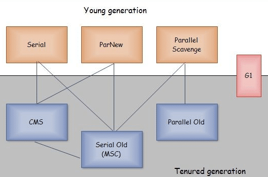

# JVM 分析
- https://www.cnblogs.com/kongzhongqijing/articles/5534624.html

# JDK、JRE、JVM的关系
- 范围关系：JDK>JRE>JVM。
如下图：
    

- .java文件与.class文件的关系
    

    
- class文件与JVM的关系  
JVM通过类加载机制，把class文件装载进JVM中，然后JVM解析class文件的内容，于是就有了类加载过中的链接、初始化等。

- 类加载器关系
    

- Minor、Major、Full GC的关系
1. Minor GC：发生在年轻代的 GC。

>Minor GC是指从年轻代空间（包括 Eden 和 Survivor 区域）回收内存。当 JVM 无法为一个新的对象分配空间时会触发Minor GC，比如当 Eden 区满了。

>Eden区满了触发MinorGC，这时会把Eden区存活的对象复制到Survivor区，当对象在Survivor区熬过一定次数的MinorGC之后，就会晋升到老年代（当然并不是所有的对象都是这样晋升的到老年代的），当老年代满了，就会报OutofMemory异常。

>所有的MinorGC都会触发全世界的暂停（stop-the-world），停止应用程序的线程，不过这个过程非常短暂。

2. Major GC：发生在老年代的 GC。

3. Major GC清理Tenured区(老年代)。

4. Full GC：新生代+老年代，比如 方法区引起年轻代和老年代的回收。

- 垃圾收集器之间有什么关系

**新生代收集器**：Serial、ParNew、Parallel Scavenge

**老年代收集器**：CMS、Serial Old、Parallel Old

**整堆收集器**：G1，ZGC(因为不涉年代不在图中)


# GC详解及Minor GC和Full GC触发条件总结
GC，即就是Java垃圾回收机制。

目前主流的JVM（HotSpot）采用的是分代收集算法。
与C++不同的是，Java采用的是类似于树形结构的可达性分析法来判断对象是否还存在引用。
即：从gcroot开始，把所有可以搜索得到的对象标记为存活对象。

## GC机制

要准确理解Java的垃圾回收机制，就要从：“什么时候”，“对什么东西”，“做了什么”三个方面来具体分析。

第一：“什么时候”即就是GC触发的条件。
GC触发的条件有两种。
1. 程序调用System.gc时可以触发(会建议JVM进行垃圾回收，不代表一定会进行GC)；
2. 系统自身来决定GC触发的时机。

系统判断GC触发的依据：根据Eden区和From Space区的内存大小来决定。当内存大小不足时，则会启动GC线程并停止应用线程。

第二：“对什么东西”笼统的认为是Java对象并没有错。
但是准确来讲，GC操作的对象分为：
1. 通过可达性分析法无法搜索到的对象和可以搜索到的对象。
2. 对于搜索不到的方法进行标记。

第三：“做了什么”最浅显的理解为释放对象。
但是从GC的底层机制可以看出，对于可以搜索到的对象进行复制操作，对于搜索不到的对象，调用finalize()方法进行释放。

具体过程：
1. 当GC线程启动时，会通过可达性分析法把Eden区和From Space区的存活对象复制到To Space区，然后把Eden Space和From Space区的对象释放掉。
2. 当GC轮训扫描To Space区一定次数后，把依然存活的对象复制到老年代，然后释放To Space区的对象。

对于用可达性分析法搜索不到的对象，GC并不一定会回收该对象。要完全回收一个对象，至少需要经过两次标记的过程。
1. 第一次标记：对于一个没有其他引用的对象，筛选该对象是否有必要执行finalize()方法，如果没有执行必要，则意味可直接回收。（筛选依据：是否复写或执行过finalize()方法；因为finalize方法只能被执行一次）。

2. 第二次标记：如果被筛选判定位有必要执行，则会放入FQueue队列，并自动创建一个低优先级的finalize线程来执行释放操作。如果在一个对象释放前被其他对象引用，则该对象会被移除FQueue队列。

## GC过程中用到的回收算法：

通过上面的GC过程不难看出，Java堆中的年轻代和老年代采用了不同的回收算法。年轻代采用了复制法；而老年代采用了标记-整理法

具体各种回收算法的详解参考：http://www.cnblogs.com/dolphin0520/p/3783345.html

## JVM内存空间图解


程序计数器：线程私有。是一块较小的内存，是当前线程所执行的字节码的行号指示器。是Java虚拟机规范中唯一没有规定OOM（OutOfMemoryError）的区域。

Java栈：线程私有。生命周期和线程相同。是Java方法执行的内存模型。执行每个方法都会创建一个栈帧，用于存储局部变量和操作数（对象引用）。局部变量所需要的内存空间大小在编译期间完成分配。所以栈帧的大小不会改变。存在两种异常情况：若线程请求深度大于栈的深度，抛StackOverflowError。若栈在动态扩展时无法请求足够内存，抛OOM。

Java堆：所有线程共享。虚拟机启动时创建。存放对象实力和数组。所占内存最大。分为新生代（Young区），老年代（Old区）。新生代分Eden区，Survivor区。Survivor区又分为From space区和To Space区。Eden区和Survivor区的内存比为8:1。 当扩展内存大于可用内存，抛OOM。

方法区：所有线程共享。用于存储已被虚拟机加载的类信息、常量、静态变量等数据。又称为非堆（Non – Heap）。方法区又称“永久代”。GC很少在这个区域进行，但不代表不会回收。这个区域回收目标主要是针对常量池的回收和对类型的卸载。当内存申请大于实际可用内存，抛OOM。

本地方法栈：线程私有。与Java栈类似，但是不是为Java方法（字节码）服务，而是为本地非Java方法服务。也会抛StackOverflowError和OOM。

 

## Minor GC ，Full GC 触发条件

Minor GC触发条件：当Eden区满时，触发Minor GC。

Full GC触发条件：

（1）调用System.gc时，系统建议执行Full GC，但是不必然执行

（2）老年代空间不足

（3）方法去空间不足

（4）通过Minor GC后进入老年代的平均大小大于老年代的可用内存

（5）由Eden区、From Space区向To Space区复制时，对象大小大于To Space可用内存，则把该对象转存到老年代，且老年代的可用内存小于该对象大小

----

# JVM常用GC日志打印
* -XX:+PrintGC 每次GC时打印相关信息
* -XX:+PrintGCDetails 每次GC时打印详细信息
* -XX:+PrintGCTimeStamps 打印每次GC的时间戳
* -Xloggc:/tmp/jvm.log 设置垃圾回收日志打印的文件，文件名称可以自定义

# Dump文件生成方式
## 使用 JVM 参数获取 dump 文件
1. -XX:+HeapDumpOnOutOfMemoryError
当OutOfMemoryError发生时自动生成 Heap Dump 文件。
这可是一个非常有用的参数，因为当你需要分析Java内存使用情况时，往往是在OOM(OutOfMemoryError)发生时。
2. -XX:+HeapDumpBeforeFullGC  
当 JVM 执行 FullGC 前执行 dump。
3. -XX:+HeapDumpAfterFullGC  
当 JVM 执行 FullGC 后执行 dump。
4. -XX:+HeapDumpOnCtrlBreak  
交互式获取dump。在控制台按下快捷键Ctrl + Break时，JVM就会转存一下堆快照。

### 使用 -XX:HeapDumpPath=./vcb_dump.hprof dump信息输出到文，指定 dump 文件存储路径
- 输出Dump文件:*.hprof *.hprof.1 ... 
- 不会重复和覆盖以前存在的文件**


**注意：JVM 生成 Heap Dump 的时候，虚拟机是暂停一切服务的。如果是线上系统执行 Heap Dump 时需要注意。**

## jmap命令(Java Memory Map)
- 介绍文章(https://blog.csdn.net/fenglibing/article/details/6411953)
### 介绍
打印出某个java进程（使用pid）内存内的，所有‘对象’的情况（如：产生那些对象，及其数量）。

可以输出所有内存中对象的工具，甚至可以将VM 中的heap，以二进制输出成文本。

实时打印dump文件

### 命令格式
```shell
    jmap [ option ] pid

    jmap [ option ] executable core

    jmap [ option ] [server-id@]remote-hostname-or-IP
```

### 参数说明
1. options： 
> pid： 进程ID

> executable: Java executable from which the core dump was produced. (可能是产生core dump的java可执行程序)

> core: 将被打印信息的core dump文件

> remote-hostname-or-IP: 远程debug服务的主机名或ip

> server-id 唯一id,假如一台主机上多个远程debug服务 

2. 基本参数：

-dump:[live,]format=b,file=<filename> :  
使用hprof二进制形式,输出jvm的heap内容到文件=. live子选项是可选的，假如指定live选项,那么只输出活的对象到文件. 

-finalizerinfo : 打印正等候回收的对象的信息.

-heap : 打印heap的概要信息，GC使用的算法，heap的配置及wise heap的使用情况.

-histo[:live] : 打印每个class的实例数目,内存占用,类全名信息. VM的内部类名字开头会加上前缀”*”. 如果live子参数加上后,只统计活的对象数量. 

-permstat : 打印classload和jvm heap长久层的信息. 包含每个classloader的名字,活泼性,地址,父classloader和加载的class数量. 另外,内部String的数量和占用内存数也会打印出来. 

-F 强迫.在pid没有相应的时候使用-dump或者-histo参数. 在这个模式下,live子参数无效. 

-h | -help 打印辅助信息 

-J 传递参数给jmap启动的jvm. 

pid 需要被打印配相信息的java进程id,创业与打工的区别 - 博文预览,可以用jps查问.

### 使用示例
```
jmap -histo 4939
```
dump文件
```
jmap -dump:format=b,file=test.bin 4939

Dumping heap to /home/fenglb/test.bin ...

Heap dump file created
```


## 使用其它工具获取dump文件
分析 Heap Dump 的工具都可以获取 Heap Dump 文件。
比如：jdk 自带的工具 jvisualvm。
其它工具：Eclipse memory analyzer（jmat）、JProfiler 等。
