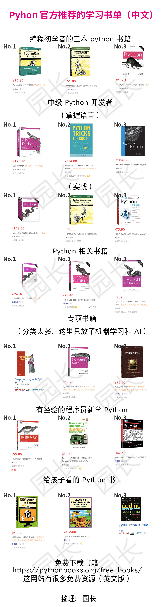

# JAVA

# Python
## 知乎推荐
- https://zhuanlan.zhihu.com/p/34378860

# 电子书免费网站
- https://www.epublink.com/free-books/page/2/

# Synergc 使用Github上的代码编译程序

# CMake
- CMake Cookbook

- Modern CMake

# 数据分析
## 数据可视化工具
- PowerBI
- Qlik
- Infogram
    Infogram是一种直观的可视化工具，可帮助你创建精美的信息图表和报告。它提供了超过35个交互式图表和500多个地图，帮助你可视化数据。除了各种各样的图表，还有柱状图、条形图、饼图或词云等，它用创新的信息图表给你留下深刻印象。
## 6款实用开源报表工具
### Web 报表工具 EasyReport
- https://gitee.com/xianrendzw/EasyReport
### Java 报表引擎 UReport2
- https://gitee.com/youseries/ureport
### EChart
- https://github.com/apache/incubator-echarts
- https://github.com/ecomfe/awesome-echarts