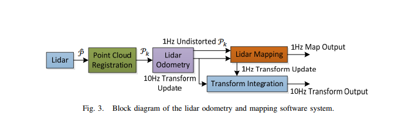

# 简介
LOAM: Lidar Odometry and Mapping in Real-time（RSS2014），
是常年位于KITTI上前列的激光雷达SLAM算法，作为该领域发表时间较早的论文，启发了后续很多类似的工作。
理解LOAM有助于初学者理解激光雷达SLAM的基本原理和整体流程。

- 论文：www.ri.cmu.edu/pub_files/2014/7/...

- 原文代码：github.com/laboshinl/loam_velodyne

- 改进代码：https://github.com/HKUST-Aerial-Robotics/A-LOAM（使用Ceres_Solver库做非线性优化，简化了代码结构）。

- 论文亮点：
    > 雷达运动畸变的补偿；
    > 特征提取减小了点云配准的数据量；
    > **ICP使用了非线性迭代优化（LM方法），而不是传统的SVD分解。**
- https://blog.csdn.net/i_robots/article/details/108331306#comments_13621877

- [论文翻译](https://blog.csdn.net/weixin_45626706/article/details/121886389)
- LOAM是Ji Zhang早期开源的多线LiDAR SLAM算法，代码后来闭源了。
- [loam_back_and_forth](https://wiki.ros.org/loam_back_and_forth)
> 这里有通过ros进行演示的数据集和操作说明。
- [loam_continuous](https://wiki.ros.org/loam_continuous)
> 这里有通过ros进行演示的数据集和操作说明。

- 术语解释
首先明确二维激光雷达只是水平方向旋转扫描，此时一次水平扫描完成的数据为一次scan；

三维激光雷达先垂直扫描再水平旋转实现三维扫描，此时一次三维扫描称为一次scan。

虽然二维激光和三维激光都有一次scan的术语，但是对应的含义只是说明一次完整的扫描过程，实际表示的数据并不一样。

原论文作者使用二维激光实现三维激光，需要添加机械结构实现垂直扫描，这样就会导致多个scan才是我们需要的三维扫描，那么这多个scan称为一次sweep。
也就是，这里的一次sweep对应于三维激光中的一次scan，二维激光的一次scan不等于三维激光的一次scan。

三维激光雷达 例如：多线雷达，激光束在垂直方向按照时间间隔依次发射。
激光束是间断发射的16束垂直方向的激光，不是同时发射的，但是间断时间很短，你可以认为是同时发射的，只是认为。
可以想一个问题，激光如果是同时发射的，如何根据反射的激光区分他们呢，所以一次只能发射一束激光。

根据官方资料，在垂直方向发射激光时，相邻激光束时间差为2.304 μs微秒，16束激光发射完成时会有18.43μs微秒的空闲时间，
一次16束激光完成发射需要花费 16 ∗ 2.034 μs + 18.43 μs = 55.296 μs微秒。

- 架构：
1. 点云注册
2. 激光里程计
3. 激光建图
4. 坐标转换发布
如下图：

- 核心思想
2步：地位和建图分开
> 高频率低精度的运动估计（定位）；低频率高精度的匹配（建图和校正）

- 原理分析
1. 特征点的提取和匹配
> 为了使特征点均有分布，将以此scan分成4个区域，每个区域2个边缘点 4个平面点
> 特征点所在的平面于激光束平行？？
> 边缘点 和边缘线  平面点和平面线

2. 里程计的估计
> 每帧进行运动估计，使用刚体运动公式和类似ICP计算位姿变化+平移和误差

- Books
Multiple View Geometry in Computer Vision Second Edition
Richard Hartley and Andrew Zisserman,
Cambridge University Press, March 2004.