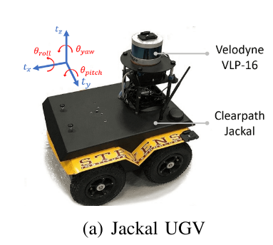

# 简介
LeGO-LOAM: Lightweight and Ground-Optimized Lidar Odometry and Mapping on Variable Terrain

论文：https://ieeexplore.ieee.org/abstract/document/8594299

代码：
> [LeGO-LOAM-BOR](https://github.com/facontidavide/LeGO-LOAM-BOR/tree/speed_optimization) 
> [LeGO-LOAM NOTED](https://github.com/wykxwyc/LeGO-LOAM_NOTED)
>  [Github](https://github.com/RobustFieldAutonomyLab/LeGO-LOAM)

文章：
- [三维SLAM算法LeGO-LOAM源码阅读一](https://blog.csdn.net/weixin_42048023/article/details/87452610)
- [如何开始SLAM学习？](https://zhuanlan.zhihu.com/p/379070942)
- [LeGO-LOAM分析之点云分割（一）](https://zhuanlan.zhihu.com/p/382460472)
- [LeGO-LOAM分析之特征提取（二）](https://zhuanlan.zhihu.com/p/384902839)
- [LeGO-LOAM分析之建图（三）](https://zhuanlan.zhihu.com/p/386235895)
- [LeGO-LOAM分析之配置（四）](https://zhuanlan.zhihu.com/p/386449627)

- [代码实战 | 用LeGO-LOAM实现BFS点云聚类和噪点剔除](https://cloud.tencent.com/developer/article/1913769)

# 代码
- [Github](https://github.com/RobustFieldAutonomyLab/LeGO-LOAM)
- [How to build&run](LOAM_Build&Run.md)

# 基础知识
- roll： 绕x轴转动
- yaw : 绕z轴转动
- pitch ： 绕y轴转动


- [用到的数学公式详解](https://wykxwyc.github.io/2019/08/01/The-Math-Formula-in-LeGO-LOAM/)

# 算法核心
LeGO-LOAM一共分为4个步骤。

1. Segmentation （filter out noise）
2. Feature Extraction（distinctive planar and edge features）
3. Lidar Odometry ：Label Matching, Two-step L-M Optimization
4. Lidar Mapping（pose-graph SLAM）

首先是对输入的原始点云进行点云分割（Segmentation），找到地面并且进行点云分割; 
> 1 -- imageProjection.cpp

接着对分割好的点云进行特征提取（Feature Extraction），找到面特征和边特征，提取出特征之后接下来进行特征匹配（点云配准），并且输出位姿;
> 2 3 featureAssociatin.cpp

最后对点云进行注册，生成全局地图，并且进行回环检测，对生成的地图进行优化。
> 4 -- mapOptmization


## 点云分割
1. 地面
- [地面分割：Fast Segmentation of 3D Point Clouds for Ground Vehicles](https://blog.csdn.net/lovelyaiq/article/details/118826534 )
> 参考论文：M. Himmelsbach, F.V. Hundelshausen, and H-J. Wuensche, 
> “Fast Segmentation of 3D Point Clouds for Ground Vehicles,” 
> Proceedings of the IEEE Intelligent Vehicles Symposium, pp. 560-565, 2010

> **核心思想**：
> 将点云从三维p(x,y,z)将到二维p(d, z)，虽然点云的维度减少，但点云的有效信息是不减少的：
> 1. d = sqrt(x*x + y*y) ，相当于把笛卡尔坐标系转换到极坐标系。
> 2. 保留Z轴的信息，要基于z的高度信息判断是否该点是否为路面点。

> Lego中采用的是atan2(z,d) < 10 度为Ground Point

2. 非地面 -- 基于图像深度的分割方式进行聚类
- [range image上分割](https://blog.csdn.net/weixin_43211438/article/details/89357039)
> 参考论文：
> I. Bogoslavskyi and C. Stachniss, 
> “Fast Range Image-based Segmentation of Sparse 3D Laser Scans for Online Operation,” 
> Proceedings of the IEEE/RSJ International Conference on Intelligent Robots and Systems, pp. 163-169, 2016. 

> **核心思路**
> 

# 针对性的代码优化
## 在路口位置时，出现较大偏移
 分析是因为面特征点只用了地面点，而在路口拐弯时，地面点无法准确的进行配准优化。

 修改：
 1. 曲率计算时，/range  使得远方的点曲率相对较小些，会被优先选做地面点。
 2. 面特征点 允许从非地面点选取

 这样使用了部分非地面点作为特征点，进行优化。

修改分割：
1. 参照【A Fast Segmentation Method of Sparse Point Clouds】
    >The Euclidean distance between adjacent data points belonging to the same object is almost equal to the arc length formed by the short side. 
    > D=K * L * alpha  其实就是一个求弧长，弧长跟长度差。 D:是两条边的长度差 K: 是一个阈值   L： short side  alpha: 两条线的夹角
    > 两条边分别：d1 d2 角度是：angle1 angle2 单位是度
    > D=abs(d1-d2)  L=std:min(d1,d2) K=0.8 alpha = abs(angle1-angle2)*PI/180.0 
--这部分很重要，也是优化起核心作用的。

# 运行评测Blog
- https://blog.csdn.net/NEU_Ocean/article/details/116834590
# 问题
## 
关闭加速解决，关闭硬件加速：
```
echo " export SVGA_VGPU10=0" >> ~/.bashrc
 
source ~/.bashrc
```