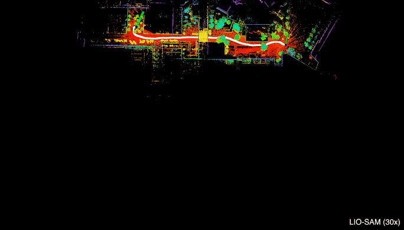

# 激光SLAM 开源库
## [KITTI 数据集和排名榜](http://www.cvlibs.net/datasets/kitti/eval_odometry.php)
## [古月居Blog](https://guyuehome.com/)
## LOAM
### 简介
1. [Github](https://github.com/laboshinl/loam_velodyne) 
2. [Paper](https://www.ri.cmu.edu/pub_files/2014/7/Ji_LidarMapping_RSS2014_v8.pdf)
4. [CSDN文章](https://blog.csdn.net/i_robots/article/details/108331306#comments_13621877)
3. LOAM使用了作者定义的特征点提取和匹配方法，主要去边角点和平面点。 
    > LOAM use a new defined feature system (corner and flat point), for the detail see its article.
4. LOAM假设每一次激光扫描过程中是匀速运动，并且用这个假设修正激光雷达数据的运动扭曲问题。 在VLOAM中则是更进一步，使用视觉的里程计估计每一个扫描数据的运动。 
    > LOAM suppose linear motion within the scan swap (VLOAM further uses visual odometry to estimate it), and undistort the lidar points.
5. LOAM也有一个低频率调用的全局优化线程。

6. 优缺点：
**优点：**
    > 新颖的特征提取方式（边缘点和平面点）
    > 运动补偿（时间戳）
    > 融合了scan-to-scan（odometry）和map-to-map（mapping）的思想

**缺点：**
    > 没有后端优化（年代）
    > 不能处理大规模的旋转变换（旋转向量的求解）

7. 是Ji Zhang早期开源的多线LiDAR SLAM算法。该代码可读性很差，作者后来将其闭源。
### 代码分析

----

## A-LOAM
### 简介
1. [Github](https://github.com/HKUST-Aerial-Robotics/A-LOAM)
2. LOAM的作者曾经开源了LOAM的代码，但由于某些原因又取消了开源，现在网上也流传着一些当时的片段或者牛人的实现。
而是港科大秦通博士（VINS-Mono一作）在LOAM原有代码基础上，使用Ceres-solver和Eigen库对其进行重构和优化，在保持原有算法原理的基础上，使其可读性大大增加，作为**入门多线激光slam最好选择**。
3. [LOAM笔记及A-LOAM源码阅读](https://www.cnblogs.com/wellp/p/8877990.html)
4. 效果图展示
    

----

## LOAM-livox
### 简介
1. [Github](https://github.com/hku-mars/loam_livox)
2. LOAM拓展

----

## LEGO LOAM
### 简介
1. [Github](https://github.com/RobustFieldAutonomyLab/LeGO-LOAM)
2. LEGO LOAM和LOAM的区别（Difference LEGO LOAM vs LOAM）:
> 可以参考这个文章：https://zhuanlan.zhihu.com/p/115986186

3. 是Tixiao Shan在原有LOAM基础上，做了一些改进包括:
> 1、对前端里程计的前量化改造，提取地面点更适配水平安装的LiDAR; 
> 2、使用SLAM中的Keyframe概念以及回环检测位姿图优化的方式对后端进行重构。

4. 效果图展示
    

### 代码分析
- https://blog.csdn.net/weixin_42048023?type=blog

## LIO-SAM
1. [Github](https://github.com/TixiaoShan/LIO-SAM)
2. LIO 带IMU
3. 是Tixiao Shan在LeGO-LOAM的扩展，添加了IMU预积分因子和GPS因子：
> 前端使用紧耦合的IMU融合方式，替代原有的帧间里程计，使得前端更轻量；
> 后端沿用LeGO-LOAM，在此基础上融入了GPS观测。
> 同时前端后端相互耦合，提高系统精度。

4. 效果图展示
    
    

----

## HDL GRAPH SLAM
### 简介
1. [Github](https://github.com/koide3/hdl_graph_slam)
2. HDL GRAPH SLAM Different vs LOAM
    > 它是一个简单的图优化模型。 
    > It is basically a graph optimization algorithm.

    > 它提供了ICP为基础的和NDT为基础的一系列点云标配方法。 
    > Use ICP-based or NDT-based methods to register new point cloud, and match candidates of loop closure.
    
    > 它假设有一个共享的地面，但是假设了地面是一个平面，这个假设可能过于强了，限制了算法的鲁棒性。

    > 在全局图优化的步骤，只是使用了相邻两帧的相对位姿和每一帧检测到的地面信息。 其实使用的信息很少，图优化的结构也十分简单。 
    > For the graph optimization part, it use the most sample edge for consecutive frames, along with the floor observation edge.

    > 它提供了回环优化的模块，但是回环比较粗糙。 简单来说，就是在当前帧地附近搜索历史地每一帧，分别标配得到可能的回环，再进行优化。
总的来说，它提出了使用图优化来处理激光SLAM，这是很好的想法。 
    > In summary, it uses the most basic algorithms, however it has a complete structure.

-  cartographer 这个是2D，比较适合扫地机
1. [github](https://github.com/cartographer-project/cartographer)

- 推荐一本书籍：上海交大刘佩林教授、应忍冬教授最近刚出了新书《玩转3D视界 —3D机器视觉及其应用》
