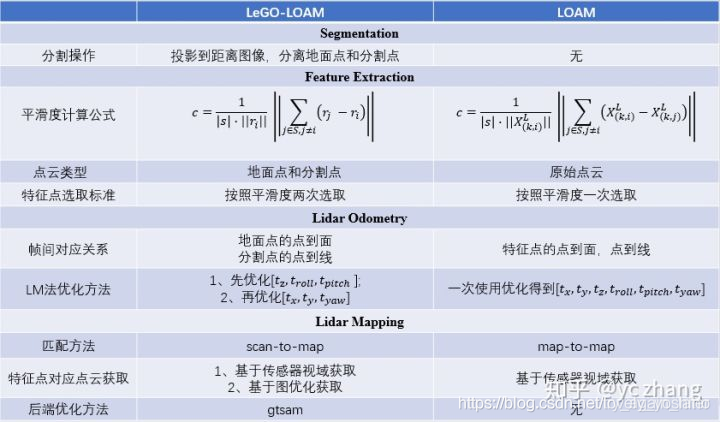

# 激光SLAM 开源库
## [KITTI 数据集和排名榜](http://www.cvlibs.net/datasets/kitti/eval_odometry.php)
## [古月居Blog](https://guyuehome.com/)
## [古月居LOAM详解](https://www.guyuehome.com/34082)
- 讲解的很到位

## LOAM
### 简介
1. [Github](https://github.com/laboshinl/loam_velodyne) 
2. [Paper](https://www.ri.cmu.edu/pub_files/2014/7/Ji_LidarMapping_RSS2014_v8.pdf)
4. [CSDN文章](https://blog.csdn.net/i_robots/article/details/108331306#comments_13621877)
3. LOAM使用了作者定义的特征点提取和匹配方法，主要去边角点和平面点。 
    > LOAM use a new defined feature system (corner and flat point), for the detail see its article.
4. LOAM假设每一次激光扫描过程中是匀速运动，并且用这个假设修正激光雷达数据的运动扭曲问题。 在VLOAM中则是更进一步，使用视觉的里程计估计每一个扫描数据的运动。 
    > LOAM suppose linear motion within the scan swap (VLOAM further uses visual odometry to estimate it), and undistort the lidar points.
5. 核心思想：
    1. 整体分割为2部分：定位和建图
    2. 定位：高频运行但是低精度进行运动估计。10Hz scan-to-scan
    3. 建图：底一个数量级的频率执行，匹配和注册点云（建图和校正） 1hz map-to-map

6. 优缺点：
**优点：**
    > 新颖的特征提取方式（边缘点和平面点）
    > 运动补偿（时间戳）
    > 融合了scan-to-scan（odometry）和map-to-map（mapping）的思想

**缺点：**
    > 没有后端优化（年代）
    > 不能处理大规模的旋转变换（旋转向量的求解）

7. 是Ji Zhang早期开源的多线LiDAR SLAM算法。该代码可读性很差，作者后来将其闭源。
### 代码分析

----

## A-LOAM
### 简介
1. [Github](https://github.com/HKUST-Aerial-Robotics/A-LOAM)
2. LOAM的作者曾经开源了LOAM的代码，但由于某些原因又取消了开源，现在网上也流传着一些当时的片段或者牛人的实现。
而是港科大秦通博士（VINS-Mono一作）在LOAM原有代码基础上，使用Ceres-solver和Eigen库对其进行重构和优化，在保持原有算法原理的基础上，使其可读性大大增加，作为**入门多线激光slam最好选择**。
3. [LOAM笔记及A-LOAM源码阅读](https://www.cnblogs.com/wellp/p/8877990.html)
4. 效果图展示
    
5. 舍去了IMU数据。
6. 使用Ceres库完成LM和雅克比矩阵的正逆求解。

----

## LOAM-livox
### 简介
1. [Github](https://github.com/hku-mars/loam_livox)
2. LOAM拓展

----

## LEGO LOAM
### 简介
1. [Github](https://github.com/RobustFieldAutonomyLab/LeGO-LOAM)
2. LEGO LOAM和LOAM的区别（Difference LEGO LOAM vs LOAM）:
> 可以参考这个文章：https://zhuanlan.zhihu.com/p/115986186

3. 是Tixiao Shan在原有LOAM基础上，做了一些改进包括:
> 1、对前端里程计的前量化改造，提取地面点更适配水平安装的LiDAR; 
> 2、使用SLAM中的Keyframe概念以及回环检测位姿图优化的方式对后端进行重构。

4. 效果图展示
    

5. Lego Loam 同LOAM对比：
    
### 代码分析
- https://blog.csdn.net/weixin_42048023?type=blog
### Lego_loam_Bor
- fork original lego_loam and improve the code more readable.
- https://github.com/facontidavide/LeGO-LOAM-BOR

### SC-Lego_loam
- https://github.com/irapkaist/SC-LeGO-LOAM
- 

## LIO-SAM
- [Github](https://github.com/TixiaoShan/LIO-SAM)
- LIO 带IMU
- 该文章作为LeGO-LOAM作者的正统续作，也是近年来比较有了解价值的多传感器融合里程计。
    LIO-SAM实际上是LeGO-LOAM的扩展版本，添加了IMU预积分因子和GPS因子，去除了帧帧匹配部分。
- 作者认为LegoLoam存在问题：
    1. 将其数据保存在全局体素地图中，难以执行闭环检测；
    2. 没有结合其他绝对测量（GPS，指南针等）；
    3. 当该体素地图变得密集时，在线优化过程的效率降低
- 作者引入 因子图 的思想优化：
    1. IMU预积分因子；
    2. 激光雷达里程因子；
    3. GPS因子；
    4. 闭环因子

- 效果图展示
    
    

- 核心：
    - 里程计部分改为scan2localmap的匹配，
    - 特征提取部分去除了原LeGO-LOAM中的聚、分割并提取较为突出的边缘点和平面点，而是沿用LOAM中的边缘和平面点。（精度高一些，LeGO-LOAM主要考虑性能多一点）
    - 维护两个因子图，
        > 预积分因子图可联合优化激光雷达odom和IMU，并估计IMU偏差，进行实时的里程计估算，这里将雷达位姿作为预测，而把imu作为观测，去更新imu的bias。
        > 全局因子图联合优化雷达odom和GPS因子以及回环因子。
----

## Scan Context
- 简介：
    **Scan context: Egocentric spatial descriptor for place recognition within 3d point cloud map**
    > 韩国KAIST大学的 Giseop Kim, Ayoung Kim 于2018年发表在IROS
    > Kim, Giseop, and Ayoung Kim. "Scan context: Egocentric spatial descriptor for place recognition within 3d point cloud map.
    > "2018 IEEE/RSJ International Conference on Intelligent Robots and Systems (IROS). IEEE, 2018.
    
    相关扩展论文：
    > Wang H , Wang C , Xie L . Intensity Scan Context: Coding Intensity and Geometry Relations for Loop Closure Detection[J].2020.

    **Scan Context++: Structural Place Recognition Robust to Rotation and Lateral Variations in Urban Environments.**
    > 2021年发表，在原ScanContent基础上完善。
    >[Paper](https://arxiv.org/pdf/2109.13494.pdf)

- [Giseop Kim](https://gisbi-kim.github.io/publications/)
> 作者的github的个人主页，一些研究论文和coade
    
- [Github](https://github.com/irapkaist/scancontext)
- 原理：
> 1. 给定一帧点云，划分成20个环，每个环分成60等份，一共1200个格子
> 2. 每个格子存里面点的最大高度值（z值），这样一帧点云就用一个二维图像表示了，想象成一个带高度的俯视图，或者地形图，记为scan context
> 3. scan context进一步计算列的均值，得到一个1x60的向量，记为ring key；
> 4. 计算行的均值，得到一个20x1的向量，记为sector key
> 5. 用ring key构造kd-tree，并且执行knn搜索
> 6. 对于候选匹配scan context，首先要左右循环偏移一下，对齐，实际会用sector key去对齐，得到一个偏移量,对候选匹配scan context，施加偏移量，然后作比较
- 优势是高效利用场景点云分布特征，引入"旋转不变性"描述子，快速搜索。

- 这里有各个LOAM算法 + ScanContent++的开源库链接：
  - Integrated with A-LOAM: [SC-A-LOAM](https://github.com/gisbi-kim/SC-A-LOAM)
  - Integrated with LeGO-LOAM: [SC-LeGO-LOAM](https://github.com/irapkaist/SC-LeGO-LOAM)
  - Integrated with LIO-SAM: [SC-LIO-SAM](https://github.com/gisbi-kim/SC-LIO-SAM)
  - Integrated with FAST-LIO2: [FAST_LIO_SLAM](https://github.com/gisbi-kim/FAST_LIO_SLAM)
  - Integrated with a basic ICP odometry: [PyICP-SLAM](https://github.com/gisbi-kim/PyICP-SLAM)

- [开源SLAM系统：ISCLOAM源码解析](http://www.xchu.net/2020/08/17/50iscloam/)
    - 论文里面作者提出了一种基于scan context(18 IROS)改进的全局点云描述符
    - 作者发表在ICRA2020上的论文，Intensity Scan Context: Coding Intensity and Geometry Relations for Loop Closure Detection
    - 项目地址：https://github.com/wh200720041/iscloam
    - 个人注释版地址：https://github.com/JokerJohn/opensource_slam_noted
----

## HDL GRAPH SLAM
### 简介
1. [Github](https://github.com/koide3/hdl_graph_slam)
2. HDL GRAPH SLAM Different vs LOAM
    > 它是一个简单的图优化模型。 
    > It is basically a graph optimization algorithm.

    > 它提供了ICP为基础的和NDT为基础的一系列点云标配方法。 
    > Use ICP-based or NDT-based methods to register new point cloud, and match candidates of loop closure.
    
    > 它假设有一个共享的地面，但是假设了地面是一个平面，这个假设可能过于强了，限制了算法的鲁棒性。

    > 在全局图优化的步骤，只是使用了相邻两帧的相对位姿和每一帧检测到的地面信息。 其实使用的信息很少，图优化的结构也十分简单。 
    > For the graph optimization part, it use the most sample edge for consecutive frames, along with the floor observation edge.

    > 它提供了回环优化的模块，但是回环比较粗糙。 简单来说，就是在当前帧地附近搜索历史地每一帧，分别标配得到可能的回环，再进行优化。
总的来说，它提出了使用图优化来处理激光SLAM，这是很好的想法。 
    > In summary, it uses the most basic algorithms, however it has a complete structure.

-  cartographer 这个是2D，比较适合扫地机
1. [github](https://github.com/cartographer-project/cartographer)

- 推荐一本书籍：上海交大刘佩林教授、应忍冬教授最近刚出了新书《玩转3D视界 —3D机器视觉及其应用》

----

# 激光语义分割

# ICP && NDT
ICP和NDT原本是作为点云与点云的直接匹配方法来作为前端里程计估计的方法，
但是目前由于LOAM系列的出现，导致这种方法已经很少使用。

此处我们提到ICP和NDT是想说明其在回环检测的作用，由于**回环检测需要寻找到回环点**。

以LeGO-LOAM算法为代表的回环检测就是使用**ICP+欧式距离的方法来寻找到回环点**。
而以SC-LeGO-LOAM算法为代表的回环检测使用了**scan context系列提取的全局特征子**来进行查找，
同时有些方法会在此基础上再加入ICP来提升回环检测后重定位的精度，方便图优化。这两种方法各有千秋，可以根据需求进行选择。