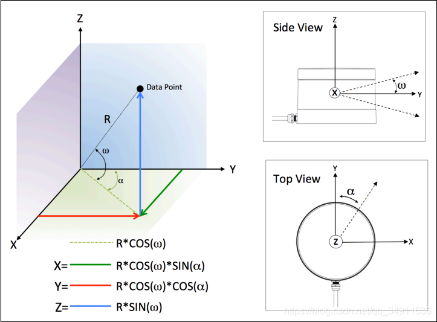

# project depend
```sh
sudo apt-get install libboost-dev libpcap-dev libpcl-dev libeigen3-dev
```

# Define a point type

Now the driver will automatically detect and assign value to the following six variables.

- x ------ The x coordinate of point.
- y ------ The y coordinate of point.
- z ------ The z coordinate of point.
- intensity ------ The intensity of point.
- timestamp ------ The timestamp of point. If ```use_lidar_clock``` is set to ```true```, this timestamp will be lidar time, otherwise will be system time.
- ring ------ The ring ID of the point, which represents the row number. e.g. For RS80, the range of ring ID is 0~79 (from bottom to top).

# Point cloud storage order

In rs_driver, the point cloud is stored in **column major order**, which means if there is  a point msg.point_cloud_ptr->at(i) , the next point on the same ring should be msg.point_cloud_ptr->at(i+msg.height). User can set the parameter ```saved_by_rows``` to ```true``` to make the point cloud stored in **row major order**.


# /rslidar_packets_difop : topic结构
```C++
typedef struct
{
  uint8_t lidar_ip[4];
  uint8_t dest_ip[4];
  uint8_t mac_addr[6];
  uint16_t msop_port;
  uint16_t reserve_1;
  uint16_t difop_port;
  uint16_t reserve_2;
} RSEthNetNew;

typedef struct
{
  uint16_t start_angle;
  uint16_t end_angle;
} RSFOV;

typedef struct
{
  uint8_t top_firmware_ver[5];
  uint8_t bot_firmware_ver[5];
  uint8_t bot_soft_ver[5];
  uint8_t motor_firmware_ver[5];
  uint8_t hw_ver[3];
} RSVersionNew;

typedef struct
{
  uint8_t num[6];
} RSSn;

typedef struct
{
  uint8_t sync_mode;
  uint8_t sync_sts;
  RSTimestampUTC timestamp;
} RSTimeInfo;

typedef struct
{
  uint8_t device_current[3];
  uint8_t main_current[3];
  uint16_t vol_12v;
  uint16_t vol_sim_1v8;
  uint16_t vol_dig_3v3;
  uint16_t vol_sim_3v3;
  uint16_t vol_dig_5v4;
  uint16_t vol_sim_5v;
  uint16_t vol_ejc_5v;
  uint16_t vol_recv_5v;
  uint16_t vol_apd;
} RSStatus;

typedef struct
{
  uint8_t reserved_1[9];
  uint16_t checksum;
  uint16_t manc_err1;
  uint16_t manc_err2;
  uint8_t gps_status;
  uint16_t temperature1;
  uint16_t temperature2;
  uint16_t temperature3;
  uint16_t temperature4;
  uint16_t temperature5;
  uint8_t reserved_2[5];
  uint16_t cur_rpm;
  uint8_t reserved_3[7];
} RSDiagno;

typedef struct
{
  uint8_t sign;
  uint16_t value;
} RSCalibrationAngle;

typedef struct
{
  uint64_t id;
  uint16_t rpm;
  RSEthNetNew eth;
  RSFOV fov;
  uint16_t reserved_0;
  uint16_t phase_lock_angle;
  RSVersionNew version;
  uint8_t reserved_1[229];
  RSSn sn;
  uint16_t zero_cali;
  uint8_t return_mode;
  RSTimeInfo time_info;
  RSStatus status;
  uint8_t reserved_2[5];
  RSDiagno diagno;
  uint8_t gprmc[86];
  RSCalibrationAngle ver_angle_cali[128];
  RSCalibrationAngle hori_angle_cali[128];
  uint8_t reserved_3[10];
  uint16_t tail;
} RS80DifopPkt;
```

记录时雷达的一些参数，转速 刻度，那些雷达线垂直排序等等。
typedef struct RS80DifopPkt

  uint64_t id; 标识ID ,是一个固定值。
  uint16_t rpm; 600 大小端交换 RS_SWAP_SHORT
  RSEthNetNew eth; 记录IP和Port
  **RSFOV fov**
  uint16_t reserved_0;
  uint16_t phase_lock_angle;
  RSVersionNew version;
  uint8_t reserved_1[229];
  RSSn sn;
  uint16_t zero_cali;
  uint8_t return_mode; EchoMode{ECHO_SINGLE,ECHO_DUAL}
  RSTimeInfo time_info;
  RSStatus status;
  uint8_t reserved_2[5];
  RSDiagno diagno;
  uint8_t gprmc[86];
  RSCalibrationAngle ver_angle_cali[128];//刻度
  RSCalibrationAngle hori_angle_cali[128];
  uint8_t reserved_3[10];
  uint16_t tail;


----
```C++

typedef struct
{
  uint8_t sec[6];
  uint32_t us;
} RSTimestampUTC;

typedef struct
{
  uint32_t id;
  uint16_t protocol_version;
  uint8_t reserved_1;
  uint8_t wave_mode;
  uint8_t temp_low;
  uint8_t temp_high;
  RSTimestampUTC timestamp;
  uint8_t reserved_2[10];
  uint8_t lidar_type;
  uint8_t reserved_3[49];
} RSMsopHeaderNew;

//
typedef struct
{
  uint16_t distance;
  uint8_t intensity;
} RSChannel;
typedef struct
{
  uint8_t id;
  uint8_t ret_id;
  uint16_t azimuth;//方位角
  RSChannel channels[80];
} RS80MsopBlock;

//
typedef struct
{
  RSMsopHeaderNew header;
  RS80MsopBlock blocks[4];
  uint8_t reserved[188];
  unsigned int index;
} RS80MsopPkt;
```

---

速腾聚创的lidar垂直角度：
lidar线（bottom-->top) 角度
0	-25
1	-19.58
2	-16.04
3	-13.56
4	-11.74
5	-10.34
6	-9.24
7	-8.35
8	-7.65
9	-7.15
10	-6.85
11	-6.5
12	-6.19
13	-5.99
14	-5.79
15	-5.59
16	-5.39
17	-5.19
18	-4.98
19	-4.79
20	-4.59
21	-4.39
22	-4.19
23	-3.99
24	-3.79
25	-3.59
26	-3.39
27	-3.19
28	-2.99
29	-2.89
30	-2.79
31	-2.69
32	-2.59
33	-2.49
34	-2.39
35	-2.29
36	-2.19
37	-2.09
38	-1.99
39	-1.89
40	-1.79
41	-1.69
42	-1.59
43	-1.49
44	-1.39
45	-1.29
46	-1.19
47	-1.09
48	-0.99
49	-0.89
50	-0.79
51	-0.69
52	-0.58
53	-0.49
54	-0.39
55	-0.29
56	-0.19
57	-0.09
58	0.01
59	0.11
60	0.21
61	0.31
62	0.41
63	0.51
64	0.61
65	0.71
66	0.81
67	0.91
68	1.01
69	1.21
70	1.41
71	1.61
72	1.81
73	2.51
74	3.51
75	5.06
76	6.56
77	9
78	11.5
79	15


----

核心计算逻辑：


```C++
or (size_t channel_idx = 0; channel_idx < this->lidar_const_param_.CHANNELS_PER_BLOCK; channel_idx++)
    {
      int dsr_temp = (channel_idx / 4) % 16;
      float azi_channel_ori = RS_SWAP_SHORT(mpkt_ptr->blocks[blk_idx].azimuth) +
                              (azi_diff * static_cast<float>(dsr_temp) * this->lidar_const_param_.DSR_TOFFSET *
                               this->lidar_const_param_.FIRING_FREQUENCY);
      int azi_channel_final = this->azimuthCalibration(azi_channel_ori, channel_idx);
      float distance = RS_SWAP_SHORT(mpkt_ptr->blocks[blk_idx].channels[channel_idx].distance) * RS_DIS_RESOLUTION;
      int angle_horiz = static_cast<int>(azi_channel_ori + RS_ONE_ROUND) % RS_ONE_ROUND;
      int angle_vert = ((this->vert_angle_list_[channel_idx]) + RS_ONE_ROUND) % RS_ONE_ROUND;

      T_Point point;
      if ((distance <= this->param_.max_distance && distance >= this->param_.min_distance) &&
          ((this->angle_flag_ && azi_channel_final >= this->start_angle_ && azi_channel_final <= this->end_angle_) ||
           (!this->angle_flag_ &&
            ((azi_channel_final >= this->start_angle_) || (azi_channel_final <= this->end_angle_)))))
      {
        float x = distance * this->checkCosTable(angle_vert) * this->checkCosTable(azi_channel_final) +
                  this->lidar_const_param_.RX * this->checkCosTable(angle_horiz);
        float y = -distance * this->checkCosTable(angle_vert) * this->checkSinTable(azi_channel_final) -
                  this->lidar_const_param_.RX * this->checkSinTable(angle_horiz);
        float z = distance * this->checkSinTable(angle_vert) + this->lidar_const_param_.RZ;
        uint8_t intensity = mpkt_ptr->blocks[blk_idx].channels[channel_idx].intensity;
        this->transformPoint(x, y, z);
        setX(point, x);
        setY(point, y);
        setZ(point, z);
        setIntensity(point, intensity);
      }
      else
      {
        setX(point, NAN);
        setY(point, NAN);
        setZ(point, NAN);
        setIntensity(point, 0);
      }
      setRing(point, this->beam_ring_table_[channel_idx]);
      setTimestamp(point, block_timestamp);
      //add by liqian 2022-02-11 begin
      setDistance(point,distance);
      //add by liqian 2022-02-11 end
      vec.emplace_back(std::move(point));
    }
```