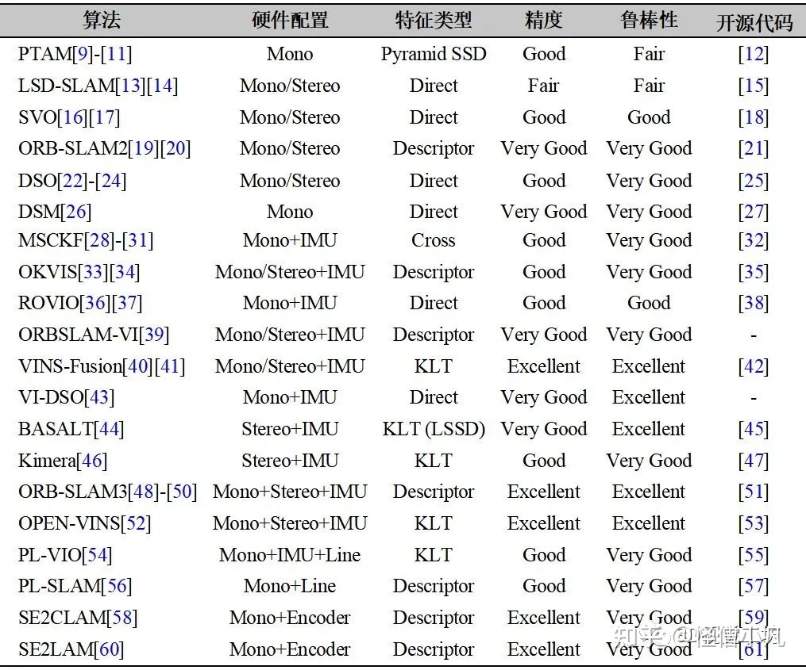
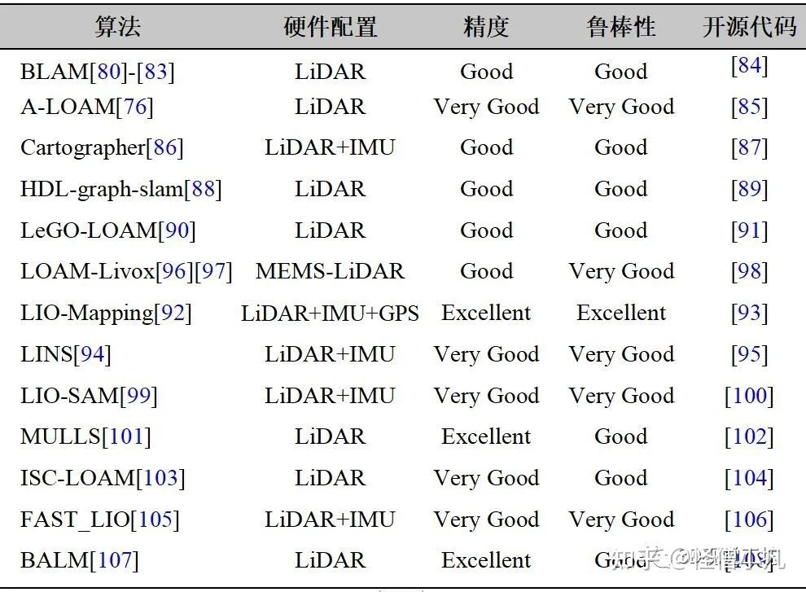
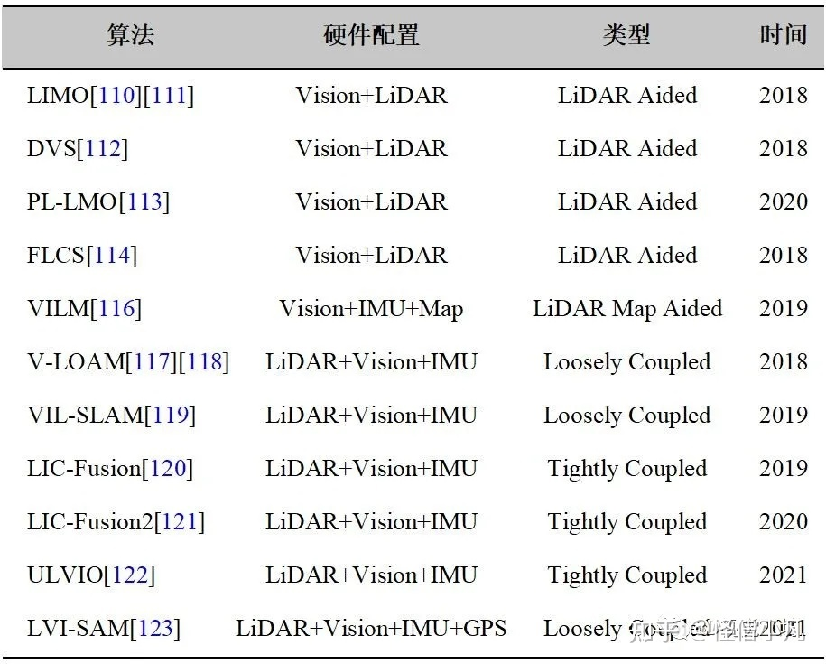

文章来源：
https://zhuanlan.zhihu.com/p/423979070

1. 代表性视觉SLAM算法论文与开源代码总结

2. 代表性激光SLAM算法论文与开源代码总结

3. 代表性激光-视觉融合SLAM算法论文总结

[激光-视觉-IMU-GPS融合SLAM算法梳理和代码讲解](https://mp.weixin.qq.com/s/CEJPWHVAnKsLepqP3lSAbg)

**参考文献**:
[1] CADENA C, CARLONE L, CARRILLO H, et al. Past, present, and future of simultaneous localization and mapping: Toward the robust-perception age[J]. IEEE Transactions on robotics, 2016, 32(6):1309-1332.

[2] YOUNES G , ASMAR D , SHAMMAS E. A survey on non-filter-based monocular Visual SLAM systems. Robotics & Autonomous Systems, 2016.

[3] STRASDAT H, MONTIEL J M, DAVISON A J. Visual slam: why filter?[J]. Image and Vision Computing, 2012, 30(2):65-77.

[4] DAVISON A J. Real-time simultaneous localization and mapping with a single camera[C]// Proceedings Ninth IEEE International Conference on Computer Vision. IEEE, 2003.

[5] DAVISON A J, REID I D, MOLTON N D, et al. Monoslam: Real-time single camera slam[J]. IEEE transactions on pattern analysis and machine intelligence, 2007, 29(6):1052-1067.

[6] CIVERA J, DAVISON A J, MONTIEL J M. M. Inverse depth parametrization for monocular SLAM[J]. IEEE Transactions on Robotics, 24(5):932–945, 2008.

[7] KUMMERLE R , GRISETTI G , STRASDAT H , et al. G2o: A general framework for graph optimization[C]// IEEE Internatonal Conference on Robotics & Automation. IEEE, 2011.

[8] POLOK L . Incremental Block Cholesky Factorization for Nonlinear Least Squares in Robotics[C]// IFAC Proceedings Volumes. 2013:172-178.

[9] KLEIN G , MURRAY D W. Parallel Tracking and Mapping for Small AR Workspaces[C]// IEEE & Acm International Symposium on Mixed & Augmented Reality. ACM, 2008.

[10] KLEIN G, MURRAY D W . Improving the Agility of Keyframe-Based SLAM[C]// European Conference on Computer Vision. Springer-Verlag, 2008.

[11] KLEIN G, MURRAY D W. Parallel Tracking and Mapping on a camera phone. IEEE International Symposium on Mixed & Augmented Reality, 2009:83-86.

[12] KLEIN G, MURRAY D W. PTAM-GPL[EB/OL]. 2013. https://github.com/Oxford-PTAM/ PTAM-GPL.

[13] ENGEL J , SCHPS T , CREMERS D . LSD-SLAM: Large-scale direct monocular SLAM[C]// European Conference on Computer Vision. Springer, Cham, 2014.

[14] ENGEL J , STUCKLER J , CREMERS D . Large-scale direct SLAM with stereo cameras[C]// 2015 IEEE/RSJ International Conference on Intelligent Robots and Systems (IROS). IEEE, 2015.

[15] ENGEL J , SCHPS T , CREMERS D. LSD-SLAM: Large-scale direct monocular SLAM [EB/OL]. 2014. https://github.com/tum-vision/lsd slam.

[16] FORSTER C , PIZZOLI M , D SCARAMUZZA∗. SVO: Fast semi-direct monocular visual odometry[C]// IEEE International Conference on Robotics & Automation. IEEE, 2014.

[17] FORSTER C , ZHANG Z , GASSNER M , et al. SVO: Semidirect Visual Odometry for Monocular and Multicamera Systems[J]. IEEE Transactions on Robotics, 2017, 33(2):249-265.

[18] C. FORSTER, M. PIZZOLI, AND D. SCARAMUZZA. SVO[EB/OL]. 2014. https:// http://github.com/uzh-rpg/rpg svo.

[19] MUR-ARTAL R , MONTIEL J M M , TARDOS J D . ORB-SLAM: A Versatile and Accurate Monocular SLAM System[J]. IEEE Transactions on Robotics, 2015, 31(5):1147-1163.

[20] MURARTAL R, TARDOS J. ORB-SLAM2: an Open-Source SLAM System for Monocular, Stereo and RGB-D Cameras[J]. IEEE Transactions on Robotics, 2017, 33(5):1255-1262.

[21] MUR-ARTAL R, TARDOS J D, MONTIEL J M M, et al. ORB-SLAM2[EB/OL]. 2016. https://github.com/raulmur/ORB SLAM2.

[22] ENGEL J , KOLTUN V , CREMERS D . Direct Sparse Odometry[J]. IEEE Transactions on Pattern Analysis & Machine Intelligence, 2016:1-1.

[23] HIDENOBU M , LUKAS V S , VLADYSLAV U , et al. Omnidirectional DSO: Direct Sparse Odometry with Fisheye Cameras[J]. IEEE Robotics & Automation Letters, 2018, PP:1-1.

[24] WANG R , SCHWRER M , CREMERS D . Stereo DSO: Large-Scale Direct Sparse Visual Odometry with Stereo Cameras[C]// 2017 IEEE International Conference on Computer Vision (ICCV). IEEE, 2017.

[25] ENGEL J , KOLTUN V , CREMERS D. DSO: Direct Sparse Odometry[EB/OL]. 2018. https://github.com/JakobEngel/dso.

[26] ZUBIZARRETAJON, AGUINAGAIKER, MARTINEZ M . Direct Sparse Mapping[J]. IEEE Transactions on Robotics, 2020.

[27] ZUBIZARRETAJON, AGUINAGAIKER, MARTINEZ M . DSM: Direct Sparse Mapping [EB/OL]. 2019. https://github.com/jzubizarreta/dsm.

[28] MOURIKIS A I , ROUMELIOTIS S I . A Multi-State Constraint Kalman Filter for Vision-Aided Inertial Navigation[C]// Robotics and Automation, 2007 IEEE International Conference on. IEEE, 2007.

[29] LI M , MOURIKIS A I . High-precision, consistent EKF-based visual-inertial odometry[J]. The International Journal of Robotics Research, 2013.

[30] PAUL M K , WU K , HESCH J A , et al. A comparative analysis of tightly-coupled monocular, binocular, and stereo VINS[C]// 2017 IEEE International Conference on Robotics and Automation (ICRA). IEEE, 2017.

[31] PAUL M K , ROUMELIOTIS S I . Alternating-Stereo VINS: Observability Analysis and Performance Evaluation[C]// IEEE/CVF Conference on Computer Vision & Pattern Recognition. IEEE, 2018.

[32] CHANEY K. Monocular MSCKF[EB/OL]. 2018. https://github.com/daniilidis-group/msckf mono.

[33] LEUTENEGGER S, FURGALE P, RABAUD V, et al. Keyframe-based Visual-Inertial SLAM using Nonlinear Optimization[J]. Proceedings of Robotis Science and Systems (RSS) 2013.

[34] LEUTENEGGER S , LYNEN S , BOSSE M , et al. Keyframe-based visual–inertial odometry using nonlinear optimization[J]. International Journal of Robotics Research, 2014, 34(3):314-334.

[35] LEUTENEGGER S, Forster A, Furgale P, et al. OKVIS: Open keyframe-based visual-inertial SLAM (ROS version) [EB/OL]. 2016. https://github.com/ethz-asl/okvis_ros.

[36] BLOESCH M, OMARI S, HUTTER M, et al. Robust visual inertial odometry using a direct EKF-based approach[C]//2015 IEEE/RSJ international conference on intelligent robots and systems (IROS). IEEE, 2015: 298-304.

[37] BLOESCH M, BURRI M, OMARI S, et al. Iterated extended Kalman filter based visual-inertial odometry using direct photometric feedback[J]. The International Journal of Robotics Research, 2017, 36(10): 1053-1072.

[38] BLOESCH M, OMARI S, HUTTER M, et al. ROVIO[EB/OL]. 2015. https://github.com/ ethz-asl/rovio.

[39] MUR-ARTAL R , TARDOS J D . Visual-Inertial Monocular SLAM with Map Reuse[J]. IEEE Robotics and Automation Letters, 2016, PP(99):796-803.

[40] QIN T, LI P, SHEN S. Vins-mono: A robust and versatile monocular visual-inertial state estimator[J]. IEEE Transactions on Robotics, 2018, 34(4): 1004-1020.

[41] QIN T, PAN J, CAO S, et al. A general optimization-based framework for local odometry estimation with multiple sensors[J]. arXiv preprint arXiv:1901.03638, 2019.

[42] QIN T, Cao S, Pan J, et al. VINS-Fusion: An optimization-based multi-sensor state estimator [EB/OL]. 2019. https://github.com/HKUST-Aerial-Robotics/VINS-Fusion.

[43] VON STUMBERG L, USENKO V, CREMERS D. Direct sparse visual-inertial odometry using dynamic marginalization[C]//2018 IEEE International Conference on Robotics and Automation (ICRA). IEEE, 2018: 2510-2517.

[44] USENKO V, DEMMEL N, SCHUBERT D, et al. Visual-inertial mapping with non-linear factor recovery[J]. IEEE Robotics and Automation Letters, 2019, 5(2): 422-429.

[45] USENKO V, DEMMEL N. BASALT[EB/OL]. 2019. https://gitlab.com/VladyslavUsenko/ basalt.

[46] ROSINOL A, ABATE M, CHANG Y, et al. Kimera: an open-source library for real-time metric-semantic localization and mapping[C]//2020 IEEE International Conference on Robotics and Automation (ICRA). IEEE, 2020: 1689-1696.

[47] ROSINOL A, ABATE M, CHANG Y, et al. Kimera[EB/OL]. 2019. https://github.com/ MIT-SPARK/Kimera.

[48] CAMPOS C, ELVIRA R, RODRÍGUEZ J J G, et al. ORB-SLAM3: An accurate open-source library for visual, visual-inertial and multi-map SLAM[J]. arXiv preprint arXiv:2007.11898, 2020.

[49] ELVIRA R, TARDÓS J D, MONTIEL J M M. ORBSLAM-Atlas: a robust and accurate multi-map system[J]. arXiv preprint arXiv:1908.11585, 2019.

[50] CAMPOS C, MONTIEL J M M, TARDÓS J D. Inertial-Only Optimization for Visual-Inertial Initialization[C]//2020 IEEE International Conference on Robotics and Automation (ICRA). IEEE, 2020: 51-57.

[51] CAMPOS C, ELVIRA R, RODRÍGUEZ J J G, et al. ORB-SLAM3[EB/OL]. 2020. https://github.com/ UZ-SLAMLab/ORB_SLAM3.

[52] GENEVA P, ECKENHOFF K, LEE W, et al. Openvins: A research platform for visual-inertial estimation[C]//2020 IEEE International Conference on Robotics and Automation (ICRA). IEEE, 2020: 4666-4672.

[53] GENEVA P, ECKENHOFF K, LEE W, et al. open_vins[EB/OL]. 2020. https://github.com/ rpng/open_vins.

[54] HE Y, ZHAO J, GUO Y, et al. PL-VIO: Tightly-coupled monocular visual–inertial odometry using point and line features[J]. Sensors, 2018, 18(4): 1159.

[55] HE Y, ZHAO J, GUO Y, et al. PL-VIO[EB/OL]. 2018. https://github.com/HeYijia/PL-VIO.

[56] GOMEZ-OJEDA R, MORENO F A, ZUNIGA-NOËL D, et al. PL-SLAM: A stereo SLAM system through the combination of points and line segments[J]. IEEE Transactions on Robotics, 2019, 35(3): 734-746.

[57] GOMEZ-OJEDA R, MORENO F A, ZUNIGA-NOËL D, et al. PL-SLAM[EB/OL]. 2018. https://github.com/rubengooj/pl-slam.

[58] ZHENG F, TANG H, LIU Y H. Odometry-vision-based ground vehicle motion estimation with se(2)-constrained se(3) poses[J]. IEEE transactions on cybernetics, 2018, 49(7): 2652-2663.

[59] ZHENG F, TANG H, LIU Y H. SE2CLAM[EB/OL]. 2018. https://github.com/izhengfan/ se2clam.

[60] ZHENG F, LIU Y H. Visual-Odometric Localization and Mapping for Ground Vehicles Using SE (2)-XYZ Constraints[C]//2019 International Conference on Robotics and Automation (ICRA). IEEE, 2019: 3556-3562.

[61] ZHENG F, LIU Y H. SE2LAM[EB/OL]. 2019. https://github.com/izhengfan/se2lam.

[62] CIVERA J, GRASA O G, DAVISON A J, et al. 1‐Point RANSAC for extended Kalman filtering: Application to real‐time structure from motion and visual odometry[J]. Journal of field robotics, 2010, 27(5): 609-631.

[63] GÁLVEZ-LÓPEZ D, TARDOS J D. Bags of binary words for fast place recognition in image sequences[J]. IEEE Transactions on Robotics, 2012, 28(5): 1188-1197.

[64] GÁLVEZ-LÓPEZ D, TARDOS J D. DBoW2[EB/OL]. 2012. https://github.com/dorian3d/ DBoW2.

[65] DBoW3[EB/OL]. 2017. https://github.com/rmsalinas/DBow3.

[66] GAO X, WANG R, DEMMEL N, et al. LDSO: Direct sparse odometry with loop closure[C]//2018 IEEE/RSJ International Conference on Intelligent Robots and Systems (IROS). IEEE, 2018: 2198-2204.

[67] LEE S H, CIVERA J. Loosely-coupled semi-direct monocular slam[J]. IEEE Robotics and Automation Letters, 2018, 4(2): 399-406.

[68] LUPTON T, SUKKARIEH S. Visual-inertial-aided navigation for high-dynamic motion in built environments without initial conditions[J]. IEEE Transactions on Robotics, 2011, 28(1): 61-76.

[69] FORSTER C, CARLONE L, DELLAERT F, et al. On-Manifold Preintegration for Real-Time Visual--Inertial Odometry[J]. IEEE Transactions on Robotics, 2016, 33(1): 1-21.

[70] LI L, LIU Y H. Estimating position of mobile robots from omnidirectional vision using an adaptive algorithm[J]. IEEE transactions on cybernetics, 2014, 45(8): 1633-1646.

[71] WU K J, GUO C X, GEORGIOU G, et al. Vins on wheels[C]//2017 IEEE International Conference on Robotics and Automation (ICRA). IEEE, 2017: 5155-5162.

[72] QUAN M, PIAO S, TAN M, et al. Tightly-coupled Monocular Visual-odometric SLAM using Wheels and a MEMS Gyroscope[J]. IEEE Access, 2019, 7: 97374-97389.

[73] ZHANG M, CHEN Y, LI M. Vision-aided localization for ground robots[C]//2019 IEEE/RSJ International Conference on Intelligent Robots and Systems (IROS). IEEE, 2019: 2455-2461.

[74] HE Y, GUO Y, YE A, et al. Camera-odometer calibration and fusion using graph based optimization[C]//2017 IEEE International Conference on Robotics and Biomimetics (ROBIO). IEEE, 2017: 1624-1629.

[75] Pomerleau F, Colas F, Siegwart R, et al. Comparing ICP variants on real-world data sets[J]. Autonomous Robots, 2013, 34(3): 133-148.

[76] ZHANG J, SINGH S. LOAM: Lidar Odometry and Mapping in Real-time[C]//Robotics: Science and Systems. 2014, 2(9).

[77] ZHANG J, SINGH S. Low-drift and real-time lidar odometry and mapping[J]. Autonomous Robots, 2017, 41(2): 401-416.

[78] ZHANG J, KAESS M, SINGH S. On degeneracy of optimization-based state estimation problems[C]//2016 IEEE International Conference on Robotics and Automation (ICRA). IEEE, 2016: 809-816.

[79] ZHANG J, SINGH S. LOAM[EB/OL]. 2016. https://github.com/laboshinl/loam_velodyne.

[80] SEGAL A, HAEHNEL D, THRUN S. Generalized-icp[C]//Robotics: science and systems. 2009, 2(4): 435.

[81] SERAFIN J, GRISETTI G. NICP: Dense normal based point cloud registration[C]//2015 IEEE/RSJ International Conference on Intelligent Robots and Systems (IROS). IEEE, 2015: 742-749.

[82] RUSU R B, COUSINS S. 3d is here: Point cloud library (pcl)[C]//2011 IEEE international conference on robotics and automation. IEEE, 2011: 1-4.

[83] BIBER P, STRAßER W. The normal distributions transform: A new approach to laser scan matching[C]//Proceedings 2003 IEEE/RSJ International Conference on Intelligent Robots and Systems (IROS 2003) (Cat. No. 03CH37453). IEEE, 2003, 3: 2743-2748.

[84] ERIK-NELSON. BLAM[EB/OL]. 2016. https://github.com/erik-nelson/blam.

[85] QIN T, CAO S. A-LOAM[EB/OL]. 2018. https://github.com/HKUST-Aerial-Robotics/ A-LOAM.

[86] HESS W, KOHLER D, RAPP H, et al. Real-time loop closure in 2D LIDAR SLAM[C]//2016 IEEE International Conference on Robotics and Automation (ICRA). IEEE, 2016: 1271-1278.

[87] HESS W, KOHLER D, RAPP H, et al. Cartographer[EB/OL]. 2016. https://github.com/ cartographer-project/cartographer.

[88] KOIDE K, MIURA J, MENEGATTI E. A portable 3d lidar-based system for long-term and wide-area people behavior measurement[J]. IEEE Trans. Hum. Mach. Syst, 2018.

[89] KOIDE K, MIURA J, MENEGATTI E. hdl_graph_slam[EB/OL]. 2018. https://github.com/ koide3/hdl_graph_slam.

[90] SHAN T, ENGLOT B. Lego-loam: Lightweight and ground-optimized lidar odometry and mapping on variable terrain[C]//2018 IEEE/RSJ International Conference on Intelligent Robots and Systems (IROS). IEEE, 2018: 4758-4765.

[91] SHAN T, ENGLOT B. LeGO-LOAM[EB/OL]. 2018. https://github.com/RobustField AutonomyLab/LeGO-LOAM.

[92] YE H, CHEN Y, LIU M. Tightly coupled 3d lidar inertial odometry and mapping[C]//2019 International Conference on Robotics and Automation (ICRA). IEEE, 2019: 3144-3150.

[93] YE H, CHEN Y, LIU M. lio-mapping[EB/OL]. 2019. https://github.com/hyye/lio-mapping.

[94] QIN C, YE H, PRANATA C E, et al. LINS: A Lidar-Inertial State Estimator for Robust and Efficient Navigation[C]//2020 IEEE International Conference on Robotics and Automation (ICRA). IEEE, 2020: 8899-8906.

[95] QIN C, YE H, PRANATA C E, et al. LINS---LiDAR-inertial-SLAM[EB/OL]. 2020. https://github.com/ChaoqinRobotics/LINS---LiDAR-inertial-SLAM.

[96] LIN J, ZHANG F. Loam livox: A fast, robust, high-precision LiDAR odometry and mapping package for LiDARs of small FoV[C]//2020 IEEE International Conference on Robotics and Automation (ICRA). IEEE, 2020: 3126-3131.

[97] LIN J, ZHANG F. A fast, complete, point cloud based loop closure for lidar odometry and mapping[J]. arXiv preprint arXiv:1909.11811, 2019.

[98] LIN J, ZHANG F. loam_livox[EB/OL]. 2020. https://github.com/hku-mars/loam_livox.

[99] SHAN T, ENGLOT B, MEYERS D, et al. Lio-sam: Tightly-coupled lidar inertial odometry via smoothing and mapping[C]//2020 IEEE/RSJ International Conference on Intelligent Robots and Systems (IROS). IEEE, 2020: 5135-5142.

[100] SHAN T. LIO-SAM[EB/OL]. 2020. https://github.com/TixiaoShan/LIO-SAM.

[101] PAN Y, XIAO P, HE Y, et al. MULLS: Versatile LiDAR SLAM via Multi-metric Linear Least Square[J]. arXiv preprint arXiv:2102.03771, 2021.

[102] PAN Y, XIAO P, HE Y, et al. MULLS[EB/OL]. 2020. https://github.com/ YuePanEdward/MULLS.

[103] WANG H, WANG C, XIE L. Intensity scan context: Coding intensity and geometry relations for loop closure detection[C]//2020 IEEE International Conference on Robotics and Automation (ICRA). IEEE, 2020: 2095-2101.

[104] WANG H, WANG C, XIE L. ISCLOAM[EB/OL]. 2020. https://github.com/wh2007 20041/iscloam.

[105] XU W, ZHANG F. Fast-lio: A fast, robust lidar-inertial odometry package by tightly coupled iterated kalman filter[J]. IEEE Robotics and Automation Letters, 2021, 6(2): 3317-3324.

[106] XU W, ZHANG F. FAST_LIO[EB/OL]. 2021. https://github.com/hku-mars/FAST_LIO.

[107] LIU Z, ZHANG F. Balm: Bundle adjustment for lidar mapping[J]. IEEE Robotics and Automation Letters, 2021, 6(2): 3184-3191.

[108] LIU Z, ZHANG F. BALM[EB/OL]. 2021. https://github.com/hku-mars/BALM.

[109] DELLAERT F. Factor graphs and GTSAM: A hands-on introduction[R]. Georgia Institute of Technology, 2012.

[110] GRAETER J, WILCZYNSKI A, LAUER M. Limo: Lidar-monocular visual odometry[C] //2018 IEEE/RSJ international conference on intelligent robots and systems (IROS). IEEE, 2018: 7872-7879.

[111] GRAETER J. limo[EB/OL]. 2018. https://github.com/johannes-graeter/limo.

[112] SHIN Y S, PARK Y S, KIM A. Direct visual slam using sparse depth for camera-lidar system[C]//2018 IEEE International Conference on Robotics and Automation (ICRA). IEEE, 2018: 5144-5151.

[113] HUANG S S, MA Z Y, MU T J, et al. Lidar-Monocular Visual Odometry using Point and Line Features[C]//2020 IEEE International Conference on Robotics and Automation (ICRA). IEEE, 2020: 1091-1097.

[114] DE SILVA V, ROCHE J, KONDOZ A. Fusion of LiDAR and camera sensor data for environment sensing in driverless vehicles. arXiv 2018[J]. arXiv preprint arXiv:1710.06230.

[115] DING X, WANG Y, LI D, et al. Laser map aided visual inertial localization in changing environment[C]//2018 IEEE/RSJ International Conference on Intelligent Robots and Systems (IROS). IEEE, 2018: 4794-4801.

[116] ZUO X, GENEVA P, YANG Y, et al. Visual-inertial localization with prior LiDAR map constraints[J]. IEEE Robotics and Automation Letters, 2019, 4(4): 3394-3401.

[117] ZHANG J, SINGH S. Visual-lidar odometry and mapping: Low-drift, robust, and fast[C]//2015 IEEE International Conference on Robotics and Automation (ICRA). IEEE, 2015: 2174-2181.

[118] ZHANG J, SINGH S. Laser–visual–inertial odometry and mapping with high robustness and low drift[J]. Journal of Field Robotics, 2018, 35(8): 1242-1264.

[119] SHAO W, VIJAYARANGAN S, LI C, et al. Stereo visual inertial lidar simultaneous localization and mapping[J]. arXiv preprint arXiv:1902.10741, 2019.

[120] ZUO X, GENEVA P, LEE W, et al. Lic-fusion: Lidar-inertial-camera odometry[J]. arXiv preprint arXiv:1909.04102, 2019.

[121] ZUO X, YANG Y, GENEVA P, et al. LIC-Fusion 2.0: LiDAR-Inertial-Camera Odometry with Sliding-Window Plane-Feature Tracking[J]. arXiv preprint arXiv:2008.07196, 2020.

[122] WISTH D, CAMURRI M, DAS S, et al. Unified Multi-Modal Landmark Tracking for Tightly Coupled Lidar-Visual-Inertial Odometry[J]. IEEE Robotics and Automation Letters, 2021, 6(2): 1004-1011.

[123] Tedaldi D, Pretto A, Menegatti E. A robust and easy to implement method for IMU calibration without external equipments[C]//2014 IEEE International Conference on Robotics and Automation (ICRA). IEEE, 2014: 3042-3049.

[124] El-Sheimy N, Hou H, Niu X. Analysis and modeling of inertial sensors using Allan variance[J]. IEEE Transactions on instrumentation and measurement, 2007, 57(1): 140-149.

[125] 高翔. 视觉 SLAM 十四讲: 从理论到实践[M]. 电子工业出版社, 2017.

[126] REHDER J, NIKOLIC J, SCHNEIDER T, et al. Extending kalibr: Calibrating the extrinsics of multiple IMUs and of individual axes[C]//2016 IEEE International Conference on Robotics and Automation (ICRA). IEEE, 2016: 4304-4311.

[127] KANG Y, SONG Y. Stereo Visual Odometry Algorithm with Rotation-Translation Decoupling for Dynamic Environments[J]. Robot, 2014, 36(6): 758-768.

[128] CI W, HUANG Y, HU X. Stereo visual odometry based on motion decoupling and special feature screening for navigation of autonomous vehicles[J]. IEEE Sensors Journal, 2019, 19(18): 8047-8056.

[129] WANG H, WANG C, XIE L. Intensity scan context: Coding intensity and geometry relations for loop closure detection[C]//2020 IEEE International Conference on Robotics and Automation (ICRA). IEEE, 2020: 2095-2101.

[130] KIM G, KIM A. Scan context: Egocentric spatial descriptor for place recognition within 3d point cloud map[C]//2018 IEEE/RSJ International Conference on Intelligent Robots and Systems (IROS). IEEE, 2018: 4802-4809.

[131] GroundRobotDataset:https://drive.google.com/drive/folders/110Hko3zPcDmY0_bnZdXxJXJKe6wr3t10?usp=sharing.

[132] Agarwal S, Mierle K. ceres-solver[EB/OL]. 2015. http://www.ceres-solver.org.