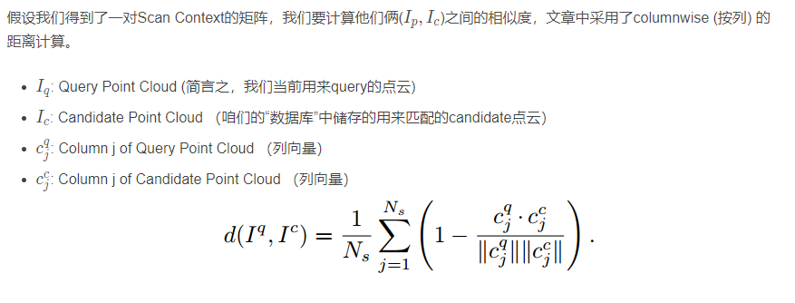

## 论文怎么下载
- IEEEE文章
> https://tool.yovisun.com/scihub/  然后把论文地址复制进入，就可以下载了。
> 参考[如何免费下载IEEE文章](https://blog.csdn.net/weixin_43935696/article/details/109681676)这篇文章。

## LOAM相关
### Fast Segmentation of 3D Point Clouds for Ground Vehicles
- Author： M. Himmelsbach and Felix v. Hundelshausen and H.-J. Wuensche
- 地面分割的经典算法，在Lego-Loam 和Loam中都在会用。
- [整体介绍不错的一篇文章](https://blog.csdn.net/lovelyaiq/article/details/118826534)

## 点云分割、聚类和检测
### PolarStream: Streaming Lidar Object Detection and Segmentation with Polar Pillars
- (./Others/LidarSematic/NeurIPS-2021-polarstream-streaming-object-detection-and-segmentation-with-polar-pillars-Paper.pdf)
- PolarStream：基于极柱的流式激光雷达目标检测与分割

### Fast Segmentation of 3D Point Clouds for Ground Vehicles
- (./Others/Fast Segmentation of 3D Point Clouds for Ground Vehicles_M. Himmelsbach and Felix v. Hundelshausen and H.-J. Wuensche.pdf)
- 发表于：2010 IEEE Intelligent Vehicles Symposium,University of California, San Diego, CA, USA, June 21-24, 2010.

- 作者：M. Himmelsbach and Felix v. Hundelshausen and H.-J. Wuensche
- 介绍了一种大规模长距离3D点云的快速分割方法.
- https://zhuanlan.zhihu.com/p/464550791
- [详细查看“点云分割处理/Fast Segmentation Of 3DPoint Clouds For Ground Vehicles_论文笔记.md]

- 缺点：
    > 第一，存在少量噪点，不能彻底过滤出地面;
    > 第二，非地面的点容易被错误分类，造成非地面点缺失;
    > 第三，对于目标接近激光雷达盲区的情况，会出现误分割，即将非地面点云分割为地面

### Fast segmentation of 3D point clouds: a paradigm on LIDAR data for Autonomous Vehicle Applications
- 作者： D. Zermas, I. Izzat and N. Papanikolopoulos, 2017
- https://blog.csdn.net/weixin_42718092/article/details/93379051
- https://adamshan.blog.csdn.net/article/details/84569000
- https://github.com/AbangLZU/plane_fit_ground_filter
- https://github.com/VincentCheungM/Run_based_segmentation

### Fast Range Image-Based Segmentation of Sparse 3D Laser Scans for Online Operation
- Bogoslavskyi提出的：基于深度图的点云聚类方法
- https://github.com/wangx1996/LIDAR-Segmentation-Based-on-Range-Image

### Fast Multi-Pass 3D Point Segmentation Based on a Structured Mesh Graph for Ground Vehicles," 2018 IEEE Intelligent Vehicles Symposium (IV)
- 经常用于运动补偿，补充点云数据
> 遍历每一次激光器发射的点云数据，也就是一次发射的数据，
> 当两个有数据的点之间有一定数量的缺失点并且这两个点的距离满足一定的阈值，
> 就可以假设这两个点之间的点近似为线性关系，通过线性插值的方式补全点云。

- 

### Curved-Voxel Clustering for Accurate Segmentation of 3D LiDAR Point Clouds with Real-Time Performance
- 2019 IEEE/RSJ International Conference on Intelligent Robots and Systems (IROS)
- 原理：
> 采用构建hash表的形式来代替一般的cv::Mat深度图形式, 哈希的键值则选择将图的像素按顺序拆解的值，
> 比如一个图的高为h，宽为w，某一个点的像素坐标为(Row Col)，那么按顺序拆解该图后，
> 像素点的索引可以表示为：
>   index = Row*w+col

### Scan Context - Egocentric spatial descriptor for place recognition within 3d point cloud map
- 韩国KAIST大学的Giseop Kim和Ayoung Kim所写，它的主要特点是提出了Scan Context这个**非直方图**的**全局描述符**，进行快速、有效的检索。
- 灵感来源Shape Context, 最大不同是把每个bin中最大的Z-Value最为bin的value
- scan context has three components: 
> 1. the representation that preserves absolute location information of a point cloud in each bin
> 2. efficient bin encoding function
> 3. two-step search algorithm.
- 核心步骤：
    1. Scan Contex
    > Nr: number of ringe 论文中的黄色圈
    > Ns: number of sector :论文中绿色的扇区
    > Lmax:lidar每条射线的最远距离
    > Radial Gap beTween rings = Lmax/Nr
    > Sector 弧度： 2*PI/Ns
    > 论文中Ns=60 Nr=20
    > Bin Encoding 赋值：去每个bin中的max(z)
    2. Similarity Score between Scan Contexts
    > **计算ScanContext的相似度**
    > 实际是余弦相似度原理
    

    > 假如我们在同一位置，但是观察的角度不同（可以相反、旋转角度）
    > 那么Ring的顺心是不会变得（圆中心向外扩散的顺序）--Row Order，Sector会发生变化 你先看到和后看到的--column Order

    > 怎么计算的？论文方法是不停的变更column Index（其实也就是不同的旋转角度），计算一个最相近的。-- 最佳旋转
    
    > 这样有一个附加好处，给ICP是一个好的初始值。

    3. Two-phase Search Algorithm
    > Ring Key=the occupancy ratio  一个Ring中的value的平均值（从实现代码上看是这样实现的。也有的解释是非0个数）

    > KD-Tree:
    > 用上面的RingKey 建立kd-tree;然后去kd-tree 查找最近的几个scan index,再用Similarity Score找到最近相似的。也及时loop-clourse过程。

- Ring Key
> 1. 旋转无关性。 旋转不会对它造成影响

- 缺点：
> 1. 丢失了很多点云信息，只有了高度信息
> 2. 针对旋转不变性，找到最相近的时候，需要暴力匹配。

### Scan Context++: Structural Place Recognition Robust to Rotation and Lateral Variations in Urban Environments
- 2021年发表，作者在原ScanContext基础上完善。

### Intensity Scan Context: Coding Intensity and Geometry Relations for Loop Closure Detection
-  Wang H , Wang C , Xie L  2020  是ScanContext的相关扩展

### LiDAR Iris for Loop-Closure Detection
- 2020年 应用于回环检测的。实验性能高于ScanContext

### Shape Matching and Object Recognition Using Shape Contexts
- 2002

- shape context
----

## Others
### ICP
- efficient-variants-of-the-icp-algorithm.pdf
> S. Rusinkiewicz and M. Levoy, “Efficient variants of the ICP algorithm,”
> in Third International Conference on 3D Digital Imaging and Modeling
> (3DIM), Quebec City, Canada, June 2001.

- Comparing-ICP-Variants-on-Real-World-data-sets.pdf
> F. Pomerleau, F. Colas, R. Siegwart, and S. Magnenat, “Comparing ICP
> variants on real-world data sets,” Autonomous Robots, vol. 34, no. 3, pp.133–148, 2013

### PCL
- 3D is here Point Cloud Library (PCL).pdf
> R. B. Rusu and S. Cousins, “3D is here: Point Cloud Library (PCL),”
> in IEEE International Conference on Robotics and Automation (ICRA),
> Shanghai, China, May 9-13 2011.

> voxel grid filter: LOAM使用PCL中的实现。