# ROS
## 简介
- http://wiki.ros.org/ROS/Tutorials
- [动手学ROS](https://zhuanlan.zhihu.com/p/422007778)

ROS是 [通讯机制]+[开发工具]+[应用功能]+[生态系统]，提高机器人研发中的软件复用率。

## 安装
- 参照[install_Ros.md]

## ROS 架构概念
- http://wiki.ros.org/ROS/Concepts
### 系统基本架构


总体来说，每个Node都是一个进程，进程间进行通讯。
实际是一个微服务架构，Master是一个注册中心，每个节点都需要到Master注册。

整个Ros分为如下几部分：
- 环境
    包含软件和硬件。通常会是PC机，开发板等
- 执行器
    给操作系统发送指令，通过指令控制硬件。例如给开发板发送控制旋转命令等。
- 传感器
    硬件中一些环境探测器，例如温度感应器等。
- 软件结构
    ROS机器人运行时部署的软件及软件间的关系。

    机器人运行起来后，内部会有很多单元程序运行，每个单元程序做很小的事情。
    有的负责读取硬件传递的数据，有的负责判断数据，有的负责发出指令。

    总之，ros将复杂的程序分解成很小的一部分，每部分干很少的活，每个部分还可以复用。

### ROS软件结构


#### ROS Master
- 管理Node节点
- 每个Node节点都需要到ROS Master注册。
- 为节点提供命名和注册服务。

通过`roscore`命令启动ROS Master，启动节点前必须先启动ROS Master
```
# 启动ROS Master
roscore

```

#### ROS Node
- 具备单一功能的可执行程序
- 可以单独编译，可执行，可管理
- 存放在package中
- 不同节点可以使用不同编程语言，可以分布式运行在不同主机上。
- 节点在系统中的名称必须是唯一的。

### ROS 概念
1. Peer to Peer
点对点设计。

    - Node节点单元
    - 采用分布式网络结构
    - 节点间通过RPC+TCP/UDP进行通讯

2. Distributied
分散协同式布局。
可以将ROS同时部署到多台机器上，让多台机器进行通讯。

3. Multi-langual
多编程语言的支持。

    - 可以采用Python C++ lisp等语言进行开发。
    - 遵循协议进行编码，和编程语言无关。

4. Light-weight
组件工具包丰富。ros提供了丰富的开发工具包。

5. Free and Open-source
免费且开源

    - BSD许可。可以修改，可以复用，可以商用。

百度的apollo就是基于ROS二次开发的。

6. Topic -- 异步通信机制
    - 节点间用来传输数据
    - 使用 发布/订阅 模型。

7. Message -- Topic的数据
    - 具有一定的类型和数据结构，包括ROS提供的标准类型和用户自定义类型
    - 使用与编程语言无关的 `.msg`文件定义，编译过程中生成对应的代码文件。
8. Service -- 同步通信机制
    - 使用 C/S模型，客户端发送，服务端接收后返回应答。
    - 使用与编程语言无关的`.srv`文件定义请求和应答数据结构，编译过程中生成对应的代码文件。
    - Topic VS Service

    |      | Topic | Service |
    |:-----|:------|:--------|
    | 同步性   | 异步     | 同步         |
    | 通信模型 | 发布/订阅 | 服务器/客户端 |
    | 底层协议 | TCP/UDP  | TCP/UDP      |
    | 反馈机制 | 无       | 有           |
    | 缓冲区   | 有       | 无           |
    | 实时性   | 弱       | 强           |
    | 节点关系 | 多对多    | 一对多（1个Server）|
    | 试用场景 | 数据传输  | 逻辑处理 |

### ROS文件系统

核心概念：Workspace Package Node .

可以理解：一个Workspace中有很多Package，每个Package中有很多个Node节点。

#### Workspace工作目录结构：
```
Workspace
|-- build
|-- devel
    |-- setup.bash 
|-- src
    |-- CMakeLists.txt
    |-- pkg1
        |-- CMakeLists.txt
        |-- include
        |-- ....
        |-- package.xml
    |-- pkg2
        |-- CMakeLists.txt
        |-- include
        |-- ....
        |-- package.xml
```

使用`catkin_make -j1`进行初始化，注意需要先把`src`手动创建出来。会自动生成一些目录。

build：编译空间，自动生成，ros编译打包目录。
devel：开发空间，自动生成,开发所需要的目录，一些环境变量等
src:代码空间，存放package的目录
CMakeLists.txt:整个工作空间编译的脚本。此文件通常不需要去做修改。

#### 工作单元Package
一个项目中有多个工作单间，我们成为Package。

package的文件组成结构：

```
pkg1
|-- CMakeLists.txt
|-- pacakge.xml
|-- include
|-- config
|-- launch
|-- src
|-- scripts
|-- srv
|-- msg
|-- action
```

- pkg1:pacakge的名称，开发过程中根据自己的实际情况进行创建设定。
- CMakeLists.txt：当前pkg的编译脚本。同城需要未C++代码添加编译时的依赖，执行等操作。
- package.xml: package相关信息。通常添加一些ros库支持。
- include文件夹：存在C++头文件的
- config文件夹 : 存放参数配置文件，格式为yaml
- launch文件夹 : 存放lanuch文件的
- src : C++源码
- scripts : python源码
- srv : 存放自定义的service
- msg ： 存放自定义的message，消息协议
- action : 存放自定义的action

创建package:

**进入`src`目录**，使用`catkin_create_pkg pkg_name roscpp rospy rosmsg`创建出来。

----

## ROS 开发

### 创建工作空间
- 创建工作空间目录 `mkdir -p ~/catkin_ws` 
- 创建 src目录 `mkdir -p ~/catkin_ws/src`
- 首先需要初始化工作空间`catkin_init_workspace`, 一定要在`src`下进行初始化。
    会在工作空间根目录下生成`CMakeLists.txt`,通常情况不需要修改。
    实际这个`CMakeLists.txt`是一个指向 `opt/ros/noetic/share/catkin/cmake/toplevel.cmake`的超链接文件。


- 创建`src`目录 
- 使用`catkin_make -j1`进行编译，注意需要先把`src`手动创建出来。会自动生成一些目录。 

### 创建Package
- 使用如下命令：

    ```bash

    catkin_create_pkg <package name> [depend1] [depend2] [depend3] [depend4]
    ```

    e.g: 注意这里一定要在`src`目录下运行命令
    ```bash
    cd ~/catkin_ws/src
    catkin_create_pkg turtlesim_topic rospy roscpp std_msgs geometry_msgs turtlesim
    ```

    编译：
    ```
    catkin_make 
    ```

    NOTE:同一个工作空间下，不允许存在同名的Pacakge，不同空间允许存在。


- package.xml作用：
    列出了工程依赖的库文件。

- `source deve/setup.bash` 是自己的package中一些环境变量生效。

### 创建Pushlisher
ROS 会有个对列用于缓存数据，如果缓存爆了，会将老旧数据丢弃。


如下代码，通过发送信息，控制ROS中的小乌龟
```C++
#include <string>
#include <ros/ros.h>
#include <geometry_msgs/Twist.h>

int main(int argc, char **argv)
{

    //ROS 节点初始化
    ros::init(argc, argv, "turtle_publisher");
 
    // 创建节点句柄
    ros::NodeHandle n;

    /**
        创建Publisher 
        发布名为：/turtle1/cmd_vel 的topic
        消息类型为：geometry_msgs::Twist
    */
    std::string topic = "/turtle1/cmd_vel";//小乌龟默认接收的topic名字
    ros::Publisher pub = n.advertise<geometry_msgs::Twist>(topic,10);

    // 设置循环的频率 10Hz：一秒10次
    ros::Rate loop_rate(10);

    
    int count =0;
    while(ros::ok())
    {
        //发送消息
        geometry_msgs::Twist msg;

        msg.linear.x = 0.5;// 0.5 m/s
        msg.angular.z=0.2; //0.2 radius 
        
        pub.publish(msg);
        ROS_INFO("Topic: %s -- Turtle Run:[%0.2f] m/s,[%0.2f] rad/s",topic.c_str(),msg.linear.x,msg.angular.z);
        //按照循环频率进行延时
        loop_rate.sleep();
    }
    return 0;
}

```

CMakeLists.txt中添加：

```
add_executable(turtle_publisher src/turtlesim_topic.cpp)

target_include_directories(turtle_publisher PRIVATE ${CMAKE_CURRENT_SOURCE_DIR})

target_link_libraries(turtle_publisher ${catkin_LIBRARIES})
```


编译完成后:
首先启动`roscore`,然后运行小乌龟Ros节点`rosrun turtlesim turtlesim_node`

启动我们自己的publisher程序，用`rosrun turtlesim_topic turtle_publisher`运行。
查看下小乌龟.

## ROS 可视化工具

### rqt 系列

### rviz

----

## ROS常用命令
### [rosbag](http://wiki.ros.org/rosbag/Commandline)
- `rosbag info <your bagfile>`：will show the following info:
    ```
    path:        2014-12-10-20-08-34.bag
    version:     2.0
    duration:    1:38s (98s)
    start:       Dec 10 2014 20:08:35.83 (1418270915.83)
    end:         Dec 10 2014 20:10:14.38 (1418271014.38)
    size:        865.0 KB
    messages:    12471
    compression: none [1/1 chunks]
    types:       geometry_msgs/Twist [9f195f881246fdfa2798d1d3eebca84a]
                rosgraph_msgs/Log   [acffd30cd6b6de30f120938c17c593fb]
                turtlesim/Color     [353891e354491c51aabe32df673fb446]
                turtlesim/Pose      [863b248d5016ca62ea2e895ae5265cf9]
    topics:      /rosout                    4 msgs    : rosgraph_msgs/Log   (2 connections)
                /turtle1/cmd_vel         169 msgs    : geometry_msgs/Twist
                /turtle1/color_sensor   6149 msgs    : turtlesim/Color
                /turtle1/pose           6149 msgs    : turtlesim/Pose
    ```
> 1. 以yaml格式显示 `rosbag info -y <your bagfile>`

> 2. 基于yaml信息表示形式，提取bag文件的某类信息, `rosbag info -y -k topics <your bagfile>`


This tells us topic names and types as well as the number (count) of each message topic contained in the bag file.

- `rosbag play <your bagfile>`
In this window you should immediately see something like:
```
[ INFO] [1418271315.162885976]: Opening 2014-12-10-20-08-34.bag

Waiting 0.2 seconds after advertising topics... done.

Hit space to toggle paused, or 's' to step.
```


> 1. `rosbag play -s 5  <your bagfile>`: Start SEC seconds into the bags.

> 2. `rosbag play -r 2 <your bagfile>` : 以2倍的速率进行播放

> 3. `rosbag play --clock <your bagfile>` : publish the clock time

> 4. `rosbag play ros.bag /point_cloud_display:=/velodyne_points` : rename topic names

> 5. `rosbag play -l ros.bag` :循环播放

> 6. `rosbag play -d 5 ros.bag`:延时5s播放,避免前面丢帧数据

> 7. `rosbag play -s 2 ros.bag`: 指定从几秒开始。

> 8. `rosbag play -u 10 ros.bag`:表示仅使用包的前几秒信息


- `rosbag record` : 记录保存成bag文件。
> 1. 文件以"basename_开始录制时的时间戳“的名称命名". `rosbag record -o base_name`

> 2. 文件以“指定名称”的名称命名. `rosbag record -O name`

> 3. 对指定话题进行录制. `rosbag record topic_name1 topic_name2 `

> 4. 对所有话题进行录制. `rosbag record -a`

> 5. 对符合要求的topic进行录制 `rosbag record -e "regex"`. regex表示正则表达式，表征着我们想要匹配的条件

> 6. 录制指定时间  `rosbag record --duration=数值`
    > --duration =0  : 无限制时长录制 
    > --duration =5s : 录制5秒
    > --duration =5m : 录制5分钟
    > --duration =5h : 录制5小时

> 7. 按照指定条件拆分bag文件  `rosbag record --split `
    > `rosbag record --split --duration=time_value`  按指定时间拆分
    > `rosbag record --split --size=size_value`  按文件大小拆分
    > --duration和--size只能存在一个，两者不可共存

> 8. 消息缓冲队列的大小 
    > --buffsize=0 无穷大
    > --buffsize=5 消息队列缓冲区的大小为5MB

> 9. 记录特定节点接受的消息 `--node=node_name`

> 10. bag文件的压缩
    > `--bz2` BZ2压缩
    > `--lz4` LZ4压缩

### [rosnode]

- `rosnode list`: 列出所有的节点信息。
- `rosnode info nodename`:显示节点信息
-  

### [rostopic]

### [rosmsg]
### [rqt_graph]

### ROS rviz 显示
首先需要先将roscore运行起来
```
roscore
```

1. 数据 nsh_indoor_outdoor.bag
```
rosbag info nsh_indoor_outdoor.bag
```
可以看出topic：/velodyne_points
2. 查看Frame_id

```
rosbag play nsd_indoor_outdoor.bag
```

另起终端：
```
rostopic echo /velodyne_points | grep frame_id
``` 

查看结果如下：frame_id=velodyne

3. rviz 显示点云信息
```
rosrun rviz rviz
```

设置rviz
点击add-》PointCloud2
设置：
fix-frame=velodyne
topic：/velodyne_points

播放bag包:
```
rosbag play nsh_indoor_outdoor.bag 
```

----

## ROS 小乌龟仿真器


## ROS rqt toolkits
### rqt_graph
rqt_graph是用图形表示当前活动中的节点与在ROS网络上传输的消息之间的相关性的工具。这对了解当前ROS网络情况非常有用。

###  rqt_bag
rqt_bag是一个可以将消息进行可视化的GUI工具。
ROS日志信息中的rosbag是基于文本的，但是rqt_bag对于图像数据类的消息管理是非常有用的，
因为rqt_bag多了可视化功能，因此可以立即查看摄像机的图像值。

```
rosrun rqt_graph rqt_graph
```

----

# Other

## ros的时间系统
1. 关于ros::time::now()在use_sim_time参数影响下的值：
No. The value of ros::time::now() depends on whether the parameter use_sim_time is set.

If use_sim_time == false, ros::time::now() gives you system time (seconds since 1970-01-01 0:00, so something like 1471868323.123456).

If use_sim_time == true, and you play a rosbag, ros::time::now() gives you the time when the rosbag was recorded (probably also something like 1471868323.123456).

If use_sim_time == true, and you run a simulator like Gazebo, ros::time::now() gives you the time from when the simulation was started, starting with zero (so probably something like 63.123456 if the simulator has been running for 63.123456 seconds).

Cases 2 and 3 are in simulation time, so a trajectory that takes 20 seconds to complete will always have a duration of 20, no matter whether the rosbag / the simulation is running at 0.1x, 1.0x or 10.0x real time.

Your example sounds like it’s an offset to whenever the trajectory is started. If that is the case, you should use ros::Duration and not ros::Time for that. Also see the documentation for this.

需要补充的是，当使用rosbag时，如果不开始播放，那么ros::time::now()反馈的值就是0，以此可以判断是否开始播放。
参考：http://wiki.ros.org/roscpp/Overview/Time

2. 而在lookupTransform里，通常用的就是ros::Time::now()，但很容易引起下面的错误：
```
[ERROR] [1560005873.049820397]: Lookup would require extrapolation into the future. Requested time 1560005873.049761685 but the latest data is at time 1560005873.037766578, when looking up transform from frame [turtle1] to frame [turtle2]
```

这主要是因为tf并不是实时转换的，而是有缓冲机制，为了避免这一点，可以使用ros::time(0),来获取最新的。

另外，令人不解的是，我在navigation/base_local_plannel的goal_functions.cpp：113行发现他用的是ros::Time()，我以为是这里出问题才会导致报错，但看了源码，ros::Time()调用了父类的默认构造函数，就是sec=0,nsec=0，似乎不是这里的问题。

另外walltime与ros time并不一样，前者直译为墙上时间，是无法变更的，而后者是可以加速、减速、暂停的：

3. ROS时间和时间戳stamp对有些rosnode来说至关重要：

比如rviz和tf会将 msg 的header/stamp与rosnode当前时间对比来抛弃无效数据(OLD_DATA)。

在录制rosbag的时候msg/header/stamp时间戳是录制时刻的值。可能导致当前ROS时间 和时间戳不匹配导致：抛出异常，更有甚者直接功能不正常。

我们可以设置use_sim_time再启动节点，改变ROS时间源。并通过对rosbag ... --clock参数让rosbag发布/clock驱动ROS时间

4. rosparam set /use_sim_time true


## bag 格式
在ROS中使用bag包来记录运行过程中各个topic中的message.

1. 对于这些message，我们可以使用
```
rosbag play *.bag
```
的方式进行播放.

但如果要截取bag包中的某一些数据，并逐一对其进行处理，那么我们就需要的bag进行解析。

2. ros中的点云文件为PointCloud2，我们将一个用velodyne64线雷达采集的bag包中的点云文件转换为我们能够使用pcl_viewer直接显示的pcd点云文件。

2.1. 查看bag文件的信息，输入以下命令：
```
rosbag info *.bag
```

就可以显示bag包中记录的话题及其记录的消息的类型。
```
path:        nsh_indoor_outdoor.bag
version:     2.0
duration:    1:27s (87s)
start:       Jan 25 2015 05:03:08.51 (1422133388.51)
end:         Jan 25 2015 05:04:36.06 (1422133476.06)
size:        721.2 MB
messages:    869
compression: none [869/869 chunks]
types:       sensor_msgs/PointCloud2 [1158d486dd51d683ce2f1be655c3c181]
topics:      /velodyne_points   869 msgs    : sensor_msgs/PointCloud2

```
上面的信息显示，在这个bag包中我们记录很多topic的数据以及这些topic的消息类型，以及对应的有多少帧消息。

ros中自带将bag包中点云文件解析的工具, 输入以下命令： 
```
rosrun pcl_ros bag_to_pcd 3.bag /velodyne_points pcd
```

解析后按照每一帧的数据进行存储为*.pcd数据

然后就可以用pcl_viewer工具进行查看了。

## tf
- reference to [ROS_TF.md].