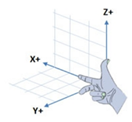
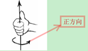

# TF概述
- http://wiki.ros.org/tf/Tutorials/Introduction%20to%20tf
- ROS中的TF库是一个完善的坐标变换工具包，主要功能是维护整个系统中所有坐标系，形成一个完整的坐标转换树。

- 利用TF库，可以描述一个物体相对于另一个物体坐标系的坐标转换，得到任何两个坐标系间的空间位置关系，这是数据融合必须要实现的环节。
- 本文是以整车坐标系为base_link，由于**一个系统中必须仅有一个TF树**，所有坐标系都应在此坐标树中；激光雷达坐标系LiDAR_link、相机坐标系Cam_link、GPS/IMU坐标系IMU_link均已其为父级。

# TF数据类型
基本的数据类型有Quaternion、Vector、Point、Pose、 Transform四类：
|类型|TF|描述|
|:----------|:---------------|:----------------------|
|Quaternion | tf::Quaternion | 表示四元数(表示旋转变换) **(x,y,z,roll,pitch,yaw)**|
|vector3    | tf::Vector3    | 一个3*1 的向量|
|point      | tf::Point      | 一个表示一个点坐标（x,y,z)|
|Pose       | tf::Pose       | 位姿 **(x,y,z,pitch,roll,yaw)** |
|Transform  | tf::Transform  | Transform是一个转换的模板 |

tf::Stamped为TF变换中使用的数据类型，主要根据监听的TF进行转标转换的类型，这个数据类型是在上述所有基本类型（除了tf::Transform）的基础上具有元素frame_id_和stamp_模板化

同时还有tf::StampedTransform，该类型是tf::Transform的一个特例，同时要求具有frame_id，stamp 和 child_frame_id。

# TF发布流程（本文仅涉及静态发布）
- 建立一个广播者（TransformBroadcaster）
- 建立广播者需要广播的数据类型（TransformStamped）
- 给数据类型赋值
- 循环广播

##
```C++
#include <ros/ros.h>
#include <tf/transform_broadcaster.h>
#include "math.h"    //常数 M_PI = π; M_PI/2 = π/2;
 
int main(int argc, char** argv)
{
    ros::init(argc, argv, "tf_publisher");//初始化ROS节点与节点名称
    ros::NodeHandle n;                    //创建节点的句柄
    ros::Rate loop_rate(100);             //控制节点运行的频率,与loop.sleep共同使用
 
    tf::TransformBroadcaster broadcaster; //创建一个TransformBroadcaster对象(tf广播器,)，是用来发布tf变换树;
    
    tf::Transform base2laser;             //激光雷达坐标系LiDAR_link;创建一个Transform对象,用于描述两个坐标系之间的转化关系，即两个点的相对坐标;
    tf::Quaternion q;                     //Quaternion应为四元数；
    q.setRPY(M_PI,M_PI*0.9,M_PI*1.5);              //setRPY应为欧拉角,设置旋转坐标
    base2laser.setRotation(q);                   //
    base2laser.setOrigin(tf::Vector3(0,1.1,1.5));//setOrigin应为平移坐标,设平移坐标，laser2在base的(1.1,0,1.5)位置
 
    tf::Transform base3laser;             //相机坐标系Cam_link
    tf::Quaternion p;
    p.setRPY(M_PI/2,0,M_PI);                 //设置旋转坐标
    base3laser.setRotation(p);              
    base3laser.setOrigin(tf::Vector3(0,0.8,1.1));//设平移坐标，laser3在base的(0.8,0,1.1)位置
 
    tf::Transform base4laser;
    tf::Quaternion rs;
    rs.setRPY(0,M_PI,0);                   //设置旋转坐标
    base4laser.setRotation(rs);              
    base4laser.setOrigin(tf::Vector3(0,0,0));//设平移坐标，laser4在base的(1,0,0)位置
 
 
    while (n.ok())
    {
        //循环发布坐标变换，两种方式
        broadcaster.sendTransform(tf::StampedTransform(base2laser,ros::Time::now(),"base_link","LiDAR_link"));
	    broadcaster.sendTransform(tf::StampedTransform(base3laser,ros::Time::now(),"base_link","Cam_link"));
	    broadcaster.sendTransform(tf::StampedTransform(base4laser,ros::Time::now(),"base_link","IMU_link"));
	    //发布tf变换树的类型，一个变换树包含 变换、时间戳、父坐标系frame_id、子坐标系frame_id；
	    //tf::StampedTransform(transform, ros::Time::now(), “turtle1”, “carrot1”)
        //broadcaster.sendTransform(tf::StampedTransform(tf::Transform(tf::Quaternion(0, 0, 0, 0), tf::Vector3(1, 0.0, 0)),ros::Time::now(),"base_link", "base_laser"));
        loop_rate.sleep();
    }
    return 0;
}
 
```

# ROS TF中的欧拉角和四元数变换及代码验证
## 先复习一下几个结论:
1. ROS的坐标系统使用右手定义


对于 ROS 机器人，如果以它为坐标系的原心，那么：

        x轴正向：前方

        y轴正向：左方

        z轴正向：上方
2. 在一个绕轴线上的旋转，也使用右手定义


即绕轴旋转的正方向为逆时针旋转，当我们将绕z轴旋转90度时，是绕z轴逆时针旋转90度。

3. **用于旋转的四元数必须是单位四元数**
欧拉角使用绕x,y,z三个轴的旋转来表示物体旋转

绕 Z轴 旋转，称之为 航向角，使用yaw表示;

绕 X轴 旋转，称之为 横滚角，使用roll表示;

绕 Y轴 旋转，称之为 俯仰角，使用pitch表示;

  四元数是使用一个旋转的向量 + 一个旋转的角度来表示物体旋转。

   Q=(x,y,z,w)

四元数的模使用如下公式计算：


用于旋转的四元数，它的模须为1.

## ROS中的实现

Ros TF库中定义几个class来完成欧拉角和四元数之间的转换。

例如，在ROS Melodic中，位于/opt/ros/melodic/include/tf2/LinearMath
```bash
├── Matrix3x3.h
├── MinMax.h
├── QuadWord.h
├── Quaternion.h
├── Scalar.h
├── Transform.h
└── Vector3.h
```

在Quaternion.h中给出了转换使用方法。

### 在Quaternion.h中，存在以下三种设置方法：
1. setRPY();

这个函数采用**固定轴的旋转方式**，先绕定轴x旋转（横滚），然后再绕定轴y（俯仰），最后绕定轴z（偏航）。

从数学形式上说，这是绕定轴XYZ矩阵依次左乘，即：R = R(z) R(y)R(x)的顺序。由于是绕着定轴转动，所以很直观，便于人机交互。

```C++
/**@brief Set the quaternion using fixed axis RPY

@param roll Angle around X

@param pitch Angle around Y

@param yaw Angle around Z*/

void setRPY(const tfScalar& roll, const tfScalar& pitch, const tfScalar& yaw)；
```
 

2. setEuler

这种方式是**绕着动轴转动**，先绕Y轴，在绕变换后的X轴，再绕变换后的Z轴旋转。

从数学形式上说，这是绕定轴YXZ矩阵依次右乘，即：R = R(y)R(x)R(z) 的顺序。

```C++
/**@brief Set the quaternion using Euler angles

@param yaw Angle around Y

@param pitch Angle around X

@param roll Angle around Z */

void setEuler(const tfScalar& yaw, const tfScalar& pitch, const tfScalar& roll)；
```
 

3. setEulerZYX

与2相同，此种旋转变换也是绕动轴旋转，只不过次序为ZYX，矩阵也是右乘，即R = R(z) R(y)R(x)。我们发现，这里的R与1中的R的最终结果相同，所以1和3的定义最终是等价的。

```C++
/**@brief Set the quaternion using euler angles

@param yaw Angle around Z

@param pitch Angle around Y

@param roll Angle around X */

void setEulerZYX(const tfScalar& yaw, const tfScalar& pitch, const tfScalar& roll) attribute((deprecated))；
```

总结：

ros中的欧拉角可以分为**绕定轴和绕动轴**的变换方式.
>1. 函数没有给出Euler时，是按定轴转动，矩阵依次左乘。
>2. 若函数的名字中有Euler，则表示为绕动轴转动的方式，矩阵依次右乘。

## ROS TF 欧拉角四元数代码验证
为了方便理解，我们只绕一个轴旋转。

例如：让三位空间的点（1,1,0）绕Z轴旋转90度， 计算旋转后的点坐标。

如图所示，ROS中，逆时针为正，所以，很容易分析出(1,2,0)绕Z轴旋转90度后的坐标应该为（-2,1,0）。

用ROS TF代码如何实现上面的旋转呢？
```C++
#include <ros/ros.h>
#include <tf/tf.h>
using namespace std;
//定义一个常量表示Pi的值
#define PI_CONST 3.141592653589793238462643383279502884
 
int main(int argc, char** argv){
//初始化
ros::init(argc, argv, "coordinate_transformation");
ros::NodeHandle node;
tfScalar yaw,pitch,roll;
 
//因为是绕Z轴旋转90度，所以只要yaw值为PI_CONST/2，pitch,roll都为0
yaw=PI_CONST/2; pitch=0; roll=0;
std::cout<<"欧拉角rpy("<<roll<<","<<pitch<<","<<yaw<<")";
 
tf::Quaternion q;
q.setRPY(roll,pitch,yaw); //将roll, pitch,yas赋给四元数后，可以得到转换后的四元数
std::cout<<"，转化到四元数q:"<<"("<<q.x()<<","<<q.y()<<","<<q.z()<<","<<q.w()<<")"<<std::endl;
 
//length()函数计算四元数的模，可以验证是否为1
std::cout<<"the quaternion length: "<<q.length()<<endl;
 
tf::Vector3 up(1, 2, 0); //原始的点
tf::Vector3 axis = q.getAxis(); // 获取四元数的旋转轴
double angle = q.getAngle(); //获取四元数的旋转角度
 
cout<<"axis of q is:"<<axis.x()<<","<<axis.y()<<","<<axis.z()<<endl;
cout<<"angle is:"<<angle<<endl;
 
tf::Vector3 newup = up.rotate(q.getAxis(), q.getAngle()); //计算原始点旋转之后的坐标
cout<<"(1,2,0) after rotate with Z 90: "<<newup.x()<<","<<newup.y()<<","<<newup.z()<<endl;
 
return 0;
};
```

结果：
```bash
欧拉角rpy(0,0,1.5708)，转化到四元数q:(0,0,0.707107,0.707107)
the quaternion length: 1
axis of q is:0,0,1
angle is:1.5708
(1,2,0) after rotate with Z 90: -2,1,0
```

### ROS中欧拉角与四元数相互转换
- Euler2Quaternion.cpp
```C++
#include <ros/ros.h>
#include <tf/tf.h>
//退出用：ctrl+z
int main(int argc, char** argv){
//初始化
  ros::init(argc, argv, "Euler2Quaternion");
  ros::NodeHandle node;
  geometry_msgs::Quaternion q;
  double roll,pitch,yaw;
  while(ros::ok())
  {
  //输入一个相对原点的位置
  std::cout<<"输入的欧拉角：roll,pitch,yaw:";
  std::cin>>roll>>pitch>>yaw;
  //输入欧拉角，转化成四元数在终端输出
 q=tf::createQuaternionMsgFromRollPitchYaw(roll,pitch,yaw);
  //ROS_INFO("输出的四元数为：w=%d,x=%d,y=%d,z=%d"，q.w,q.x,q.y,q.z);
  std::cout<<"输出的四元数为：w="<<q.w<<",x="<<q.x<<",y="<<q.y<<",z="<<q.z<<std::endl;
  ros::spinOnce();
  }
  return 0;
};
```

- Quaternion2Euler.cpp
```C++
#include <ros/ros.h>
#include "nav_msgs/Odometry.h"
#include <tf/tf.h>
//退出用：ctrl+z
int main(int argc, char** argv){
//初始化
  ros::init(argc, argv, "Quaternion2Euler");
  ros::NodeHandle node;
  nav_msgs::Odometry position;
  tf::Quaternion RQ2;  
  double roll,pitch,yaw;
  while(ros::ok())
  {
  //输入一个相对原点的位置
  std::cout<<"输入的四元数：w,x,y,z:";
  std::cin>>position.pose.pose.orientation.w>>position.pose.pose.orientation.x>>position.pose.pose.orientation.y>>position.pose.pose.orientation.z;
  //输入四元数，转化成欧拉角数在终端输出
  tf::quaternionMsgToTF(position.pose.pose.orientation,RQ2);  
 // tf::Vector3 m_vector3; 方法2
 // m_vector3=RQ2.getAxis();
  tf::Matrix3x3(RQ2).getRPY(roll,pitch,yaw);  
  std::cout<<"输出的欧拉角为：roll="<<roll<<",pitch="<<pitch<<",yaw="<<yaw<<std::endl;
  //std::cout<<"输出欧拉角为：roll="<<m_vector3[0]<<",pitch="<<m_vector3[1]<<",yaw="<<m_vector3[2]<<std::endl;
  ros::spinOnce();
  }
  return 0;
};    
```