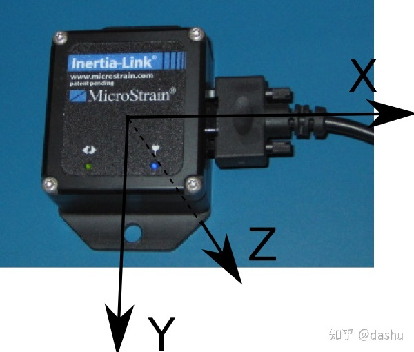

# ROS传感器之IMU简介
## 概念
IMU，全称inertial measurement unit，即惯性测量单元，主要用于测量自身位姿，位姿包含位置和姿态。


## 组成
最为基本的IMU包含两个器件，加速计和陀螺仪。

## 数学模型
通常使用一个三维笛卡尔坐标系来表示IMU，以microstrain 3DM-GX2为例，如图：


加速计测量三轴上的加速度，陀螺仪测量绕三轴的角速度，通过这两种传感器数据，可以计算出IMU自身的位姿变化，即当前时刻相对于上一时刻的姿态变化。

**IMU与AHRS**
AHRS，全称Attitude and Heading Reference System，即航姿参考系统，其组件为加速计、陀螺仪和磁力计，
可以看到AHRS比IMU多一个磁力计，磁力计可以测量磁场的方向和强度。

AHRS与IMU都可以测量位姿，但是其参考坐标系不同，**IMU参考坐标系是其上一时刻的位姿**，**AHRS的参考坐标系一般是导航坐标系**，
例如东北天或者北东地坐标系。

AHRS可以测量静止状态时的绝对姿态，IMU测量相对位姿。市面上有些IMU实际是集成了AHRS，模式可配置选择。


## IMU与GPS
在自动驾驶定位算法中，IMU+GPS被称为黄金搭档，其主要原因是这两种器件互补性比较好，其数据有以下特征：

1. 频率互补，GPS频率一般为10Hz，IMU频率一般为100Hz。

2. 数据干扰互补，GPS数据易受环境影响，例如高楼、隧道等；IMU不易受外界干扰。

3. 数据误差互补，如上述第六点所述，IMU存在数据漂移，GPS每次测量都是独立的，即与上次测量无关，所以不存在误差累计。

4. IMU测量的是相对位置，GPS测量的是绝对位置。


## 数据漂移
我们使用IMU器件最终想要获取的是位姿数据，包含位置和姿态，而实际IMU直接测量的数据是加速度和角速度，需要对角速度进行一次积分计算角度，也就是姿态；对加速度进行二次积分获取距离，也就是位置。由于种种原因，所有的传感器测量数据，都有测量误差，而IMU是通过积分实现间接测量值，且其参考数据是上时刻数据，这就造成其误差也会随着时间传递下去，时间越久，其误差越大，这一特性成为数据漂移，所以IMU一般需要与其它传感器配合使用。

## ROS中IMU数据表示
执行一下指令：
```
rosmsg show sensor_msgs/Imu
```

执行效果如下：
```bash
std_msgs/Header header
  uint32 seq
  time stamp
  string frame_id
geometry_msgs/Quaternion orientation
  float64 x
  float64 y
  float64 z
  float64 w
float64[9] orientation_covariance
geometry_msgs/Vector3 angular_velocity
  float64 x
  float64 y
  float64 z
float64[9] angular_velocity_covariance
geometry_msgs/Vector3 linear_acceleration
  float64 x
  float64 y
  float64 z
float64[9] linear_acceleration_covariance

```

header项同前文GPS(链接“ROS传感器之GPS简介”):
- linear_acceleration表示线加速度，
- linear_acceleration_covariance表示线加速度协方差，
- angular_velocity表示角速度，
- angular_velocity_covariance角速度协方差，
- orientation表示姿态，使用四元数表示，
- orientation_covariance表示姿态协方差。

**orientation是由linear_acceleration和angular_velocity计算而得**

但并不是所有IMU设备都直接提供orientation，如果没有提供，将orientation各项置为0，orientation_covariance各项置为-1.这里协方差表示各个数据的误差，一般由器件厂商给出。