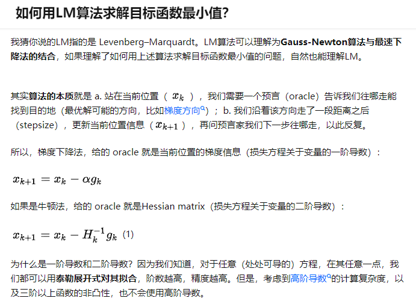
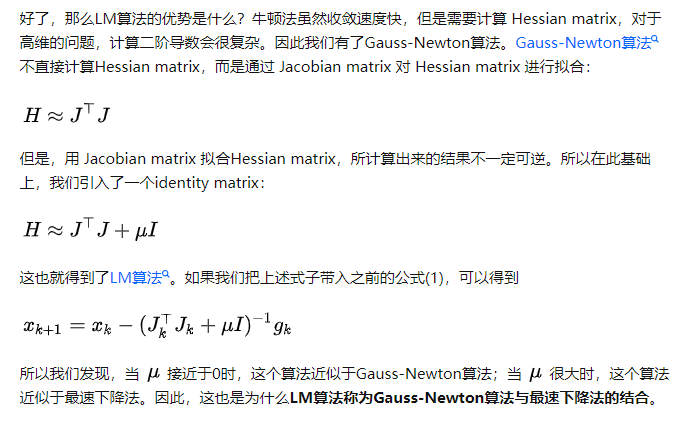
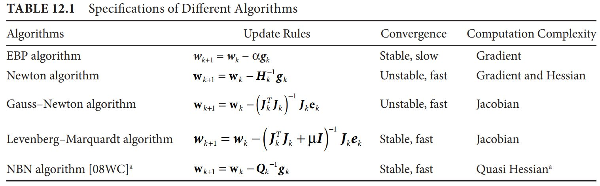

# 刚体运动

# 非线性优化

## 最小二乘
## 高斯牛顿

## LM 
- https://blog.csdn.net/qq_37340588/article/details/107494444
### [优化算法学习（LM算法）](https://blog.csdn.net/zhulinmanbu114/article/details/96432116)
- 推荐如下几篇文章：
> METHODS FOR NON-LINEAR LEAST SQUARES PROBLEMS : 专门解释GN LM算法的。
> NumericalOptimization.pdf
> 1. [CSDN 数字优化专栏](https://blog.csdn.net/fangqingan_java/article/details/48951191)
> 2. [知乎专栏](https://zhuanlan.zhihu.com/p/53882647)

- 如下是知乎上介绍LM算法的文章： https://www.zhihu.com/question/269579938/answer/349205519
    > 
    > 
    > 最后，上一张图表示几种算法之间的关系：
    > 
    > 参考文献：Wilamowski, B. M., & Yu, H. (2010). Improved computation for Levenberg–Marquardt training. IEEE transactions on neural networks, 21(6), 930-937.

- 另外，有个levmar的C/C++的库：
    > levmar : Levenberg-Marquardt nonlinear least squares algorithms in C/C++
    > http://users.ics.forth.gr/~lourakis/levmar/index.html#download
    > http://users.ics.forth.gr/~lourakis/sparseLM/

## 点云格式和ROS

## 点云排序

## 点云分割(./自动驾驶点云处理文章/3D点云分割.md)

# 视觉SLAM 
## 霍夫变换
霍夫变换是一种特征检测(feature extraction)，被广泛应用在图像分析（image analysis）、计算机视觉(computer vision)以及数位影像处理(digital image processing)。

霍夫变换是用来辨别找出物件中的特征，例如：线条。

他的算法流程大致如下，给定一个物件、要辨别的形状的种类，算法会在参数空间(parameter space)中执行投票来决定物体的形状，而这是由累加空间(accumulator space)里的局部最大值(local maximum)来决定。

广义的霍夫变换可以检测描述任何形状。

- [知乎文章](https://zhuanlan.zhihu.com/p/203292567)

# Others
## 学习资料
- SLAM十四讲
- [泡泡机器人论坛](http://paopaorobot.org/bbs/)
- 小六哥<<从零一起学SLAM>>
- 深蓝学院推出的<<从零手写VIO>>
## 正太分布随机数 
- Action
## 简单术语 专有名词
欧几里得度量（euclidean metric）（也称欧氏距离）是一个通常采用的距离定义，
指在m维空间中两个点之间的真实距离，或者向量的自然长度（即该点到原点的距离）。
在二维和三维空间中的欧氏距离就是两点之间的实际距离。