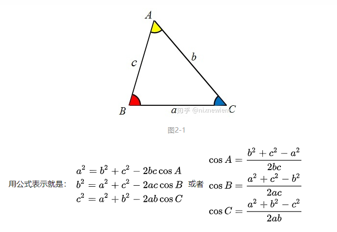
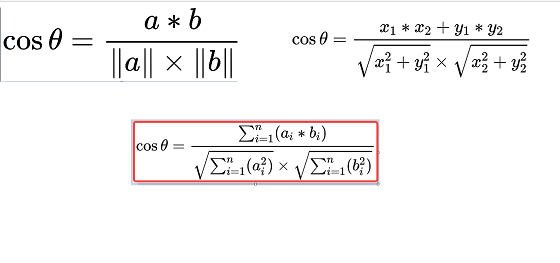

# 概述
**余弦距离** 或者 **余弦相似度**，是用向量空间中两个向量夹角的余弦值作为衡量两个个体间差异的大小的度量。

向量，是多维空间中有方向的线段，如果两个向量的方向一致，即夹角接近零，那么这两个向量就相近。
而要确定两个向量方向是否一致，这就要用到余弦定理计算向量的夹角。

例如在机器学习领域中，将两篇文章向量化，余弦距离可以避免因为文章的长度不同而导致距离偏大，余弦距离只考虑两篇文章生成的向量的夹角。

## 余弦定理公式
- 参考： https://zhuanlan.zhihu.com/p/109342493
先来回忆下高中数学的**余弦定理**，如下图。


推理证明略。

## 余弦相似度(余弦距离)公式


余弦距离：dist = 1-cos()

如下特性：
余弦相似度的取值范围是[-1,1]，相同两个向量的之间的相似度为1。

余弦距离的取值范围是[0,2]。

0度角的余弦值是1，余弦值越接近于1越相似。

# 余弦距离和欧氏距离的对比
- 欧氏距离衡量的是空间各点的**绝对距离**，跟各个点所在的位置坐标直接相关；
- 余弦距离衡量的是**空间向量的夹角**，更加体现在方向上的差异，而不是位置。


# 调整余弦相似度算法（Adjusted Cosine Similarity）

余弦相似度更多的是从方向上区分差异，而对绝对的数值不敏感，因此没法衡量每个维度上数值的差异，会导致这样一种情况：

用户对内容评分，按5分制，A和B两个用户对两个内容的评分分别为（1,2）和（4,5），使用余弦相似度得到的结果是0.98，两者极为相似。

但从评分上看A似乎不喜欢2这个 内容，而B则比较喜欢，余弦相似度对数值的不敏感导致了结果的误差，需要修正这种不合理性就出现了调整余弦相似度.

即所有维度上的数值都减去一个均值，比如A和B的评分均值都是3，那么调整后为（-2，-1）和（1,2），再用余弦相似度计算，得到-0.8，
相似度为负值并且差异不小，但显然更加符合现实。

# 具体应用案例
余弦相似度算法：
一个向量空间中两个向量夹角间的余弦值作为衡量两个个体之间差异的大小，余弦值接近1，夹角趋于0，表明两个向量越相似，余弦值接近于0，夹角趋于90度，表明两个向量越不相似。
**基本思路是**
如果这两句话的用词越相似，它们的内容就应该越相似。因此，可以从词频入手，计算它们的相似程度。
第一步，分词
句子A：这只/皮靴/号码/大了。那只/号码/合适。
句子B：这只/皮靴/号码/不/小，那只/更/合适。
第二步，列出所有的词
这只，皮靴，号码，大了。那只，合适，不，小，很
第三步，计算词频
句子A：这只1，皮靴1，号码2，大了1。那只1，合适1，不0，小0，更0
句子B：这只1，皮靴1，号码1，大了0。那只1，合适1，不1，小1，更1
第四步，写出词频向量
　　句子A：(1，1，2，1，1，1，0，0，0)
　　句子B：(1，1，1，0，1，1，1，1，1)
到这里，问题就变成了如何计算这两个向量的相似程度。我们可以把它们想象成空间中的两条线段，都是从原点（[0, 0, …]）出发，指向不同的方向。两条线段之间形成一个夹角，如果夹角为0度，意味着方向相同、线段重合,这是表示两个向量代表的文本完全相等；如果夹角为90度，意味着形成直角，方向完全不相似；如果夹角为180度，意味着方向正好相反。因此，我们可以通过夹角的大小，来判断向量的相似程度。夹角越小，就代表越相似。

计算两个句子向量
句子A：  (1，1，2，1，1，1，0，0，0)
和句子B：(1，1，1，0，1，1，1，1，1)的向量余弦值来确定两个句子的相似度。
计算过程如下：
```
cos = (1*1+1*1+2*1+1*0+1*1+1*1+0*1+0*1+0*1)/( sqrt(1*1+1*1+2*2+1*1+1*1+1*1+0*0+0*0+0*0)*sqrt(1*1+1*1+1*1+0*0+1*1+1*1+1*1+1*1+1*1))
    = 6/( sqrt(7)*sqrt(8) )
    = 0.81

```

计算结果中夹角的余弦值为0.81非常接近于1，所以，上面的句子A和句子B是基本相似的