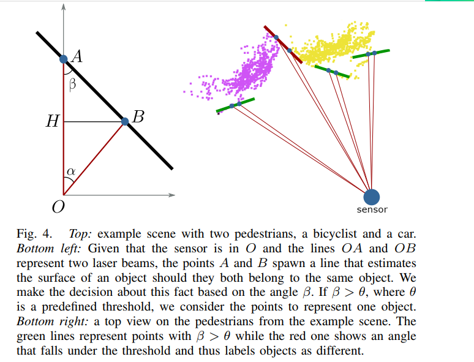

# 
由于lidar点云的稀疏性，尤其在垂直方向上，即便相邻点云是来自于同一物体，它们之间也会存在着一个欧氏距离。并且随着Object与Lidar距离的增大，这个距离会越来越大，给目标识别带来的挑战也越大。

## 常见点云分割方法
主要有三类：

### 基于特征的方法

这类方法通过复杂的特征来定义点云，或者先剔除地平面，然后再通过设置一定的阈值来以点之间的距离分割点云。

这种方法能够进行准确的分割，但是计算量比较大，消耗时间，会限制在线的应用。

但这类方式使用得好像挺多的，IMLS-SLAM用的是类似这种方法。

典型的论文有：
[7] B. Douillard, J. Underwood, N. Kuntz, V. Vlaskine, A. Quadros,P. Morton, and A. Frenkel. On the segmentation of 3d lidar point clouds. In Proc. of the IEEE Int. Conf. on Robotics & Automation
(ICRA), 2011.
[8] B. Douillard, J. Underwood, V. Vlaskine, A. Quadros, and S. Singh. A pipeline for the segmentation and classification of 3d point clouds. In Proc. of the Int. Symposium on Experimental Robotics (ISER), 2014.
[14]K. Klasing, D. Wollherr, and M. Buss. A clustering method for efficient segmentation of 3d laser data. In Proc. of the IEEE Int. Conf. on Robotics & Automation (ICRA), pages 4043–4048, 2008.

### 3D 2 2D

这类方法先将3D点云投影到地平面上的2D网格上，然后在已占用的网格上进行点云分割。这类算法速度快，适合online，但是这类方法倾向于弱分割，即当两个object离得比较近的时候，容易将它们识别为同一个object，尤其是在Z轴方向上更为明显。
典型论文有：
[2] J. Behley, V. Steinhage, and A. Cremers. Laser-based segment classification using a mixture of bag-of-words. In Proc. of the IEEE/RSJ Int. Conf. on Intelligent Robots and Systems (IROS), 2013.
[13] M. Himmelsbach, F. v Hundelshausen, and H. Wuensche. Fast segmentation of 3d point clouds for ground vehicles. In IEEE Intelligent Vehicles Symposium, pages 560–565, 2010.
[15] D. Korchev, S. Cheng, Y. Owechko, and K. Kim. On real-time lidar data segmentation and classification. In Proc. of the Intl. Conf. on Image Processing, Computer Vision, and Pattern Recog. (IPCV), 2013.

### 在range image上分割

#### Fast Range Image-Based Segmentation of Sparse 3D Laser Scans for Online Operation

论文: [pdf](../Paper/Others/SegmentationOf3DPointCloud/Fast Range Image-Based Segmentation of Sparse 3D Laser Scans for Online Operation.pdf)

首先将lidar采集的未经处理的点云数据转成深度图，行数取决于laidar线束，列数取决于lidar转一圈采集的点数，每个像素存储点的欧式距离。

如下图：

A B 是任意2个点，O是Lidar点，OA OB为两道连续的光束。
过AB做一条直线，O到A B点较长的最为Y轴，β为这个光束于AB的夹角。显然β与AB的深度有关。

给β设定一个阈值θ，β>θ 代表是同一个Object。

β角的计算公式为：

α为连续的两个lidar光束的夹角，是已知的。
d2为OB，d1为OA，在深度图中也是已知的。
可以求出β角。

**结论**：
对于大多数情况下，β角都是很大的，只有A B的深度值相差很大的时候，β角才会比较小。因此设定一个阈值θ对点云进行分割是可行的。

**优点**：
只用了一个参数对点云进行分割处理，简单 速度很会，适合online。

**缺点**：
当lidar距离墙面很近的时候，距离较远的点容易判定为不同Object。

#### A Fast Segmentation Method of Sparse Point Clouds
论文: [pdf](../Paper/Others/SegmentationOf3DPointCloud/A Fast Segmentation Method of Sparse Point Clouds.pdf)

对上面的缺点进行了改进，除了以β角为判别条件，还增加了一个距离条件。

>The Euclidean distance between adjacent data points belonging to the same object is almost equal to the arc length formed by the short side.

## 常见的聚类方法
- [参考文章](https://blog.csdn.net/weixin_43885544/article/details/111193386)
- 代码： https://github.com/wangx1996/LIDAR-Segmentation-Based-on-Range-Image

