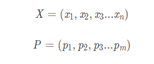
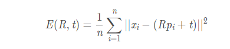
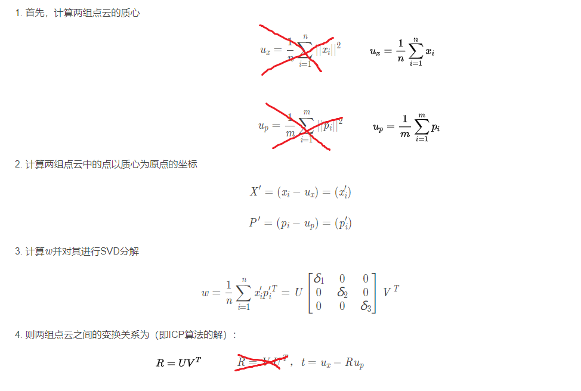
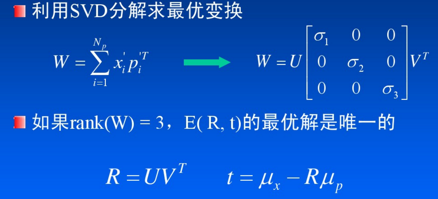
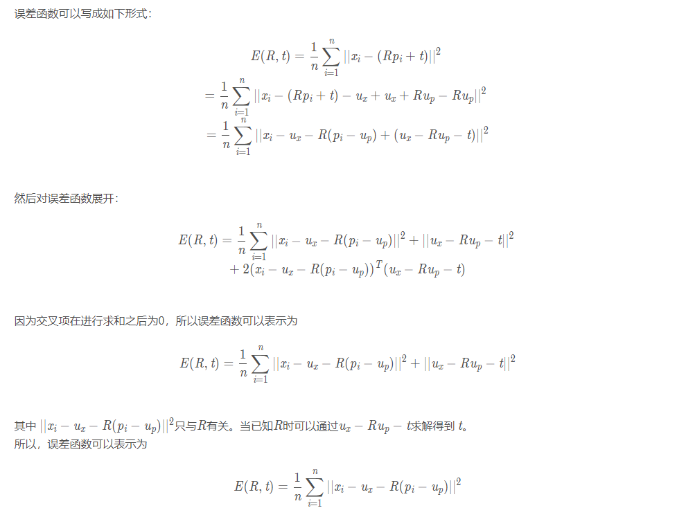
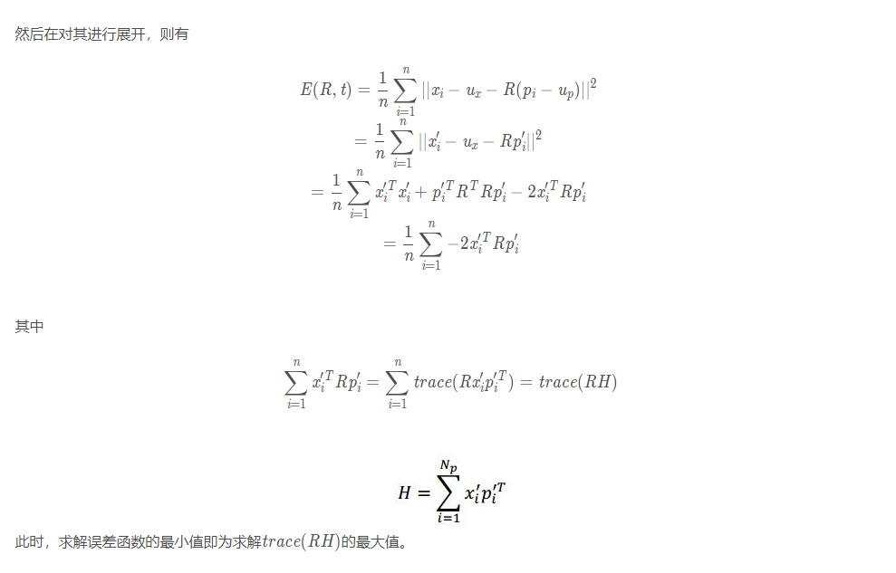
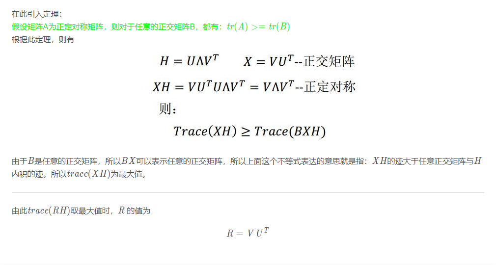

# ICP 算法
- https://blog.csdn.net/u014709760/article/details/99241393
- 点云质心计算不太合理，修改了下。
- 旋转矩阵R错误，进行修改。

## ICP算法（迭代最近点算法）
ICP(迭代最近点算法)是一种古老而又经典的点云匹配算法，其思路也很清晰。
点云配准就是求解两堆点云之间的变换关系——也就是旋转关系 R 和平移关系 t 。

ICP算法的思路就是：
> 找到两组点云集合中距离最近的点对，
> 根据估计的变换关系（R 和 t ）来计算距离最近点对经过变换之后的误差，
> 进过不断的迭代直至误差小于某一阈值或者达到迭代次数来确定最终的变换关系。

### ICP算法的数学描述：

给定两个点云集合：

求解R 和 t，使下式最小:

### ICP算法的求解
1. 已知对应点的情况
如果已知两个点云中点的对应关系，那么ICP算法的求解过程将非常简单，这个在视觉slam中较为常用，因为我们可以根据特种匹配的方式找出空间点的对应关系。

具体方法为：

另外一篇求解文章(经过代码验证，对上面的文章中的错误进行了修正)：

2. 未知对应点的情况

已知对应点的情况下，我们可以一次性计算出点云之间的变换关系。

但是在激光slam中，我们并不知道两组点云之间的对应关系。
因此也就不能通过一次计算就求解出点云之间的变换关系。
这时候我们的策略就是使用迭代的方式。

具体方法为：

    1. 寻找两组点云中距离最近的点对。
    2. 根据找到的距离最近点对，来求解两组点云之间的位姿关系。
    3. 根据求解的位姿关系对点云进行变换，并计算误差。
    4. 若误差没有达到要求，则重复1，2，3步直至误差满足要求或达到最大迭代次数。

ICP算法很简单，但是其思想却很巧妙。

为什么这么说呢？
因为ICP算法要求解的是两组点云之间的变换关系，要求解这种变换关系需要直到两组点云中点的对应关系。
可是我们并不知道这种点的对应关系。

那怎么办？
ICP算法的策略是，反正我不知道两组点云之间点的对应关系，
那就认为距离最近的点是相互匹配的，
然后以此来计算两组点云之间的变换关系。
在得到变换关系之后，对点云进行变换并计算误差。
然后再次选取距离最近的点作为匹配点并求解变换关系，重复该过程直至误差满足要求。

3. 数学证明
通过上面的分析可以看出，已知对应点的情况是未知对应点情况的一部分。接下来我们来证明一下已知对应点的求解方法。

